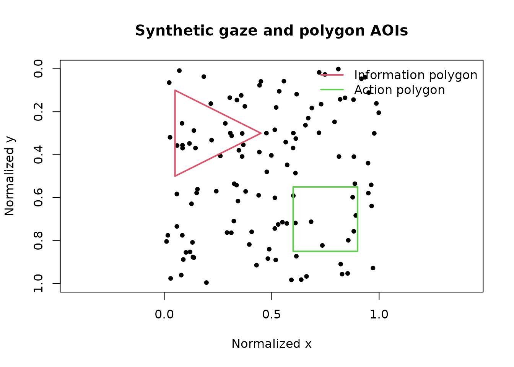

# Advanced static and dynamic AOI assignment

## Scope

This article demonstrates base-R assignment of gaze coordinates to
non-rectangular and time-varying AOIs.

The helpers support:

- polygon AOIs defined by ordered vertices;
- rectangular or polygonal AOIs that change over time;
- participant- or trial-specific definitions;
- nearest, previous, or next definition-time matching;
- explicit overlap handling;
- coverage and definition-gap audits.

The resulting labels describe geometric membership only. They do not
establish attention, comprehension, or psychological interpretation
without additional design and measurement evidence.

``` r

library(gp3tools)
```

## Static polygon AOIs

Create two polygons: a triangular information region and a four-vertex
action region.

``` r

polygon_vertices <- rbind(
  data.frame(
    aoi_name = "information",
    vertex_order = 1:3,
    vertex_x = c(0.05, 0.45, 0.05),
    vertex_y = c(0.10, 0.30, 0.50)
  ),
  data.frame(
    aoi_name = "action",
    vertex_order = 1:4,
    vertex_x = c(0.60, 0.90, 0.90, 0.60),
    vertex_y = c(0.55, 0.55, 0.85, 0.85)
  )
)

polygon_vertices
#>      aoi_name vertex_order vertex_x vertex_y
#> 1 information            1     0.05     0.10
#> 2 information            2     0.45     0.30
#> 3 information            3     0.05     0.50
#> 4      action            1     0.60     0.55
#> 5      action            2     0.90     0.55
#> 6      action            3     0.90     0.85
#> 7      action            4     0.60     0.85
```

Synthetic gaze samples span both AOIs and the surrounding display.

``` r

set.seed(20260715)

static_gaze <- data.frame(
  sample = seq_len(120),
  x = stats::runif(120),
  y = stats::runif(120),
  stringsAsFactors = FALSE
)

static_assigned <- add_gazepoint_polygon_aoi(
  master_df = static_gaze,
  vertices = polygon_vertices,
  x_col = "x",
  y_col = "y",
  vertex_order_col = "vertex_order",
  output = "both",
  label_col = "aoi_label"
)

table(static_assigned$aoi_label)
#> 
#>      action information     outside 
#>           8          12         100
```

``` r

plot(
  static_gaze$x,
  static_gaze$y,
  asp = 1,
  xlim = c(0, 1),
  ylim = c(1, 0),
  xlab = "Normalized x",
  ylab = "Normalized y",
  main = "Synthetic gaze and polygon AOIs",
  pch = 19,
  cex = 0.7
)

polygon(
  polygon_vertices$vertex_x[
    polygon_vertices$aoi_name == "information"
  ],
  polygon_vertices$vertex_y[
    polygon_vertices$aoi_name == "information"
  ],
  border = 2,
  lwd = 2
)

polygon(
  polygon_vertices$vertex_x[
    polygon_vertices$aoi_name == "action"
  ],
  polygon_vertices$vertex_y[
    polygon_vertices$aoi_name == "action"
  ],
  border = 3,
  lwd = 2
)

legend(
  "topright",
  legend = c("Information polygon", "Action polygon"),
  lty = 1,
  lwd = 2,
  col = c(2, 3),
  bty = "n"
)
```



Boundary points can be counted as inside or outside. When polygons
overlap, `overlap = "first"`, `"last"`, or `"error"` makes the
assignment rule explicit.

## Time-varying rectangular AOIs

The following target moves horizontally across a synthetic display.
Definitions are available every 250 ms.

``` r

definition_times <- seq(0, 2000, by = 250)
target_left <- 0.10 + 0.00025 * definition_times

dynamic_rectangles <- data.frame(
  trial = "trial_01",
  aoi_time = definition_times,
  aoi_name = "moving_target",
  left = target_left,
  right = target_left + 0.20,
  top = 0.35,
  bottom = 0.65,
  stringsAsFactors = FALSE
)

utils::head(dynamic_rectangles)
#>      trial aoi_time      aoi_name   left  right  top bottom
#> 1 trial_01        0 moving_target 0.1000 0.3000 0.35   0.65
#> 2 trial_01      250 moving_target 0.1625 0.3625 0.35   0.65
#> 3 trial_01      500 moving_target 0.2250 0.4250 0.35   0.65
#> 4 trial_01      750 moving_target 0.2875 0.4875 0.35   0.65
#> 5 trial_01     1000 moving_target 0.3500 0.5500 0.35   0.65
#> 6 trial_01     1250 moving_target 0.4125 0.6125 0.35   0.65
```

Synthetic gaze follows the target with small coordinate noise and
includes several deliberately displaced samples.

``` r

sample_times <- seq(0, 2000, by = 20)
true_left <- 0.10 + 0.00025 * sample_times

dynamic_gaze <- data.frame(
  trial = "trial_01",
  time = sample_times,
  x = true_left + 0.10 + stats::rnorm(
    length(sample_times),
    sd = 0.035
  ),
  y = 0.50 + stats::rnorm(
    length(sample_times),
    sd = 0.035
  ),
  stringsAsFactors = FALSE
)

dynamic_gaze$x[c(20, 60, 90)] <-
  dynamic_gaze$x[c(20, 60, 90)] + 0.35
```

Match each gaze sample to the nearest available AOI definition.

``` r

dynamic_assigned <- add_gazepoint_dynamic_aoi(
  master_df = dynamic_gaze,
  aoi_defs = dynamic_rectangles,
  x_col = "x",
  y_col = "y",
  time_col = "time",
  group_cols = "trial",
  match = "nearest",
  max_time_gap = 150,
  output = "both",
  label_col = "aoi_label"
)

table(dynamic_assigned$aoi_label, useNA = "ifany")
#> 
#> moving_target       outside 
#>            98             3
```

``` r

plot(
  dynamic_assigned$time,
  dynamic_assigned$x,
  type = "l",
  xlab = "Time (ms)",
  ylab = "Normalized x",
  main = "Gaze relative to a moving rectangular AOI"
)

lines(
  dynamic_rectangles$aoi_time,
  dynamic_rectangles$left,
  lty = 2
)

lines(
  dynamic_rectangles$aoi_time,
  dynamic_rectangles$right,
  lty = 2
)

points(
  dynamic_assigned$time[
    dynamic_assigned$aoi_label == "moving_target"
  ],
  dynamic_assigned$x[
    dynamic_assigned$aoi_label == "moving_target"
  ],
  pch = 19,
  cex = 0.55
)

legend(
  "topleft",
  legend = c("Gaze x", "AOI bounds", "Inside matched AOI"),
  lty = c(1, 2, NA),
  pch = c(NA, NA, 19),
  bty = "n"
)
```


`match = "previous"` is useful when each definition remains valid until
the next update. `match = "next"` supports designs where definitions
describe the next known frame. `max_time_gap` prevents distant
definitions from being applied silently.

## Dynamic polygon AOIs

Dynamic polygons use repeated vertex rows at each definition time.

``` r

dynamic_polygons <- do.call(
  rbind,
  lapply(
    c(0, 1000),
    function(definition_time) {
      offset <- definition_time / 2000

      data.frame(
        trial = "trial_01",
        aoi_time = definition_time,
        aoi_name = "moving_polygon",
        vertex_order = 1:4,
        vertex_x = offset + c(0, 0.25, 0.25, 0),
        vertex_y = c(0.10, 0.10, 0.35, 0.35),
        stringsAsFactors = FALSE
      )
    }
  )
)

dynamic_polygons
#>      trial aoi_time       aoi_name vertex_order vertex_x vertex_y
#> 1 trial_01        0 moving_polygon            1     0.00     0.10
#> 2 trial_01        0 moving_polygon            2     0.25     0.10
#> 3 trial_01        0 moving_polygon            3     0.25     0.35
#> 4 trial_01        0 moving_polygon            4     0.00     0.35
#> 5 trial_01     1000 moving_polygon            1     0.50     0.10
#> 6 trial_01     1000 moving_polygon            2     0.75     0.10
#> 7 trial_01     1000 moving_polygon            3     0.75     0.35
#> 8 trial_01     1000 moving_polygon            4     0.50     0.35
```

The same
[`add_gazepoint_dynamic_aoi()`](https://stefanosbalaskas.github.io/gp3tools/reference/add_gazepoint_dynamic_aoi.md)
interface is used with `shape = "polygon"` and the vertex columns.

## Coverage audit

Audit whether samples had a usable definition, how large matching gaps
were, and whether coordinates fell inside or outside all AOIs.

``` r

coverage_audit <- audit_gazepoint_dynamic_aoi_coverage(
  dynamic_assigned,
  label_col = "aoi_label",
  group_cols = "trial",
  max_time_gap = 100,
  x_col = "x",
  y_col = "y"
)

coverage_audit$overview
#>   n_rows n_with_definition pct_with_definition n_inside_aoi pct_inside_aoi
#> 1    101               101                 100           98        97.0297
#>   n_outside_aoi pct_outside_aoi n_missing_gaze n_excessive_gap mean_time_gap
#> 1             3        2.970297              0              16      61.78218
#>   max_time_gap_observed audit_status
#> 1                   120       review
coverage_audit$group_summary
#>      trial n_rows n_with_definition pct_with_definition n_inside_aoi
#> 1 trial_01    101               101                 100           98
#>   pct_inside_aoi n_outside_aoi n_missing_gaze n_excessive_gap mean_time_gap
#> 1        97.0297             3              0              16      61.78218
coverage_audit$aoi_summary
#>             aoi n_samples pct_all_samples pct_defined_samples
#> 1 moving_target        98         97.0297             97.0297
utils::head(coverage_audit$flagged_rows)
#>       trial time         x         y aoi_moving_target     aoi_label
#> 7  trial_01  120 0.2280927 0.5022645              TRUE moving_target
#> 8  trial_01  140 0.2775847 0.4645416              TRUE moving_target
#> 19 trial_01  360 0.2389342 0.5166784              TRUE moving_target
#> 20 trial_01  380 0.7083769 0.4502671             FALSE       outside
#> 32 trial_01  620 0.3575538 0.4999766              TRUE moving_target
#> 33 trial_01  640 0.4518490 0.4800465              TRUE moving_target
#>    aoi_overlap_count aoi_definition_time aoi_time_gap
#> 7                  1                   0          120
#> 8                  1                 250          110
#> 19                 1                 250          110
#> 20                 0                 500          120
#> 32                 1                 500          120
#> 33                 1                 750          110
#>                   dynamic_aoi_issue
#> 7  definition_gap_exceeds_threshold
#> 8  definition_gap_exceeds_threshold
#> 19 definition_gap_exceeds_threshold
#> 20 definition_gap_exceeds_threshold
#> 32 definition_gap_exceeds_threshold
#> 33 definition_gap_exceeds_threshold
```

A `"review"` status identifies missing gaze, unavailable definitions,
excessive definition-time gaps, or samples outside all AOIs. Outside-AOI
samples are not automatically invalid; their relevance depends on the
stimulus and analysis plan.

## Recommended reporting

Report:

- coordinate system and screen normalization;
- polygon vertex ordering or rectangle bounds;
- AOI-definition update frequency;
- participant/trial grouping;
- definition-time matching rule;
- maximum permitted matching gap;
- boundary and overlap rules;
- percentage of samples with definitions;
- inside-, outside-, and missing-gaze proportions.

These details make dynamic AOI assignment auditable and reproducible.
