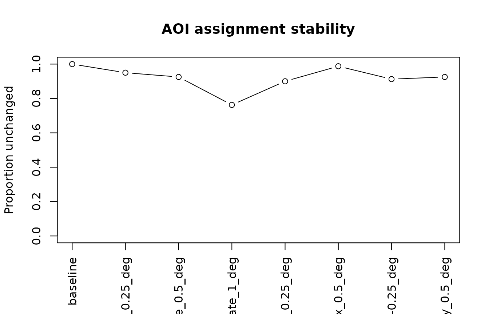

# Gazepoint AOI Perturbation and Uncertainty

## Architecture

This workflow is deliberately thin. `gp3tools` handles
Gazepoint-specific column names and coordinate units; `eyeprocess` owns
AOI perturbation, assignment stability, feature recomputation,
statistical propagation, and visualization. The wrapper does not create
a second scientific implementation.

## When to use

Use the adapter when Gazepoint samples or fixations must be tested
against small, defensible AOI-boundary changes. Do not use it to search
for a favorable AOI or to replace calibration, screen-coordinate, or
tracking-quality checks.

## Synthetic normalized Gazepoint-style data

``` r

set.seed(20260918)
aois <- data.frame(
  aoi_id = c("headline", "image", "claim", "disclosure", "cta"),
  xmin = c(.10, .30, .30, .30, .68), xmax = c(.40, .70, .70, .70, .92),
  ymin = c(.08, .19, .36, .50, .60), ymax = c(.18, .34, .48, .59, .71)
)
gaze <- data.frame(
  sample_id = 1:80, participant = rep(paste0("p", 1:8), each = 10),
  trial = rep(rep(1:2, each = 5), 8),
  FPOGX = pmin(1, pmax(0, runif(80, .08, .94))),
  FPOGY = pmin(1, pmax(0, runif(80, .06, .74))),
  duration = runif(80, .06, .18)
)
```

## Audit the adapter boundary

Normalized coordinates are not treated as pixels implicitly. Screen
dimensions must be supplied before conversion.

``` r

audit <- audit_gazepoint_aoi_uncertainty(
  gaze, aois, gaze_x_col = "FPOGX", gaze_y_col = "FPOGY",
  coordinate_unit = "normalized", screen_width_px = 1920, screen_height_px = 1080
)
audit$overview
#> # A tibble: 1 × 5
#>   n_rows n_missing_coordinates n_aois coordinate_unit core_status
#>    <int>                 <int>  <int> <chr>           <chr>      
#> 1     80                     0      5 normalized      valid
```

## Run the vendor-neutral sensitivity workflow

``` r

result <- run_gazepoint_aoi_sensitivity(
  gaze, aois, gaze_x_col = "FPOGX", gaze_y_col = "FPOGY",
  coordinate_unit = "normalized", perturbation_unit = "deg",
  dilations = c(.25, .50, 1.00), erosions = .25,
  translations_x = .50, translations_y = .50,
  translations_xy = list(c(.25, -.25)),
  screen_width_px = 1920, screen_height_px = 1080,
  viewing_distance = 60, physical_screen_size = c(53.1, 29.9),
  observation_id_col = "sample_id", participant_col = "participant",
  trial_col = "trial", duration_col = "duration",
  observation_level = "sample",
  overlap_policy = "ambiguous", quality_rules = list(missing = "preserve")
)
#> Warning: No time_col supplied; first_fixation is returned as NA rather than
#> inferred from row order.
#> Warning: No time_col supplied; first_fixation is returned as NA rather than
#> inferred from row order.
#> Warning: No time_col supplied; first_fixation is returned as NA rather than
#> inferred from row order.
#> Warning: No time_col supplied; first_fixation is returned as NA rather than
#> inferred from row order.
#> Warning: No time_col supplied; first_fixation is returned as NA rather than
#> inferred from row order.
#> Warning: No time_col supplied; first_fixation is returned as NA rather than
#> inferred from row order.
#> Warning: No time_col supplied; first_fixation is returned as NA rather than
#> inferred from row order.
#> Warning: No time_col supplied; first_fixation is returned as NA rather than
#> inferred from row order.
result$core_result$stability$overall
#>                                 perturbation_id n_total n_comparable
#> baseline                               baseline      80           80
#> dilate_0.25_deg                 dilate_0.25_deg      80           80
#> dilate_0.5_deg                   dilate_0.5_deg      80           80
#> dilate_1_deg                       dilate_1_deg      80           80
#> erode_0.25_deg                   erode_0.25_deg      80           80
#> shift_x_0.5_deg                 shift_x_0.5_deg      80           80
#> shift_xy_0.25_-0.25_deg shift_xy_0.25_-0.25_deg      80           80
#> shift_y_0.5_deg                 shift_y_0.5_deg      80           80
#>                         proportion_unchanged proportion_newly_assigned
#> baseline                              1.0000                    0.0000
#> dilate_0.25_deg                       0.9500                    0.0500
#> dilate_0.5_deg                        0.9250                    0.0750
#> dilate_1_deg                          0.7625                    0.1500
#> erode_0.25_deg                        0.9000                    0.0000
#> shift_x_0.5_deg                       0.9875                    0.0000
#> shift_xy_0.25_-0.25_deg               0.9125                    0.0250
#> shift_y_0.5_deg                       0.9250                    0.0125
#>                         proportion_lost proportion_reassigned
#> baseline                         0.0000                0.0000
#> dilate_0.25_deg                  0.0000                0.0000
#> dilate_0.5_deg                   0.0000                0.0000
#> dilate_1_deg                     0.0000                0.0875
#> erode_0.25_deg                   0.1000                0.0000
#> shift_x_0.5_deg                  0.0125                0.0000
#> shift_xy_0.25_-0.25_deg          0.0625                0.0000
#> shift_y_0.5_deg                  0.0625                0.0000
```

`translations_xy` is forwarded unchanged to the vendor-neutral core;
`gp3tools` does not implement a separate translation engine. The
complete `eyeprocess` result remains unchanged inside
`result$core_result`; the outer object records Gazepoint source columns
and unit-conversion settings.

## Visual output

``` r

plot_gazepoint_aoi_sensitivity(result, "assignment")
```



Other delegated plot families are `perturbations`, `coefficient`, and
`surface`.

### Plot-to-question map

| Adapter plot type | Delegated scientific question | Inspect together with |
|----|----|----|
| `"perturbations"` | Which observations cross a boundary when geometry changes? | adapter settings, perturbation ID, overlap policy |
| `"assignment"` | How much of the Gazepoint-to-AOI mapping changes? | unchanged/new/lost/reassigned proportions |
| `"coefficient"` | Does the same model change materially? | coefficient intervals, convergence, model `N` |
| `"surface"` | Where does sensitivity concentrate across joint geometry changes? | the declared two-dimensional perturbation plan |

The adapter passes plot arguments through to the corresponding
`eyeprocess` function. A manuscript-ready workflow normally combines one
geometry/reassignment figure, assignment stability, and coefficient
stability; use the surface only when a two-dimensional perturbation grid
was part of the declared analysis plan.

``` r

plot_gazepoint_aoi_sensitivity(
  result, "perturbations",
  perturbation_id = "dilate_0.5_deg",
  data = result$core_result$assignments
)
plot_gazepoint_aoi_sensitivity(result, "assignment")
plot_gazepoint_aoi_sensitivity(result, "coefficient", term = "condition")
plot_gazepoint_aoi_sensitivity(surface_result, "surface")
```

## Gazepoint AOI pre-run checklist

For a fillable preregistration-style template that records source
columns, coordinate conversion, perturbation choices, observation level,
failure handling, and reporting fields, see the companion **Gazepoint
AOI Sensitivity Analysis Plan** article.

Before calling the adapter, confirm:

1.  the exact Gazepoint x/y source columns;
2.  whether coordinates are normalized or pixels;
3.  screen width/height for normalized-to-pixel conversion;
4.  physical screen size and viewing distance for degree-based
    perturbations;
5.  whether rows are samples or fixations;
6.  the perturbation grid, overlap policy, and boundary policy;
7.  the fixed downstream model specification in the delegated
    `eyeprocess` callback.

The adapter never infers these scientific choices from the desired
result.

## Gazepoint AOI troubleshooting

Use
[`audit_gazepoint_aoi_uncertainty()`](https://stefanosbalaskas.github.io/gp3tools/reference/gazepoint_aoi_uncertainty.md)
first when units or source columns are uncertain. Once the adapter
boundary is valid, troubleshoot the delegated core result in this order:
geometry, assignments, feature denominators, then model callback.

| Symptom | First check | Do not do |
|----|----|----|
| Normalized coordinates rejected | screen dimensions and `coordinate_unit` | Treat 0-1 values as pixels |
| Geometry branch fails | `result$core_result$grid_result$audit` | Fall back silently to the older margin-sensitivity path |
| Many ambiguous assignments | perturbed layout and core reassignment matrix | Resolve overlap by AOI order |
| Sample count is zero | valid sample denominator | Recode missing gaze as zero |
| Sample count is missing | missing source coordinates | Treat the trial as observed non-inspection |
| Model callback fails/non-converges | core failures/models tables | Report it as a valid null effect |
| Model `N` changes | core inference stability | Report only coefficient direction |

A reporting sentence should identify the original Gazepoint columns and
coordinate unit before describing AOI robustness, because otherwise the
perturbation scale is not reproducible.

### Adapter/core API links

- [`audit_gazepoint_aoi_uncertainty()`](https://stefanosbalaskas.github.io/gp3tools/reference/gazepoint_aoi_uncertainty.md)
  validates the Gazepoint-to-core boundary.
- [`run_gazepoint_aoi_sensitivity()`](https://stefanosbalaskas.github.io/gp3tools/reference/gazepoint_aoi_uncertainty.md)
  delegates the complete workflow to `eyeprocess`.
- [`plot_gazepoint_aoi_sensitivity()`](https://stefanosbalaskas.github.io/gp3tools/reference/gazepoint_aoi_uncertainty.md)
  delegates all four plot families.
- Use the `eyeprocess` AOI troubleshooting guidance for geometry,
  denominator, convergence, and model-N interpretation.

## Gazepoint interpretation clinic

Use the adapter only after source coordinates and screen geometry are
explicit. For normalized Gazepoint samples, declare
`observation_level = "sample"`; for fixation exports or fixation
centroids, declare `"fixation"`.

| Pattern | Interpretation | Action |
|----|----|----|
| Assignments and model stable | Stable within the declared AOI envelope | Report both layers and the screen/viewing geometry |
| Assignments unstable, model stable | Geometry changes mapping without materially changing the model result | Inspect reassignment matrices and AOI-level stability |
| Model unstable | Substantive inference depends on geometry and/or branch-specific case loss | Inspect coefficient intervals, convergence, and model `N` |
| Adapter/core failure | The branch is non-evaluable | Keep the failure visible; do not fall back to the older margin-sensitivity implementation |

At sample level, a zero count means valid gaze samples existed but none
landed in that AOI. If all coordinates for a participant/trial are
missing, the count remains missing rather than becoming zero.

#### Figure set for reviewer handoff

For a compact reviewer/manuscript package, pair the Gazepoint adapter
settings with: (1) a geometry/reassignment diagnostic, (2) assignment
stability, and (3) coefficient stability. Add a robustness surface only
for a prespecified joint perturbation grid. The visual layer should
always be accompanied by the core perturbation audit, failures,
convergence, and model-`N` summaries.

## Reporting example

> Gazepoint normalized coordinates were converted using the declared
> screen dimensions, and AOI sensitivity was evaluated in degrees of
> visual angle. Sample-level assignments were recomputed across the
> nominal and perturbed geometries using explicit ambiguity handling. We
> report assignment stability, coefficient ranges/intervals,
> convergence, and model-N variation; failed branches were retained in
> the audit trail.

## Interpretation and limitations

A high unchanged-assignment proportion means the result is stable only
with respect to the declared perturbations. It is not a probability that
an AOI or scientific conclusion is true. Overlap remains explicit
ambiguity by default; missing coordinates remain missing; failed
branches and non-converged models remain in the core audit trail. When a
model callback is supplied, the core also reports the range of model `N`
across converged perturbations so case loss is not hidden.

## Reporting

For manuscript supplements, reviewer responses, or replication handoff,
see the companion **Gazepoint AOI Robustness Reporting Bundle** article,
which preserves both adapter settings and the delegated `eyeprocess`
core evidence.

Report the original Gazepoint coordinate columns, source coordinate
unit, observation level, screen dimensions used for normalized
conversion, viewing geometry for degree-based margins, perturbation
values, overlap/screen policies, zero-versus-missing denominator rules,
recomputed features, fixed statistical model specification,
coefficient/interval ranges, convergence, model-`N` variation, and
failed/non-converged branches.

If `eyeprocess` is unavailable, the adapter fails directly rather than
silently falling back to the older gp3tools margin-sensitivity
implementation.

## Adapter API map

Use
[`audit_gazepoint_aoi_uncertainty()`](https://stefanosbalaskas.github.io/gp3tools/reference/gazepoint_aoi_uncertainty.md)
to validate the Gazepoint-to-core boundary,
[`run_gazepoint_aoi_sensitivity()`](https://stefanosbalaskas.github.io/gp3tools/reference/gazepoint_aoi_uncertainty.md)
to delegate the full analysis to `eyeprocess`, and
[`plot_gazepoint_aoi_sensitivity()`](https://stefanosbalaskas.github.io/gp3tools/reference/gazepoint_aoi_uncertainty.md)
for the delegated geometry, assignment, coefficient, and
robustness-surface diagnostics.
