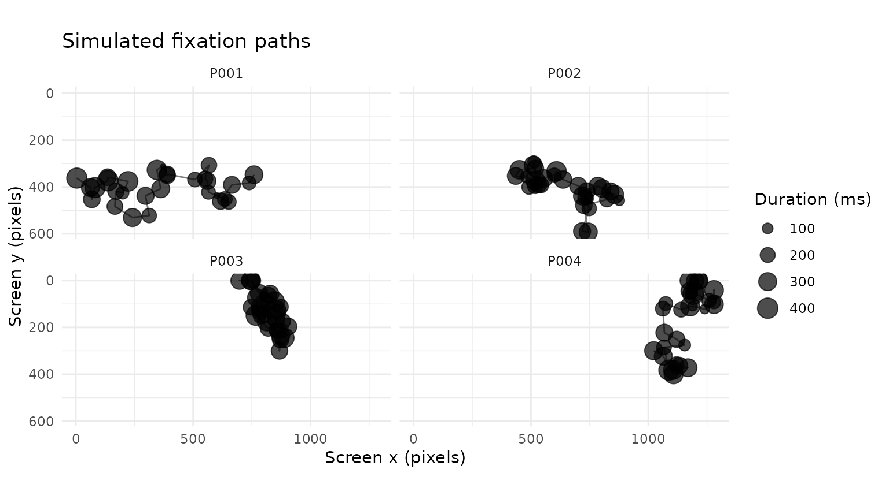
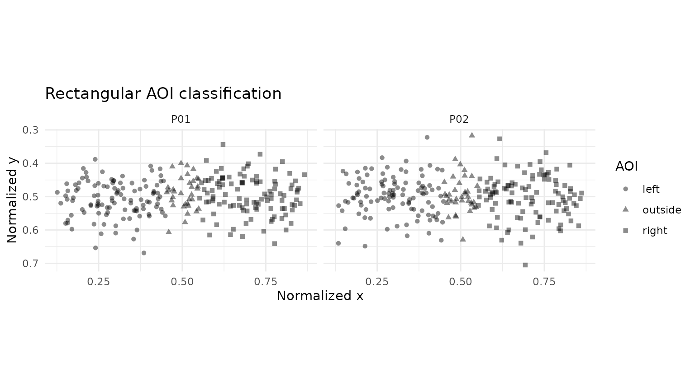
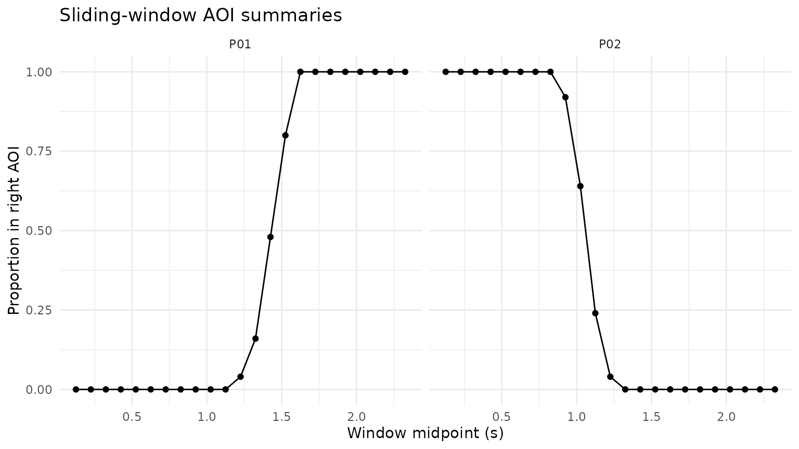

# AOI Labelling, Sliding Windows, and Fixation Simulation

## Purpose

This article combines three reusable feature-engineering helpers:

1.  simulate Gazepoint-like fixation events;
2.  add rectangular AOI membership to sample-level coordinates;
3.  summarise gaze and pupil measures in sliding time windows.

## Simulate fixation events

``` r

fixations <- simulate_gazepoint_fixations(
  n_subjects = 4,
  n_fix = 30,
  coordinate_system = "pixels",
  screen_width = 1280,
  screen_height = 720,
  sd = 45,
  seed = 2026
)

fixations
#> # A tibble: 120 × 17
#>    USER_ID MEDIA_ID    FPOGID FPOGS  FPOGD FPOGX FPOGY FPOGV subject fixation_id
#>    <chr>   <chr>        <int> <dbl>  <dbl> <dbl> <dbl> <int> <chr>         <int>
#>  1 P001    simulated_…      1 0     0.292  0.593 0.483     1 P001              1
#>  2 P001    simulated_…      2 0.327 0.164  0.577 0.532     1 P001              2
#>  3 P001    simulated_…      3 0.503 0.261  0.520 0.543     1 P001              3
#>  4 P001    simulated_…      4 0.816 0.243  0.482 0.640     1 P001              4
#>  5 P001    simulated_…      5 1.16  0.197  0.509 0.644     1 P001              5
#>  6 P001    simulated_…      6 1.36  0.0487 0.470 0.606     1 P001              6
#>  7 P001    simulated_…      7 1.46  0.191  0.496 0.627     1 P001              7
#>  8 P001    simulated_…      8 1.66  0.168  0.442 0.587     1 P001              8
#>  9 P001    simulated_…      9 1.83  0.259  0.438 0.520     1 P001              9
#> 10 P001    simulated_…     10 2.11  0.212  0.430 0.506     1 P001             10
#> # ℹ 110 more rows
#> # ℹ 7 more variables: start_time <dbl>, end_time <dbl>, duration <dbl>,
#> #   duration_ms <dbl>, x <dbl>, y <dbl>, coordinate_system <chr>
```

``` r

ggplot(fixations, aes(x, y, group = USER_ID)) +
  geom_path(alpha = 0.5) +
  geom_point(aes(size = duration_ms), alpha = 0.7) +
  scale_y_reverse() +
  facet_wrap(~ USER_ID) +
  coord_fixed() +
  labs(
    x = "Screen x (pixels)",
    y = "Screen y (pixels)",
    size = "Duration (ms)",
    title = "Simulated fixation paths"
  ) +
  theme_minimal()
```



## Create a sample-level trace

``` r

set.seed(2026)

n <- 500
samples <- data.frame(
  USER_ID = rep(c("P01", "P02"), each = n / 2),
  trial = rep(c("T01", "T02"), each = n / 2),
  TIME = rep(seq(0, 2.49, by = 0.01), 2),
  FPOGX = c(
    seq(0.15, 0.85, length.out = n / 2),
    seq(0.85, 0.15, length.out = n / 2)
  ) + rnorm(n, 0, 0.015),
  FPOGY = 0.50 + rnorm(n, 0, 0.06),
  mean_pupil = 3.3 + rnorm(n, 0, 0.05)
)

aoi_defs <- data.frame(
  name = c("left", "right"),
  L = c(0.00, 0.55),
  R = c(0.45, 1.00),
  T = c(0.20, 0.20),
  B = c(0.80, 0.80)
)
```

## Add AOI membership

``` r

labelled <- add_gazepoint_aoi(
  samples,
  aoi_defs,
  output = "both",
  overlap = "error"
)

table(labelled$aoi_current, useNA = "ifany")
#> 
#>    left outside   right 
#>     217      70     213
```

``` r

ggplot(labelled, aes(FPOGX, FPOGY, shape = aoi_current)) +
  geom_point(alpha = 0.45) +
  scale_y_reverse() +
  facet_wrap(~ USER_ID) +
  coord_fixed() +
  labs(
    x = "Normalized x",
    y = "Normalized y",
    shape = "AOI",
    title = "Rectangular AOI classification"
  ) +
  theme_minimal()
```



## Sliding-window summaries

``` r

labelled$right_aoi_numeric <- as.numeric(labelled$aoi_right)

windows <- analyze_gazepoint_window(
  labelled,
  window_size = 250,
  step = 100,
  summary_stats = c("mean", "sd", "valid_prop"),
  by = c("USER_ID", "trial"),
  value_cols = c("mean_pupil", "right_aoi_numeric")
)

windows
#> # A tibble: 46 × 15
#>    USER_ID trial window_start window_end window_mid window_size window_step
#>    <chr>   <chr>        <dbl>      <dbl>      <dbl>       <dbl>       <dbl>
#>  1 P01     T01            0         0.25      0.125         250         100
#>  2 P01     T01            0.1       0.35      0.225         250         100
#>  3 P01     T01            0.2       0.45      0.325         250         100
#>  4 P01     T01            0.3       0.55      0.425         250         100
#>  5 P01     T01            0.4       0.65      0.525         250         100
#>  6 P01     T01            0.5       0.75      0.625         250         100
#>  7 P01     T01            0.6       0.85      0.725         250         100
#>  8 P01     T01            0.7       0.95      0.825         250         100
#>  9 P01     T01            0.8       1.05      0.925         250         100
#> 10 P01     T01            0.9       1.15      1.02          250         100
#> # ℹ 36 more rows
#> # ℹ 8 more variables: window_unit <chr>, n_samples <int>,
#> #   mean_pupil_mean <dbl>, mean_pupil_sd <dbl>, mean_pupil_valid_prop <dbl>,
#> #   right_aoi_numeric_mean <dbl>, right_aoi_numeric_sd <dbl>,
#> #   right_aoi_numeric_valid_prop <dbl>
```

``` r

ggplot(
  windows,
  aes(window_mid, right_aoi_numeric_mean, group = USER_ID)
) +
  geom_line() +
  geom_point() +
  facet_wrap(~ USER_ID) +
  labs(
    x = "Window midpoint (s)",
    y = "Proportion in right AOI",
    title = "Sliding-window AOI summaries"
  ) +
  theme_minimal()
```



## Recommended reporting

Report AOI coordinate units and boundaries, boundary inclusion rules,
overlap handling, the window width and step, whether windows overlap,
the timestamp unit, and the summary statistics calculated within each
window.
