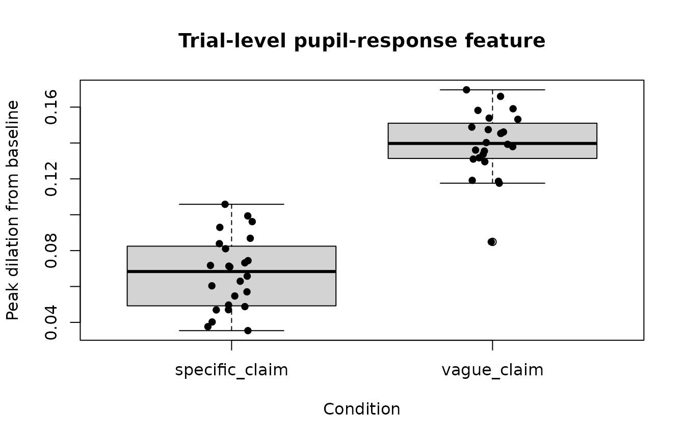
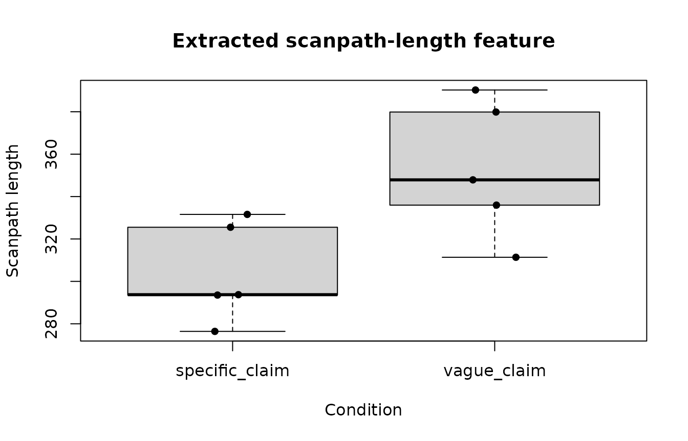

# Bayesian planning workflow

This article demonstrates how the Bayesian-planning helpers in
`gp3tools` can be used before committing to a full Bayesian model. The
workflow covers model-family selection, structural readiness checks,
pupil-response feature extraction, scanpath geometry, HDDM export
preparation, and `brms` template generation.

The helpers support analysis planning and reproducible preparation. They
do not require Stan, `brms`, HDDM, or Python unless the user
subsequently chooses to fit an external model.

``` r

library(gp3tools)

set.seed(42)
```

## Choose an outcome family before fitting

The statistical family should follow the scale and distribution of the
outcome rather than being selected after inspecting significance.

``` r

families <- recommend_gazepoint_model_family()

selected_metrics <- c(
  "fixation_duration",
  "dwell_time",
  "fixation_count",
  "aoi_proportion",
  "pupil_timecourse",
  "scanpath_length",
  "binary_choice"
)

families[
  families$metric %in% selected_metrics,
  ,
  drop = FALSE
]
#>               metric                                data_property
#> 1  fixation_duration                       positive, right-skewed
#> 2         dwell_time                       positive, right-skewed
#> 3     fixation_count      non-negative count, often overdispersed
#> 4     aoi_proportion           bounded proportion between 0 and 1
#> 6   pupil_timecourse continuous time-series, often autocorrelated
#> 11   scanpath_length                       positive, right-skewed
#> 13     binary_choice                           binary 0/1 outcome
#>                                             recommended_family
#> 1                                           lognormal or gamma
#> 2                                           lognormal or gamma
#> 3                                 negative binomial or Poisson
#> 4              beta or binomial after denominator construction
#> 6  Gaussian with smooth time terms; consider AR(1) sensitivity
#> 11                                          gamma or lognormal
#> 13                                          Bernoulli/binomial
#>                                        common_transform
#> 1                                      log(duration_ms)
#> 2                                         log(dwell_ms)
#> 3                                  none; model as count
#> 4             logit after boundary adjustment if needed
#> 6  baseline correction, smoothing, or time-course model
#> 11                                 log(scanpath_length)
#> 13                                                 none
#>                                                                          notes
#> 1                             Avoid Gaussian models on raw fixation durations.
#> 2               Avoid Gaussian models on raw dwell times when strongly skewed.
#> 3                            Check overdispersion before using Poisson models.
#> 4          Values exactly 0 or 1 require adjustment or a binomial formulation.
#> 6  Do not use repeated pointwise tests without accounting for time dependence.
#> 11               Interpret as search extent or inefficiency depending on task.
#> 13                                    Check response coding and class balance.
```

The recommendations are planning guidance. Distributional shape, zero
values, boundary values, overdispersion, hierarchical structure, and
study design still need to be inspected in the actual dataset.

## Simulate a compact pupil time course

The following synthetic dataset represents eight participants completing
six trials each. Negative times form a prestimulus baseline, and
positive times form the response window.

``` r

pupil <- expand.grid(
  subject = paste0(
    "S",
    sprintf("%02d", 1:8)
  ),
  trial = 1:6,
  time_ms = seq(
    -200,
    1000,
    by = 50
  )
)

pupil$condition <- ifelse(
  pupil$trial %% 2 == 0,
  "specific_claim",
  "vague_claim"
)

response_shape <- exp(
  -((pupil$time_ms - 450) / 260)^2
)

condition_shift <- ifelse(
  pupil$condition == "vague_claim",
  0.12,
  0.04
)

subject_effects <- setNames(
  rnorm(
    8,
    mean = 0,
    sd = 0.025
  ),
  paste0(
    "S",
    sprintf("%02d", 1:8)
  )
)

pupil$pupil_mm <- 3 +
  unname(
    subject_effects[pupil$subject]
  ) +
  condition_shift * response_shape +
  rnorm(
    nrow(pupil),
    mean = 0,
    sd = 0.025
  )

set.seed(123)

missing_rows <- sample(
  seq_len(nrow(pupil)),
  30
)

pupil$pupil_mm[missing_rows] <- NA_real_

head(pupil)
#>   subject trial time_ms   condition pupil_mm
#> 1     S01     1    -200 vague_claim 3.084966
#> 2     S02     1    -200 vague_claim 2.984546
#> 3     S03     1    -200 vague_claim 3.041932
#> 4     S04     1    -200 vague_claim 3.073219
#> 5     S05     1    -200 vague_claim 2.975617
#> 6     S06     1    -200 vague_claim 2.990609
```

## Plot the synthetic pupil time course

``` r

tc <- aggregate(
  pupil_mm ~ time_ms + condition,
  data = pupil,
  FUN = function(x) {
    mean(
      x,
      na.rm = TRUE
    )
  }
)

specific_tc <- tc[
  tc$condition == "specific_claim",
  ,
  drop = FALSE
]

vague_tc <- tc[
  tc$condition == "vague_claim",
  ,
  drop = FALSE
]

plot(
  specific_tc$time_ms,
  specific_tc$pupil_mm,
  type = "l",
  lwd = 2,
  ylim = range(
    tc$pupil_mm,
    na.rm = TRUE
  ),
  xlab = "Time from stimulus onset (ms)",
  ylab = "Mean pupil size (mm)",
  main = "Synthetic pupil time course"
)

lines(
  vague_tc$time_ms,
  vague_tc$pupil_mm,
  lty = 2,
  lwd = 2
)

abline(
  v = 0,
  lty = 3
)

legend(
  "topright",
  legend = c(
    "Specific claim",
    "Vague claim",
    "Stimulus onset"
  ),
  lty = c(
    1,
    2,
    3
  ),
  lwd = c(
    2,
    2,
    1
  ),
  bty = "n"
)
```


## Extract trial-level pupil-response features

[`summarize_gazepoint_pupil_response_features()`](https://stefanosbalaskas.github.io/gp3tools/reference/summarize_gazepoint_pupil_response_features.md)
calculates transparent trial-level summaries from sample-level pupil
data. The baseline and response windows are specified explicitly.

``` r

pupil_features <- summarize_gazepoint_pupil_response_features(
  data = pupil,
  pupil = "pupil_mm",
  time = "time_ms",
  subject = "subject",
  trial = "trial",
  baseline_window = c(
    -200,
    0
  ),
  response_window = c(
    0,
    1000
  ),
  condition = "condition"
)

head(pupil_features)
#>   subject trial baseline_mean peak_dilation latency_to_peak      auc
#> 1     S01     1      3.042491    0.11758386             400 44.77568
#> 2     S02     1      2.989078    0.14611109             450 49.00151
#> 3     S03     1      2.994252    0.16964340             450 71.03254
#> 4     S04     1      3.034405    0.08486674             450 20.73993
#> 5     S05     1      2.997575    0.15817413             500 71.29005
#> 6     S06     1      2.989950    0.14023499             450 68.23703
#>   missing_percent interpolated_percent   condition
#> 1         0.00000                   NA vague_claim
#> 2         0.00000                   NA vague_claim
#> 3         9.52381                   NA vague_claim
#> 4         0.00000                   NA vague_claim
#> 5         0.00000                   NA vague_claim
#> 6         0.00000                   NA vague_claim
```

The returned table includes the baseline mean, peak dilation, latency to
peak, area under the baseline-corrected curve, and response-window
missingness.

``` r

boxplot(
  peak_dilation ~ condition,
  data = pupil_features,
  xlab = "Condition",
  ylab = "Peak dilation from baseline",
  main = "Trial-level pupil-response feature"
)

stripchart(
  peak_dilation ~ condition,
  data = pupil_features,
  vertical = TRUE,
  method = "jitter",
  pch = 16,
  add = TRUE
)
```



## Check readiness before modelling

[`check_gazepoint_bayesian_readiness()`](https://stefanosbalaskas.github.io/gp3tools/reference/check_gazepoint_bayesian_readiness.md)
performs lightweight structural checks. It can identify missing columns,
insufficient within-participant observations, missing condition
variation, and problematic outcome values.

``` r

readiness <- check_gazepoint_bayesian_readiness(
  data = pupil_features,
  outcome = "peak_dilation",
  subject = "subject",
  trial = "trial",
  condition = "condition",
  metric_type = "continuous",
  min_observations_per_subject = 4
)

readiness
#>                      check status
#> 1         required_columns   pass
#> 2           outcome_values   pass
#> 3 observations_per_subject   pass
#> 4      condition_variation   pass
#> 5        trial_missingness   pass
#>                                            message
#> 1               All specified columns are present.
#> 2                Outcome contains observed values.
#> 3 Subjects meet the minimum observation threshold.
#> 4                 Condition has 2 observed levels.
#> 5   Subject-trial missingness is within threshold.
```

A warning is a prompt for review rather than an automatic exclusion
decision. The appropriate threshold depends on the study design,
outcome, planned model, and sensitivity analyses.

## Create a statistical analysis plan checklist

``` r

sap <- create_gazepoint_bayesian_sap(
  outcome = "Peak pupil dilation",
  design = paste(
    "Within-participant contrast between",
    "specific-claim and vague-claim trials"
  ),
  primary_model = "Bayesian hierarchical Gaussian model",
  baseline_window = c(
    -200,
    0
  ),
  analysis_window = c(
    0,
    1000
  ),
  missingness_threshold = 0.20,
  blink_padding_ms = 50,
  output = "data.frame"
)

sap
#>                   section                           item
#> 1            Study design                         Design
#> 2                 Outcome                Primary outcome
#> 3           Preprocessing Locked preprocessing decisions
#> 4          Blink handling                  Blink padding
#> 5             Missingness      Trial exclusion threshold
#> 6     Baseline correction                Baseline window
#> 7         Analysis window        Primary analysis window
#> 8            Model family                  Primary model
#> 9     Prior specification      Weakly informative priors
#> 10 Hierarchical structure     Participant/item structure
#> 11       MCMC diagnostics             Convergence checks
#> 12         Inference rule             Decision criterion
#> 13              Reporting      Reproducibility checklist
#>                                                                                      planned_specification
#> 1                                Within-participant contrast between specific-claim and vague-claim trials
#> 2                                                                                      Peak pupil dilation
#> 3                    Define filtering, interpolation, AOI assignment, and exclusion rules before analysis.
#> 4                                 50 ms before and after detected blink edges, unless otherwise justified.
#> 5                                                            Flag or exclude trials above 20% missingness.
#> 6                                                                                                [-200, 0]
#> 7                                                                                                [0, 1000]
#> 8                                                                     Bayesian hierarchical Gaussian model
#> 9                       Specify priors for fixed effects, residual scale, and hierarchical variance terms.
#> 10       Include participant-level structure; include item/stimulus structure when the design supports it.
#> 11              Require acceptable R-hat, effective sample size, and no problematic divergent transitions.
#> 12                     Define HDI, ROPE, Bayes factor, or posterior probability threshold before analysis.
#> 13 Report preprocessing decisions, model formula, priors, diagnostics, exclusions, and sensitivity checks.
```

The checklist makes preprocessing, exclusion, prior,
hierarchical-structure, convergence, and reporting decisions explicit
before the main analysis.

## Prepare an HDDM export

HDDM requires one row per decision trial with a participant identifier,
positive response time, and binary response. Continuous predictors can
be standardized within participant.

``` r

choice_data <- pupil_features

set.seed(456)

choice_data$rt <- runif(
  nrow(choice_data),
  min = 0.45,
  max = 1.40
)

choice_data$response <- sample(
  c(
    0,
    1
  ),
  nrow(choice_data),
  replace = TRUE
)

hddm_ready <- prepare_gazepoint_hddm_export(
  data = choice_data,
  subject = "subject",
  rt = "rt",
  response = "response",
  predictors = c(
    "peak_dilation",
    "auc"
  )
)

head(hddm_ready)
#>   subj_idx        rt response peak_dilation_z      auc_z
#> 1        1 0.5350740        1       0.4152555  0.4281994
#> 2        2 0.6499867        1       1.0289667  0.7169095
#> 3        3 1.1463075        1       1.3323233  1.2529888
#> 4        4 1.2595269        0      -0.3794053 -0.4520169
#> 5        5 1.1989780        1       0.8815185  1.2901689
#> 6        6 0.7653620        0       0.8771776  1.3177947
```

The helper does not fit a drift-diffusion model. The returned table can
be written to CSV and analysed in a separately documented Python/HDDM
environment.

## Create a `brms` model template without fitting

``` r

pupil_template <- create_gazepoint_brms_template(
  metric_type = "pupil_timecourse",
  outcome = "pupil_bc",
  time = "time_ms",
  condition = "condition",
  subject = "subject"
)

pupil_template
#> $metric_type
#> [1] "pupil_timecourse"
#> 
#> $formula
#> [1] "pupil_bc ~ condition + s(time_ms, by = condition, k = 5) + s(time_ms, subject, bs = \"fs\", k = 5)"
#> 
#> $family
#> [1] "gaussian()"
#> 
#> $priors
#> [1] "prior(normal(0, 1), class = \"b\")"      
#> [2] "prior(exponential(1), class = \"sigma\")"
#> [3] "prior(exponential(1), class = \"sd\")"   
#> 
#> $notes
#> [1] "Template only; inspect autocorrelation and consider AR(1) sensitivity."                
#> [2] "Use baseline-corrected pupil values when the research question concerns phasic change."
#> [3] "Report time window, baseline window, smoothing basis, and convergence diagnostics."
```

The output contains a candidate formula, family, prior text, and
reporting notes. It is deliberately a template rather than a fitted
model.

## Extract scanpath geometry

The next example creates synthetic sequential gaze coordinates and
extracts trial-level scanpath geometry.

``` r

set.seed(789)

scanpath <- do.call(
  rbind,
  lapply(
    1:10,
    function(trial_id) {
      n <- 25

      data.frame(
        subject = paste0(
          "S",
          sprintf(
            "%02d",
            ceiling(trial_id / 2)
          )
        ),
        trial = trial_id,
        condition = ifelse(
          trial_id %% 2 == 0,
          "specific_claim",
          "vague_claim"
        ),
        time_ms = seq_len(n) * 40,
        x = cumsum(
          rnorm(
            n,
            mean = ifelse(
              trial_id %% 2 == 0,
              9,
              13
            ),
            sd = 8
          )
        ) + 400,
        y = cumsum(
          rnorm(
            n,
            mean = 4,
            sd = 6
          )
        ) + 300
      )
    }
  )
)

head(scanpath)
#>   subject trial   condition time_ms        x        y
#> 1     S01     1 vague_claim      40 417.1928 300.9261
#> 2     S01     1 vague_claim      80 412.1066 303.3174
#> 3     S01     1 vague_claim     120 424.9492 306.1220
#> 4     S01     1 vague_claim     160 439.4143 315.2614
#> 5     S01     1 vague_claim     200 449.5235 318.2607
#> 6     S01     1 vague_claim     240 458.6476 320.0067
```

``` r

scan_features <- compute_gazepoint_scanpath_geometry(
  data = scanpath,
  x = "x",
  y = "y",
  subject = "subject",
  trial = "trial",
  time = "time_ms",
  condition = "condition"
)

head(scan_features)
#>   subject trial n_points scanpath_length straight_line_distance
#> 1     S01     1       25        311.3715               264.2228
#> 2     S01     2       25        325.5328               266.2296
#> 3     S02     3       25        379.8781               322.5578
#> 4     S02     4       25        293.5460               228.9091
#> 5     S03     5       25        335.9712               294.7388
#> 6     S03     6       25        276.4166               197.0523
#>   scanpath_efficiency convex_hull_area spatial_dispersion      condition
#> 1           0.8485774         5226.757           74.65742    vague_claim
#> 2           0.8178273         5690.127           73.83522 specific_claim
#> 3           0.8491087         5538.208           77.28721    vague_claim
#> 4           0.7798067         5346.367           56.10669 specific_claim
#> 5           0.8772739         5220.571           83.83887    vague_claim
#> 6           0.7128816         3924.023           50.72105 specific_claim
```

The output includes scanpath length, straight-line distance, path
efficiency, convex-hull area, spatial dispersion, and the number of
valid points.

``` r

one_trial <- scanpath[
  scanpath$trial == 1,
  ,
  drop = FALSE
]

plot(
  one_trial$x,
  one_trial$y,
  type = "b",
  pch = 16,
  xlab = "Screen x-coordinate",
  ylab = "Screen y-coordinate",
  main = "Example synthetic scanpath"
)

text(
  one_trial$x[
    c(
      1,
      nrow(one_trial)
    )
  ],
  one_trial$y[
    c(
      1,
      nrow(one_trial)
    )
  ],
  labels = c(
    "Start",
    "End"
  ),
  pos = c(
    2,
    4
  )
)
```


``` r

boxplot(
  scanpath_length ~ condition,
  data = scan_features,
  xlab = "Condition",
  ylab = "Scanpath length",
  main = "Extracted scanpath-length feature"
)

stripchart(
  scanpath_length ~ condition,
  data = scan_features,
  vertical = TRUE,
  method = "jitter",
  pch = 16,
  add = TRUE
)
```



## Interpretation boundary

The helpers above produce model-ready quantities and reproducible
planning objects. They do not independently establish deeper cognition,
critical evaluation, comprehension, credibility assessment, or a causal
psychological mechanism.

Eye-movement measures can support claims about visual allocation,
timing, sequence, and movement geometry. Pupil measures can support
claims about pupil dynamics under documented preprocessing and luminance
control. Stronger psychological interpretations require an explicit
experimental design, preregistered contrasts, validated complementary
measures, suitable models, and appropriately cautious language.
