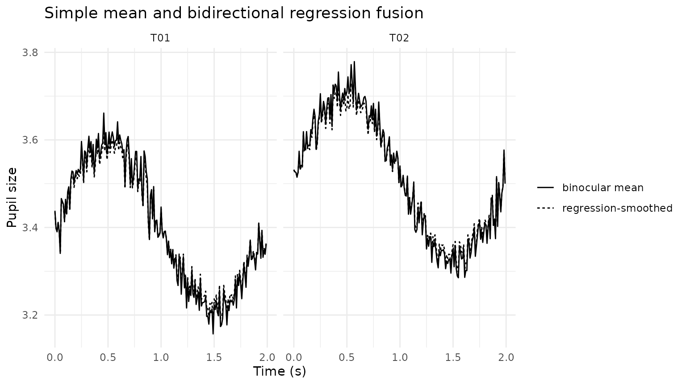
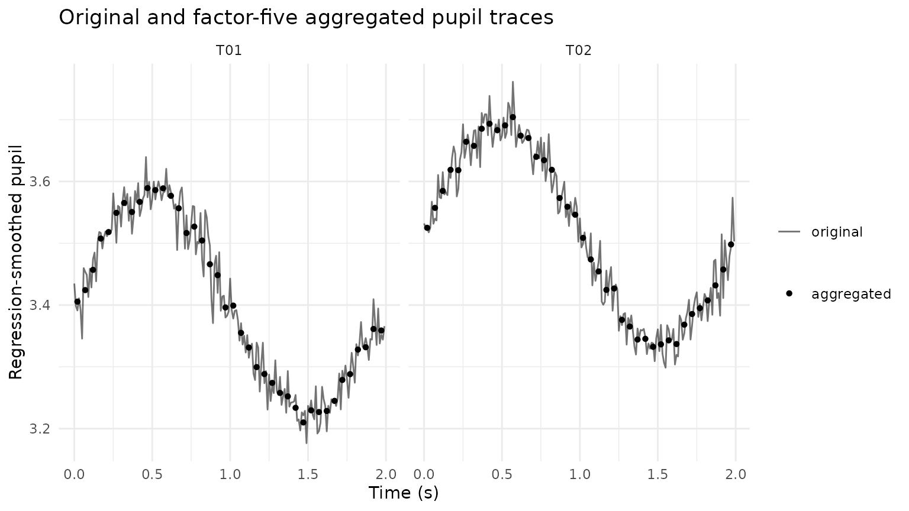

# Binocular Pupil Fusion and Downsampling

## Purpose

This article demonstrates three lightweight binocular pupil operations:

- sample-wise left/right averaging;
- cross-eye regression as a diagnostic smoothing and fusion method;
- integer-factor aggregation for lower-frequency analysis tables.

Regression-based fusion is a preprocessing device, not a causal model.
It should be compared with the simple binocular mean and inspected
visually.

## Simulate binocular pupil measurements

``` r

set.seed(2026)

n <- 400
pupil <- data.frame(
  USER_ID = "P01",
  trial = rep(c("T01", "T02"), each = n / 2),
  TIME = rep(seq(0, 1.99, by = 0.01), 2)
)

latent <- 3.4 +
  0.20 * sin(2 * pi * pupil$TIME / 2) +
  ifelse(pupil$trial == "T02", 0.12, 0)

pupil$LPupil <- latent + rnorm(n, 0, 0.035)
pupil$RPupil <- 0.10 + 0.97 * latent + rnorm(n, 0, 0.045)

pupil$LPupil[85:90] <- NA_real_
pupil$RPupil[250:255] <- NA_real_
```

## Mean binocular pupil

``` r

pupil_mean <- mean_gazepoint_pupil(
  pupil,
  lp_col = "LPupil",
  rp_col = "RPupil"
)

head(pupil_mean)
#>   USER_ID trial TIME   LPupil   RPupil mean_pupil
#> 1     P01   T01 0.00 3.418221 3.458160   3.438190
#> 2     P01   T01 0.01 3.368493 3.428966   3.398729
#> 3     P01   T01 0.02 3.417431 3.362638   3.390035
#> 4     P01   T01 0.03 3.415855 3.407699   3.411777
#> 5     P01   T01 0.04 3.401734 3.381400   3.391567
#> 6     P01   T01 0.05 3.343224 3.338307   3.340765
```

## Regression-smoothed binocular trace

``` r

pupil_regressed <- regress_gazepoint_pupils(
  pupil_mean,
  lp_col = "LPupil",
  rp_col = "RPupil",
  group_cols = "trial",
  direction = "bidirectional",
  min_complete = 20
)

ggplot(pupil_regressed, aes(TIME)) +
  geom_line(aes(y = mean_pupil, linetype = "binocular mean")) +
  geom_line(
    aes(y = pupil_regressed, linetype = "regression-smoothed")
  ) +
  facet_wrap(~ trial) +
  labs(
    x = "Time (s)",
    y = "Pupil size",
    linetype = NULL,
    title = "Simple mean and bidirectional regression fusion"
  ) +
  theme_minimal()
```



## Downsample by aggregation

``` r

downsampled <- downsample_gazepoint_pupil(
  pupil_regressed,
  factor = 5,
  pupil_cols = c("mean_pupil", "pupil_regressed"),
  group_cols = "trial",
  method = "mean"
)

downsampled[c(
  "USER_ID", "trial", "TIME", "mean_pupil",
  "pupil_regressed", "n_samples_aggregated"
)]
#>    USER_ID trial TIME mean_pupil pupil_regressed n_samples_aggregated
#> 1      P01   T01 0.02   3.406060        3.405537                    5
#> 2      P01   T01 0.07   3.426607        3.424201                    5
#> 3      P01   T01 0.12   3.462294        3.456954                    5
#> 4      P01   T01 0.17   3.517100        3.507570                    5
#> 5      P01   T01 0.22   3.528636        3.518122                    5
#> 6      P01   T01 0.27   3.561813        3.549142                    5
#> 7      P01   T01 0.32   3.580049        3.565231                    5
#> 8      P01   T01 0.37   3.563482        3.550576                    5
#> 9      P01   T01 0.42   3.581730        3.566917                    5
#> 10     P01   T01 0.47   3.605743        3.589242                    5
#> 11     P01   T01 0.52   3.602805        3.586000                    5
#> 12     P01   T01 0.57   3.606107        3.588827                    5
#> 13     P01   T01 0.62   3.592798        3.576783                    5
#> 14     P01   T01 0.67   3.570636        3.556598                    5
#> 15     P01   T01 0.72   3.526235        3.516570                    5
#> 16     P01   T01 0.77   3.537948        3.526896                    5
#> 17     P01   T01 0.82   3.515365        3.504422                    5
#> 18     P01   T01 0.87   3.477966        3.466015                    5
#> 19     P01   T01 0.92   3.452920        3.448370                    5
#> 20     P01   T01 0.97   3.395671        3.396116                    5
#> 21     P01   T01 1.02   3.399185        3.399106                    5
#> 22     P01   T01 1.07   3.351154        3.355010                    5
#> 23     P01   T01 1.12   3.325569        3.331277                    5
#> 24     P01   T01 1.17   3.290389        3.299622                    5
#> 25     P01   T01 1.22   3.278119        3.288305                    5
#> 26     P01   T01 1.27   3.262955        3.274031                    5
#> 27     P01   T01 1.32   3.245099        3.257837                    5
#> 28     P01   T01 1.37   3.239445        3.252198                    5
#> 29     P01   T01 1.42   3.219079        3.233713                    5
#> 30     P01   T01 1.47   3.193245        3.210037                    5
#> 31     P01   T01 1.52   3.214488        3.229603                    5
#> 32     P01   T01 1.57   3.211649        3.226858                    5
#> 33     P01   T01 1.62   3.213432        3.228600                    5
#> 34     P01   T01 1.67   3.231430        3.244935                    5
#> 35     P01   T01 1.72   3.268532        3.278790                    5
#> 36     P01   T01 1.77   3.278487        3.288201                    5
#> 37     P01   T01 1.82   3.321847        3.327963                    5
#> 38     P01   T01 1.87   3.325475        3.331715                    5
#> 39     P01   T01 1.92   3.357753        3.361272                    5
#> 40     P01   T01 1.97   3.354897        3.358814                    5
#> 41     P01   T02 0.02   3.525127        3.525016                    5
#> 42     P01   T02 0.07   3.561779        3.557225                    5
#> 43     P01   T02 0.12   3.589581        3.584771                    5
#> 44     P01   T02 0.17   3.629075        3.618805                    5
#> 45     P01   T02 0.22   3.625470        3.618239                    5
#> 46     P01   T02 0.27   3.675440        3.664186                    5
#> 47     P01   T02 0.32   3.669991        3.657636                    5
#> 48     P01   T02 0.37   3.699209        3.685331                    5
#> 49     P01   T02 0.42   3.708360        3.693398                    5
#> 50     P01   T02 0.47   3.701380        3.682958                    5
#> 51     P01   T02 0.52   3.729342        3.690737                    5
#> 52     P01   T02 0.57   3.717891        3.704117                    5
#> 53     P01   T02 0.62   3.687321        3.674037                    5
#> 54     P01   T02 0.67   3.683062        3.670281                    5
#> 55     P01   T02 0.72   3.651660        3.639844                    5
#> 56     P01   T02 0.77   3.643433        3.634425                    5
#> 57     P01   T02 0.82   3.627110        3.618820                    5
#> 58     P01   T02 0.87   3.578635        3.573191                    5
#> 59     P01   T02 0.92   3.564069        3.559027                    5
#> 60     P01   T02 0.97   3.548015        3.546169                    5
#> 61     P01   T02 1.02   3.507681        3.508686                    5
#> 62     P01   T02 1.07   3.471854        3.473871                    5
#> 63     P01   T02 1.12   3.448815        3.454421                    5
#> 64     P01   T02 1.17   3.415969        3.424549                    5
#> 65     P01   T02 1.22   3.420349        3.426825                    5
#> 66     P01   T02 1.27   3.367567        3.376044                    5
#> 67     P01   T02 1.32   3.351691        3.365217                    5
#> 68     P01   T02 1.37   3.332046        3.344191                    5
#> 69     P01   T02 1.42   3.332714        3.345344                    5
#> 70     P01   T02 1.47   3.320529        3.332392                    5
#> 71     P01   T02 1.52   3.322918        3.336429                    5
#> 72     P01   T02 1.57   3.328608        3.342867                    5
#> 73     P01   T02 1.62   3.322809        3.336897                    5
#> 74     P01   T02 1.67   3.357324        3.368255                    5
#> 75     P01   T02 1.72   3.376063        3.385486                    5
#> 76     P01   T02 1.77   3.385886        3.394967                    5
#> 77     P01   T02 1.82   3.400034        3.407483                    5
#> 78     P01   T02 1.87   3.426062        3.431870                    5
#> 79     P01   T02 1.92   3.453486        3.457513                    5
#> 80     P01   T02 1.97   3.496755        3.498066                    5
```

``` r

ggplot() +
  geom_line(
    data = pupil_regressed,
    aes(TIME, pupil_regressed, linetype = "original"),
    alpha = 0.55
  ) +
  geom_point(
    data = downsampled,
    aes(TIME, pupil_regressed, shape = "aggregated"),
    size = 1.5
  ) +
  facet_wrap(~ trial) +
  labs(
    x = "Time (s)",
    y = "Regression-smoothed pupil",
    linetype = NULL,
    shape = NULL,
    title = "Original and factor-five aggregated pupil traces"
  ) +
  theme_minimal()
```



## Recommended reporting

Report which eye columns were used, how missing monocular values were
handled, the regression direction, the minimum complete binocular
samples required, the fallback rule, the downsampling factor, and
whether samples were averaged or decimated.
