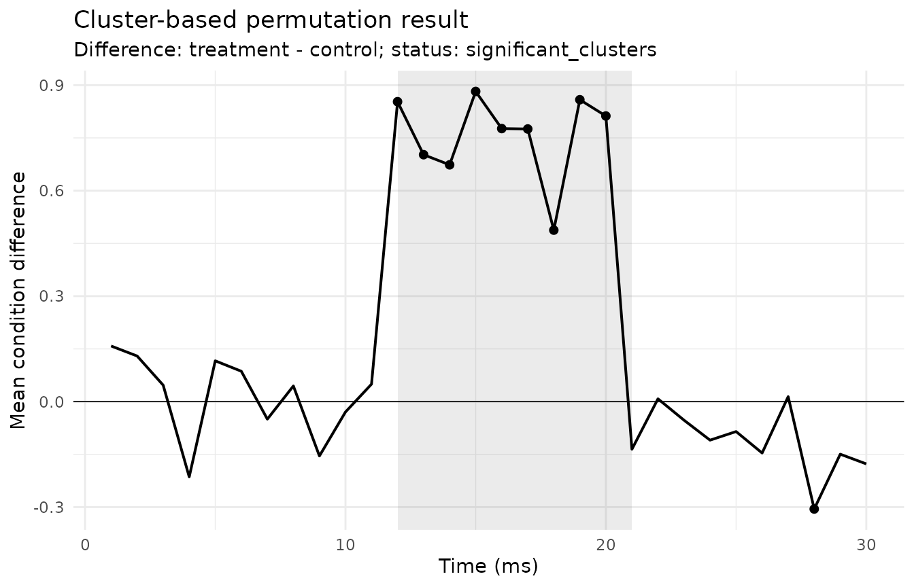

# Cluster-permutation time-course workflow

This article gives a compact example of the conservative
cluster-permutation workflow in `gp3tools`. The workflow is intended for
two-condition, within-subject, one-dimensional time-course data. It is
suitable for cautious screening of time-contiguous effects, not for
exact onset or offset claims.

## Simulated example data

``` r

set.seed(123)

raw <- simulate_gazepoint_cluster_timecourse_data(
  n_subjects = 12,
  n_time_bins = 30,
  conditions = c("control", "treatment"),
  effect_start = 12,
  effect_end = 20,
  effect_size = 0.7,
  seed = 123
)

head(raw)
#>   subject condition time_bin      outcome
#> 1    S001   control        1  0.023352640
#> 2    S002   control        1  0.006406593
#> 3    S003   control        1  0.276462794
#> 4    S004   control        1  0.767104526
#> 5    S005   control        1  0.269113265
#> 6    S006   control        1 -0.240940613
```

## Prepare the time-course grid

[`prepare_gazepoint_timecourse_test_data()`](https://stefanosbalaskas.github.io/gp3tools/reference/prepare_gazepoint_timecourse_test_data.md)
converts a long-format data set into the internal column contract
expected by
[`run_gazepoint_cluster_permutation()`](https://stefanosbalaskas.github.io/gp3tools/reference/run_gazepoint_cluster_permutation.md).

``` r

prepared <- prepare_gazepoint_timecourse_test_data(
  raw,
  subject_col = "subject",
  condition_col = "condition",
  time_col = "time_bin",
  outcome_col = "outcome",
  condition_order = c("control", "treatment")
)

head(prepared)
#>   .gp3_cluster_subject .gp3_cluster_condition .gp3_cluster_time_bin
#> 1                 S001                control                     1
#> 2                 S001              treatment                     1
#> 3                 S001                control                     2
#> 4                 S001              treatment                     2
#> 5                 S001                control                     3
#> 6                 S001              treatment                     3
#>   .gp3_cluster_outcome .gp3_cluster_status
#> 1           0.02335264                  ok
#> 2          -0.38697165                  ok
#> 3           0.11443486                  ok
#> 4           0.20485385                  ok
#> 5           0.07188089                  ok
#> 6           0.32232050                  ok
```

## Audit the grid

Before running a cluster-permutation workflow, check whether the data
grid is complete, paired, and compatible with the validated
two-condition workflow.

``` r

grid_audit <- audit_gazepoint_timecourse_grid(prepared)

grid_audit$grid_summary
#>   n_input_rows n_valid_rows n_subjects n_conditions n_time_bins
#> 1          720          720         12            2          30
#>   n_expected_cells n_observed_cells n_missing_cells n_duplicate_cells
#> 1              720              720               0                 0
#>   n_unpaired_subject_time_cells
#> 1                             0
grid_audit$readiness
#>                            check passed
#> 1         exactly_two_conditions   TRUE
#> 2          no_missing_grid_cells   TRUE
#> 3             no_duplicate_cells   TRUE
#> 4 no_unpaired_subject_time_cells   TRUE
#> 5                numeric_outcome   TRUE
```

``` r

design_diagnostic <- diagnose_gazepoint_cluster_design(prepared)

design_diagnostic
#>         diagnostic                                                    value
#> 1       conditions                                                        2
#> 2 paired_time_grid                                                        0
#> 3       duplicates                                                        0
#> 4      sample_size                                                       12
#> 5        time_bins                                                       30
#> 6  validated_scope two-condition within-subject one-dimensional time course
#>   passed
#> 1   TRUE
#> 2   TRUE
#> 3   TRUE
#> 4   TRUE
#> 5   TRUE
#> 6   TRUE
#>                                                                                                                         interpretation
#> 1                                                                    The implemented inferential engine is for exactly two conditions.
#> 2                                                                      Each subject-time cell should have both conditions represented.
#> 3                                                                     Duplicate cells should be aggregated before permutation testing.
#> 4                                                                         Permutation stability depends on the number of paired units.
#> 5                                                                     Cluster formation requires an ordered one-dimensional time grid.
#> 6 ANOVA, mixed-model, TFCE, multidimensional, covariate-adjusted, and parallel engines are intentionally outside this validated scope.
```

## Run the cluster-permutation workflow

For a fast documentation example, this article uses a small number of
permutations. Real analyses should use a larger number and report the
settings.

``` r

cluster_result <- run_gazepoint_cluster_permutation(
  prepared,
  condition_order = c("control", "treatment"),
  n_permutations = 99,
  cluster_threshold = 1.5,
  min_time_bins = 2,
  seed = 123
)

names(cluster_result)
#> [1] "timecourse"               "clusters"                
#> [3] "permutation_distribution" "data"                    
#> [5] "settings"                 "model_status"            
#> [7] "n_subjects"               "n_time_bins"             
#> [9] "warning"
```

## Summarise clusters

``` r

cluster_summary <- summarize_gazepoint_time_clusters(cluster_result)

cluster_summary
#>   cluster_id cluster_direction start_time_bin end_time_bin n_time_bins
#> 1          1          positive             12           20           9
#>   cluster_statistic p_value cluster_significant cluster_summary_status
#> 1          42.47172    0.01                TRUE                     ok
```

## Plot the cluster result

``` r

plot_gazepoint_cluster_permutation(
  cluster_result,
  plot_type = "difference",
  significant_only = FALSE
)
```



## Cautious report text

[`report_gazepoint_cluster_permutation()`](https://stefanosbalaskas.github.io/gp3tools/reference/report_gazepoint_cluster_permutation.md)
returns a compact report object. The generated wording is deliberately
cautious: detected ranges are treated as cluster-level time intervals,
not as exact effect-onset or effect-offset estimates.

``` r

cluster_report <- report_gazepoint_cluster_permutation(cluster_result)

cluster_report$report_text
#> [1] "The cluster-permutation workflow identified 1 cluster(s) below alpha = 0.05 over the following time-bin range(s): 12-20 (p = 0.01) . These ranges should be reported as cluster-level time intervals, not as precise effect-onset or effect-offset estimates."
```

## Threshold sensitivity

Cluster-level results can depend on the cluster-forming threshold. A
compact sensitivity table helps document whether the broad pattern is
stable across reasonable threshold choices.

``` r

threshold_sensitivity <- run_gazepoint_cluster_threshold_sensitivity(
  prepared,
  thresholds = c(1.25, 1.5, 1.75),
  condition_order = c("control", "treatment"),
  n_permutations = 49,
  min_time_bins = 2,
  seed = 123
)

threshold_sensitivity$summary
#>   cluster_threshold n_clusters n_significant_clusters min_p_value
#> 1              1.25          1                      1        0.02
#> 2              1.50          1                      1        0.02
#> 3              1.75          1                      1        0.02
```

## External export helpers

The external export helpers prepare long-format files and README notes
for possible continuation in specialist tools. They do not run or
validate the external analyses.

``` r

external_dir <- tempfile("gp3_cluster_export_")

external_files <- export_gazepoint_mne_cluster_input(
  prepared,
  outdir = external_dir
)

external_files
#>                                                                           file
#> 1   /tmp/RtmpZAjj4X/gp3_cluster_export_390530ff388c/mne_cluster_long_input.csv
#> 2 /tmp/RtmpZAjj4X/gp3_cluster_export_390530ff388c/README_mne_cluster_input.txt
#>      file_type export_status
#> 1 mne_long_csv            ok
#> 2       readme            ok
```

## Guardrails for unsupported extensions

Some advanced method names are available as explicit guardrails. They
intentionally stop with explanatory messages rather than silently
supporting methods outside the validated scope.

``` r

try(run_gazepoint_tfce(), silent = TRUE)
```
