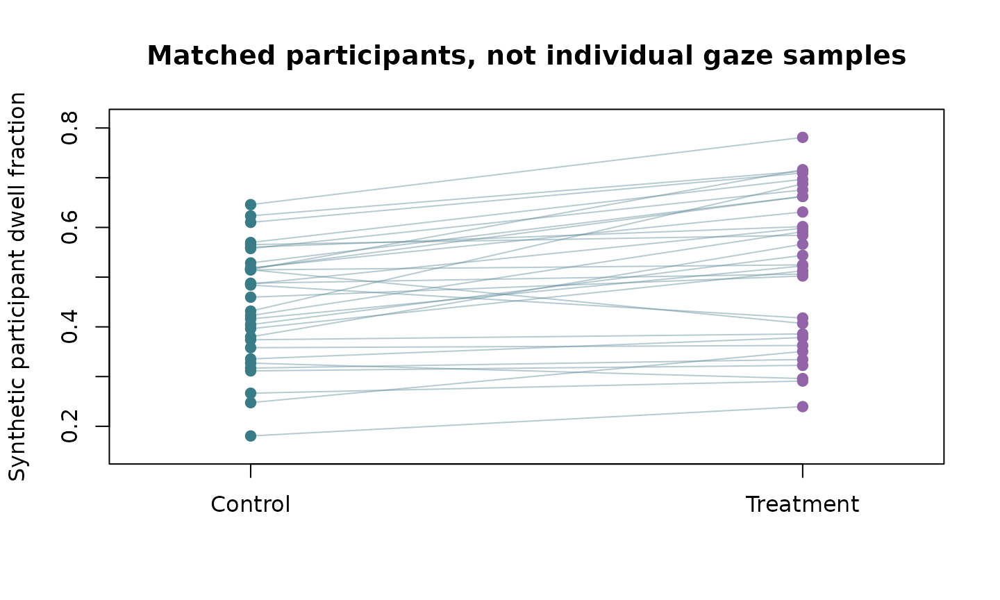
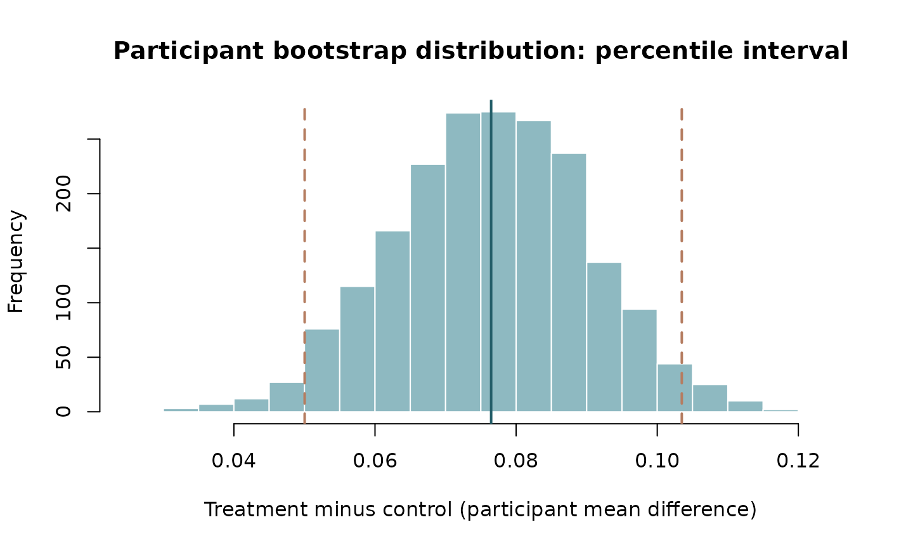

# DABEST-style estimation graphics for Gazepoint studies

## Raw observations, contrast estimation and scientific independence

The [DABEST Python](https://acclab.github.io/DABEST-python/) and
[official R dabestr implementation](https://acclab.github.io/dabestr/)
provide Gardner–Altman and Cumming estimation plots: raw measurements,
paired slopegraphs when warranted, bootstrap effect-size distributions,
and confidence intervals.

**Use the actual R dabestr package** when you want its validated
plotting API or BCa confidence intervals rather than copying Python
internals. A narrower original, participant-level ggplot implementation
is in the development branch of
[gpbiometrics](https://github.com/stefanosbalaskas/gpbiometrics),
`plot_gazepoint_estimation()`. For a strict GP3 analysis, first
aggregate fixation/AOI/pupil measures to the estimand’s
participant/trial unit.

``` r

# Conceptual example of a participant-level comparison, not real study data:
library(dabestr)
dabest_obj <- dabestr::load(
  summary_by_participant, x = Condition, y = MeanDwell,
  idx = c("Control", "Treatment")
)
dabestr::dabest_plot(dabestr::mean_diff(dabest_obj), float_contrast = FALSE)
```

Do **not** treat raw 60-Hz gaze samples as independent participants. For
repeated-participant conditions supply a unique subject ID to dabestr’s
paired loading mode, or use `gpbiometrics::plot_gazepoint_estimation`
with `paired=TRUE` on matched participant-level rows.

For model-adjusted contrasts or random-effects GLMM estimates, raw mean
difference plots are descriptive and should be accompanied by a separate
model-based effect/uncertainty visualization, not substituted for the
hierarchical inferential estimand.

This is an educational integration note and adds **no duplicate
estimator** to gp3tools. No release has been triggered.

### Rendered paired estimation demonstration (synthetic)

The plots below are computed during website construction using only base
R. They illustrate the **visual grammar** of paired estimation, rather
than claiming to be DABEST output or its BCa bootstrap estimator.

``` r

set.seed(20261009)
n <- 32L
baseline <- stats::rnorm(n, mean = .48, sd = .11)
treatment <- baseline + stats::rnorm(n, mean = .09, sd = .07)
graphics::plot(
  NA, xlim = c(.8, 2.2),
  ylim = range(baseline, treatment) + c(-.03, .03),
  xaxt = "n", xlab = "", ylab = "Synthetic participant dwell fraction",
  main = "Matched participants, not individual gaze samples"
)
graphics::axis(1, at = 1:2, labels = c("Control", "Treatment"))
graphics::segments(
  1, baseline, 2, treatment,
  col = grDevices::adjustcolor("#608B9A", alpha.f = .45)
)
graphics::points(rep(1, n), baseline, pch = 19, col = "#387C88")
graphics::points(rep(2, n), treatment, pch = 19, col = "#9265AA")
```



``` r

difference <- treatment - baseline
resampled <- replicate(
  2000L, mean(sample(difference, size = length(difference), replace = TRUE))
)
bounds <- stats::quantile(resampled, c(.025, .975))
graphics::hist(
  resampled, breaks = 25, col = "#8EB9C1", border = "white",
  xlab = "Treatment minus control (participant mean difference)",
  main = "Participant bootstrap distribution: percentile interval"
)
graphics::abline(v = mean(difference), col = "#245E69", lwd = 2)
graphics::abline(v = bounds, col = "#B57D61", lty = 2, lwd = 2)
```



These are **synthetic practice figures**, not empirical evidence.
Bootstrap resamples entire participant differences; the result is a
percentile interval, **not** the BCa interval of the maintained R
`dabestr` implementation. The full fitted-model uncertainty remains
necessary for clustered generalized or multilevel estimands.
