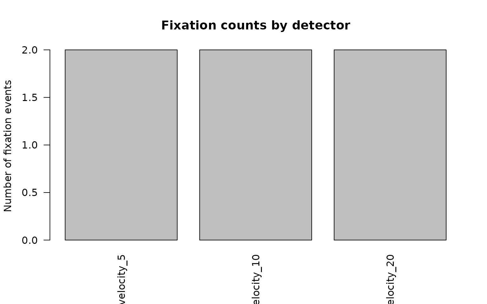
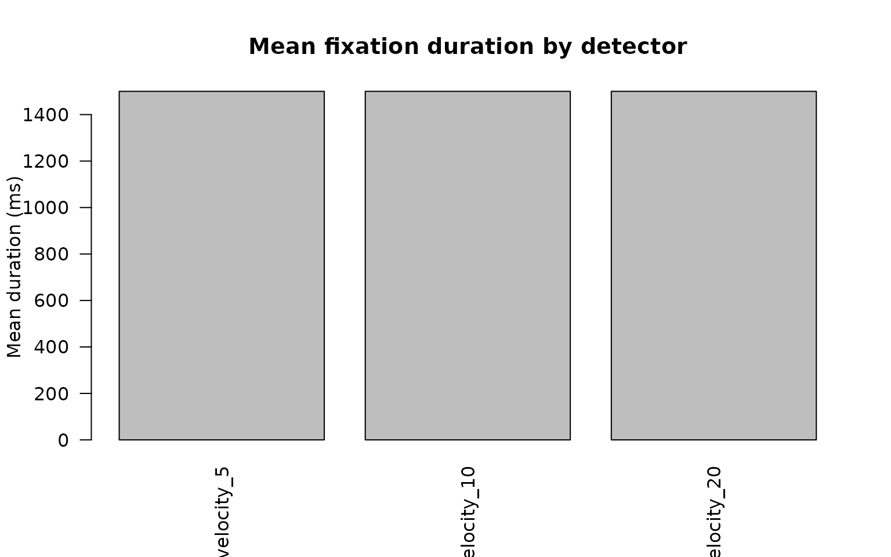
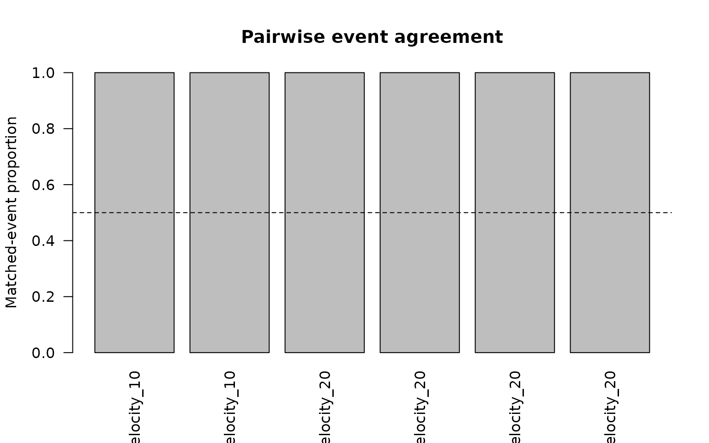

# Event-detector comparison workflow

## Scope

Different event detectors implement different definitions and
thresholds.
[`compare_gazepoint_event_detectors()`](https://stefanosbalaskas.github.io/gp3tools/reference/compare_gazepoint_event_detectors.md)
places native velocity-threshold, lightweight HMM, and optional eyetools
outputs into a common event table.

Agreement indicates methodological convergence between detector
definitions. It does not establish that one detector recovers a uniquely
true cognitive event sequence.

``` r

library(gp3tools)
```

## Synthetic gaze trace

``` r

n <- 180L

gaze <- data.frame(
  USER_ID = rep("P01", n),
  trial = rep(c("T01", "T02"), each = n / 2),
  TIME = seq(0, by = 1 / 60, length.out = n),
  FPOGX = c(
    rep(0.20, 55),
    seq(0.20, 0.80, length.out = 10),
    rep(0.80, 55),
    seq(0.80, 0.35, length.out = 10),
    rep(0.35, 50)
  ),
  FPOGY = 0.50,
  stringsAsFactors = FALSE
)

utils::head(gaze)
#>   USER_ID trial       TIME FPOGX FPOGY
#> 1     P01   T01 0.00000000   0.2   0.5
#> 2     P01   T01 0.01666667   0.2   0.5
#> 3     P01   T01 0.03333333   0.2   0.5
#> 4     P01   T01 0.05000000   0.2   0.5
#> 5     P01   T01 0.06666667   0.2   0.5
#> 6     P01   T01 0.08333333   0.2   0.5
```

## Compare velocity thresholds and the HMM branch

``` r

comparison <- compare_gazepoint_event_detectors(
  data = gaze,
  id_col = "USER_ID",
  trial_col = "trial",
  x_col = "FPOGX",
  y_col = "FPOGY",
  time_col = "TIME",
  methods = c("velocity", "hmm"),
  velocity_thresholds = c(5, 10, 20),
  min_duration = 60,
  hmm_states = 3,
  min_overlap = 0.5
)

comparison$runs
#>       detector   family status n_events
#> 1   velocity_5 velocity     ok        2
#> 2  velocity_10 velocity     ok        2
#> 3  velocity_20 velocity     ok        2
#> 4 hmm_3_states      hmm  error       NA
#>                                                 message
#> 1                                                  <NA>
#> 2                                                  <NA>
#> 3                                                  <NA>
#> 4 `HMM output` is missing required column(s): velocity.
```

A detector branch that cannot be fitted is recorded in `runs` while
successful branches remain available for review.

## Detector-level summaries

``` r

comparison$detector_summary
#>      detector   family threshold n_fixations mean_duration_ms
#> 1  velocity_5 velocity         5           2             1500
#> 2 velocity_10 velocity        10           2             1500
#> 3 velocity_20 velocity        20           2             1500
#>   median_duration_ms total_duration_ms
#> 1               1500              3000
#> 2               1500              3000
#> 3               1500              3000
```

The summary reports fixation counts and duration distributions. Large
differences indicate sensitivity to event-definition choices.

``` r

plot_gazepoint_event_detector_agreement(
  comparison,
  plot = "counts"
)
```



``` r

plot_gazepoint_event_detector_agreement(
  comparison,
  plot = "durations"
)
```



## Pairwise interval agreement

``` r

comparison$pairwise_agreement
#>   USER_ID trial  detector_a  detector_b n_a n_b matched_a matched_b agreement_a
#> 1     P01   T01  velocity_5 velocity_10   1   1         1         1           1
#> 2     P01   T02  velocity_5 velocity_10   1   1         1         1           1
#> 3     P01   T01  velocity_5 velocity_20   1   1         1         1           1
#> 4     P01   T02  velocity_5 velocity_20   1   1         1         1           1
#> 5     P01   T01 velocity_10 velocity_20   1   1         1         1           1
#> 6     P01   T02 velocity_10 velocity_20   1   1         1         1           1
#>   agreement_b mean_best_overlap_a mean_best_overlap_b min_overlap
#> 1           1                   1                   1         0.5
#> 2           1                   1                   1         0.5
#> 3           1                   1                   1         0.5
#> 4           1                   1                   1         0.5
#> 5           1                   1                   1         0.5
#> 6           1                   1                   1         0.5
```

Events are compared by interval intersection-over-union. The directional
agreement columns distinguish the proportion of events from detector A
that match detector B from the reverse comparison.

``` r

if (nrow(comparison$pairwise_agreement)) {
  plot_gazepoint_event_detector_agreement(
    comparison,
    plot = "agreement"
  )
}
```



## Unmatched events

``` r

utils::head(comparison$unmatched_events)
#> # A tibble: 0 × 15
#> # ℹ 15 variables: USER_ID <chr>, trial <chr>, detector <chr>, family <chr>,
#> #   threshold <dbl>, event_id <int>, start_time <dbl>, end_time <dbl>,
#> #   duration_ms <dbl>, mean_x <dbl>, mean_y <dbl>, n_samples <int>,
#> #   source_status <chr>, compared_with <chr>, best_overlap <dbl>
```

Unmatched events support targeted review of threshold sensitivity,
boundary differences, short events, and detector-specific segmentation.

## Optional eyetools branch

The external branch remains optional and is never a required package
dependency.

``` r

comparison_external <- compare_gazepoint_event_detectors(
  data = gaze,
  id_col = "USER_ID",
  trial_col = "trial",
  x_col = "FPOGX",
  y_col = "FPOGY",
  time_col = "TIME",
  methods = c("velocity", "hmm", "eyetools"),
  run_optional_eyetools = TRUE,
  eyetools_method = "vti"
)
```

When `eyetools` is unavailable or the optional branch is disabled, the
run table records an explicit skip status.

## Reporting

Report:

- coordinate units and any conversion to visual degrees;
- sampling rate and timestamp units;
- velocity thresholds;
- minimum event durations;
- HMM state count;
- eyetools method and parameters when used;
- interval-overlap criterion;
- detector-specific event counts and durations;
- pairwise agreement and unmatched-event rates.

Treat detector comparison as a sensitivity and validation exercise
rather than as evidence that one algorithm captures the only valid event
structure.
