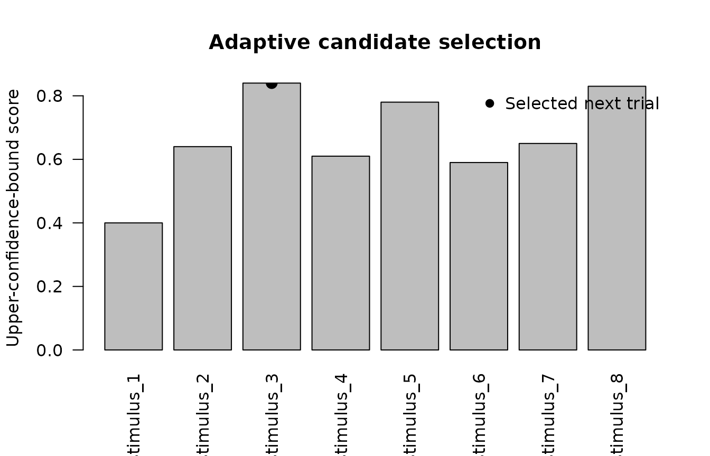

# Experimental Bayesian bridge helpers

The experimental bridge helpers connect `gp3tools` outputs with optional
Bayesian and machine-learning workflows while keeping heavy external
dependencies outside the core package.

The helpers support reproducible preparation and diagnostics. They do
not make an external model automatically valid, and they do not replace
domain-specific validation.

``` r

library(gp3tools)

set.seed(101)
```

## Optional `brms` fitting

[`fit_gazepoint_brms_model()`](https://stefanosbalaskas.github.io/gp3tools/reference/fit_gazepoint_brms_model.md)
calls [`brms::brm()`](https://paulbuerkner.com/brms/reference/brm.html)
only when `brms` is installed. A complete fit can also require a working
Stan backend, appropriate priors, sufficient sampling, and convergence
assessment.

The following is a template and is not evaluated while the article is
built:

``` r

fit <- fit_gazepoint_brms_model(
  data = model_data,
  formula = pupil_peak ~ condition + (1 | subject),
  family = "gaussian",
  chains = 4,
  iter = 2000,
  warmup = 1000,
  cores = 4,
  backend = "cmdstanr"
)

summary(fit)
```

For documentation or preregistration, users can first create a
dependency-free template:

``` r

dwell_template <- create_gazepoint_brms_template(
  metric_type = "dwell_time",
  outcome = "claim_dwell_ms",
  condition = "condition",
  subject = "subject",
  item = "stimulus"
)

dwell_template
#> $metric_type
#> [1] "dwell_time"
#> 
#> $formula
#> [1] "claim_dwell_ms ~ condition + (1 | subject) + (1 | stimulus)"
#> 
#> $family
#> [1] "lognormal()"
#> 
#> $priors
#> [1] "prior(normal(0, 1), class = \"b\")"   
#> [2] "prior(exponential(1), class = \"sd\")"
#> 
#> $notes
#> [1] "Template only; adapt priors to the scale of the outcome."             
#> [2] "Check missingness, distributional shape, and convergence diagnostics."
#> [3] "Prefer optional brms/Stan use outside the core package workflow."
```

## Generate an HDDM fitting script

The R package does not import HDDM or execute Python. Instead, it can
create a reproducible Python script from an HDDM-ready CSV export.

``` r

hddm_data <- data.frame(
  subj_idx = rep(
    1:4,
    each = 8
  ),
  rt = runif(
    32,
    min = 0.45,
    max = 1.40
  ),
  response = sample(
    c(
      0,
      1
    ),
    32,
    replace = TRUE
  ),
  target_dwell_ms_z = rnorm(32),
  pupil_peak_z = rnorm(32)
)

head(hddm_data)
#>   subj_idx        rt response target_dwell_ms_z pupil_peak_z
#> 1        1 0.8035885        0         1.0078658   0.42260433
#> 2        1 0.4916336        1        -2.0731065   0.38683529
#> 3        1 1.1241998        1         1.1898534  -0.68779833
#> 4        1 1.0748059        1        -0.7243742   0.14890249
#> 5        1 0.6873629        1         0.1679838  -0.05764975
#> 6        1 0.7350521        0         0.9203352  -0.07482336
```

``` r

tmp_csv <- tempfile(
  fileext = ".csv"
)

tmp_py <- tempfile(
  fileext = ".py"
)

utils::write.csv(
  hddm_data,
  tmp_csv,
  row.names = FALSE
)

create_gazepoint_hddm_fit_script(
  data_file = tmp_csv,
  output_file = tmp_py,
  regressions = c(
    v = "target_dwell_ms_z",
    a = "pupil_peak_z"
  ),
  draws = 1000,
  burn = 500
)

readLines(
  tmp_py,
  n = 18
)
#>  [1] "import hddm"                                                                 
#>  [2] "import pandas as pd"                                                         
#>  [3] ""                                                                            
#>  [4] "data = pd.read_csv(r\"/tmp/RtmpWtt1Vh/file52c792811b2.csv\")"                
#>  [5] ""                                                                            
#>  [6] "reg_models = ["                                                              
#>  [7] "    {\"model\": \"v ~ 1 + target_dwell_ms_z\", \"link_func\": lambda x: x}," 
#>  [8] "    {\"model\": \"a ~ 1 + pupil_peak_z\", \"link_func\": lambda x: x}"       
#>  [9] "]"                                                                           
#> [10] ""                                                                            
#> [11] "model = hddm.HDDMRegressor("                                                 
#> [12] "    data,"                                                                   
#> [13] "    reg_models,"                                                             
#> [14] "    include=[\"v\", \"a\", \"t\"],"                                          
#> [15] "    group_only_regressors=False"                                             
#> [16] ")"                                                                           
#> [17] ""                                                                            
#> [18] "model.sample(draws=1000, burn=500, dbname=\"hddm_traces.db\", db=\"pickle\")"
```

The generated script should be archived with the analysis and executed
in a documented HDDM environment. The HDDM version, Python environment,
model parameterization, sampling settings, convergence checks, and
posterior predictive assessment should be reported.

## Select an adaptive trial

[`select_gazepoint_adaptive_trial()`](https://stefanosbalaskas.github.io/gp3tools/reference/select_gazepoint_adaptive_trial.md)
implements lightweight acquisition rules when candidate-level posterior
means and uncertainties have already been estimated.

``` r

candidates <- data.frame(
  stimulus = paste0(
    "stimulus_",
    1:8
  ),
  posterior_mean = c(
    0.20,
    0.32,
    0.28,
    0.45,
    0.38,
    0.31,
    0.41,
    0.35
  ),
  posterior_sd = c(
    0.10,
    0.16,
    0.28,
    0.08,
    0.20,
    0.14,
    0.12,
    0.24
  )
)

selected <- select_gazepoint_adaptive_trial(
  candidates = candidates,
  mean = "posterior_mean",
  sd = "posterior_sd",
  acquisition = "ucb",
  kappa = 2
)

selected
#>     stimulus posterior_mean posterior_sd acquisition_score
#> 3 stimulus_3           0.28         0.28              0.84
```

``` r

scored <- candidates

scored$acquisition_score <-
  scored$posterior_mean +
  2 * scored$posterior_sd

bar_positions <- barplot(
  scored$acquisition_score,
  names.arg = scored$stimulus,
  las = 2,
  ylab = "Upper-confidence-bound score",
  main = "Adaptive candidate selection"
)

selected_index <- match(
  selected$stimulus,
  scored$stimulus
)

points(
  bar_positions[selected_index],
  selected$acquisition_score,
  pch = 19,
  cex = 1.4
)

legend(
  "topright",
  legend = "Selected next trial",
  pch = 19,
  bty = "n"
)
```



Adaptive selection requires a prespecified acquisition rule and
appropriate guardrails for stimulus balance, participant burden,
stopping rules, and confirmatory inference.

## Lightweight HMM event classification

[`classify_gazepoint_events_hmm()`](https://stefanosbalaskas.github.io/gp3tools/reference/classify_gazepoint_events_hmm.md)
estimates gaze velocity and applies a lightweight unsupervised
hidden-state classifier.

It is suitable for exploratory diagnostics and method-development
workflows. It is not a replacement for a validated fixation/saccade
detector.

``` r

n <- 90

gaze <- data.frame(
  subject = "S01",
  time_ms = seq_len(n) * 16,
  x = cumsum(
    c(
      rnorm(
        30,
        mean = 0.05,
        sd = 0.02
      ),
      rnorm(
        25,
        mean = 4.00,
        sd = 0.80
      ),
      rnorm(
        35,
        mean = 0.40,
        sd = 0.10
      )
    )
  ) + 500,
  y = cumsum(
    c(
      rnorm(
        30,
        mean = 0.04,
        sd = 0.02
      ),
      rnorm(
        25,
        mean = 3.50,
        sd = 0.70
      ),
      rnorm(
        35,
        mean = 0.30,
        sd = 0.10
      )
    )
  ) + 300
)

head(gaze)
#>   subject time_ms        x        y
#> 1     S01      16 500.0411 300.0363
#> 2     S01      32 500.1184 300.0720
#> 3     S01      48 500.1784 300.1079
#> 4     S01      64 500.2121 300.1823
#> 5     S01      80 500.2674 300.2263
#> 6     S01      96 500.3056 300.2766
```

``` r

events <- classify_gazepoint_events_hmm(
  data = gaze,
  x = "x",
  y = "y",
  time = "time_ms",
  subject = "subject",
  n_states = 3,
  state_labels = c(
    "slow",
    "medium",
    "fast"
  )
)

table(
  events$hmm_event,
  useNA = "ifany"
)
#> 
#>   fast medium   slow   <NA> 
#>     25     35     29      1
```

``` r

event_symbol <- match(
  events$hmm_event,
  c(
    "slow",
    "medium",
    "fast"
  )
)

plot(
  events$x,
  events$y,
  type = "l",
  xlab = "Screen x-coordinate",
  ylab = "Screen y-coordinate",
  main = "Synthetic gaze path and HMM states"
)

valid_event <- !is.na(event_symbol)

points(
  events$x[valid_event],
  events$y[valid_event],
  pch = event_symbol[valid_event]
)

legend(
  "topleft",
  legend = c(
    "Slow",
    "Medium",
    "Fast"
  ),
  pch = 1:3,
  bty = "n"
)
```


``` r

plot(
  events$time_ms,
  events$gaze_velocity,
  type = "h",
  xlab = "Time (ms)",
  ylab = "Coordinate velocity per millisecond",
  main = "Velocity used by the HMM classifier"
)
```


The state labels are relative to the observed sequence. They should not
be treated as universal fixation, pursuit, and saccade labels without
external validation.

## Gaussian-process pupil imputation

[`impute_gazepoint_pupil_gp()`](https://stefanosbalaskas.github.io/gp3tools/reference/impute_gazepoint_pupil_gp.md)
performs within-sequence interpolation with a Gaussian-process smoother.

The intended use is limited reconstruction of short missing intervals
after artifact and blink detection. Long unusable intervals should
ordinarily remain missing or trigger trial-level review.

``` r

pupil <- data.frame(
  subject = "S01",
  trial = 1,
  time_ms = seq(
    0,
    1500,
    by = 25
  )
)

pupil$pupil_mm <-
  3 +
  0.18 *
    exp(
      -((pupil$time_ms - 650) / 280)^2
    ) +
  rnorm(
    nrow(pupil),
    sd = 0.015
  )

pupil$pupil_mm[
  pupil$time_ms >= 425 &
    pupil$time_ms <= 550
] <- NA_real_

pupil$pupil_mm[
  pupil$time_ms >= 900 &
    pupil$time_ms <= 975
] <- NA_real_

head(pupil)
#>   subject trial time_ms pupil_mm
#> 1     S01     1       0 2.995830
#> 2     S01     1      25 3.012414
#> 3     S01     1      50 2.997155
#> 4     S01     1      75 2.999140
#> 5     S01     1     100 2.986310
#> 6     S01     1     125 3.001754
```

``` r

imputed <- impute_gazepoint_pupil_gp(
  data = pupil,
  pupil = "pupil_mm",
  time = "time_ms",
  subject = "subject",
  trial = "trial",
  max_train = 80
)

table(
  imputed$pupil_was_gp_imputed
)
#> 
#> FALSE  TRUE 
#>    51    10
```

``` r

plot(
  imputed$time_ms,
  imputed$pupil_gp_imputed,
  type = "l",
  lwd = 2,
  xlab = "Time (ms)",
  ylab = "Pupil size (mm)",
  main = "Gaussian-process pupil imputation"
)

observed <- !is.na(
  imputed$pupil_mm
)

was_imputed <-
  imputed$pupil_was_gp_imputed

points(
  imputed$time_ms[observed],
  imputed$pupil_mm[observed],
  pch = 16
)

points(
  imputed$time_ms[was_imputed],
  imputed$pupil_gp_imputed[was_imputed],
  pch = 1,
  cex = 1.3
)

legend(
  "topright",
  legend = c(
    "GP-completed series",
    "Observed samples",
    "Imputed samples"
  ),
  lty = c(
    1,
    NA,
    NA
  ),
  pch = c(
    NA,
    16,
    1
  ),
  bty = "n"
)
```


The imputation flag should be retained so the percentage and location of
reconstructed samples can be audited.

## CNN and webcam uncertainty filtering

[`filter_gazepoint_cnn_uncertainty()`](https://stefanosbalaskas.github.io/gp3tools/reference/filter_gazepoint_cnn_uncertainty.md)
post-processes externally generated gaze coordinates. It does not train
or validate a webcam or convolutional neural network.

``` r

cnn <- data.frame(
  frame = 1:120,
  x = 500 + cumsum(
    rnorm(
      120,
      sd = 3
    )
  ),
  y = 300 + cumsum(
    rnorm(
      120,
      sd = 2
    )
  ),
  uncertainty = c(
    runif(
      100,
      0.05,
      0.40
    ),
    runif(
      20,
      1.20,
      3.00
    )
  )
)

cnn$x[
  sample(
    seq_len(nrow(cnn)),
    5
  )
] <- NA_real_
```

``` r

filtered <- filter_gazepoint_cnn_uncertainty(
  data = cnn,
  x = "x",
  y = "y",
  uncertainty = "uncertainty",
  max_uncertainty = 1
)

table(
  filtered$cnn_valid_frame
)
#> 
#> FALSE  TRUE 
#>    25    95
```

``` r

plot(
  filtered$x,
  filtered$y,
  pch = 16,
  cex = 0.5 +
    2 * filtered$cnn_uncertainty_weight,
  xlab = "Predicted x-coordinate",
  ylab = "Predicted y-coordinate",
  main = "Webcam/CNN predictions weighted by uncertainty"
)
```


``` r

plot(
  filtered$frame,
  filtered$cnn_uncertainty_weight,
  type = "h",
  xlab = "Frame",
  ylab = "Uncertainty weight",
  main = "Frame-level uncertainty weights"
)

abline(
  h = 0,
  lty = 3
)
```


Invalid frames receive zero weight. Nevertheless, an uncertainty
threshold is not a substitute for calibration, accuracy, precision,
latency, demographic bias, head-pose, illumination, and
out-of-distribution validation.

## Practical reporting boundary

For an external Bayesian or machine-learning analysis, report:

- external software and version;
- computational environment;
- model formula and parameterization;
- prior distributions;
- chain, iteration, and warmup settings;
- convergence and posterior predictive diagnostics;
- adaptive-selection or stopping rule;
- event-classification validation;
- missingness and imputation rules;
- uncertainty definition and threshold;
- sensitivity analyses;
- the distinction between exploratory and confirmatory outputs.

These bridge helpers improve preparation and auditability. They do not
make advanced models automatically robust, causal, confirmatory, or
psychologically interpretable.
