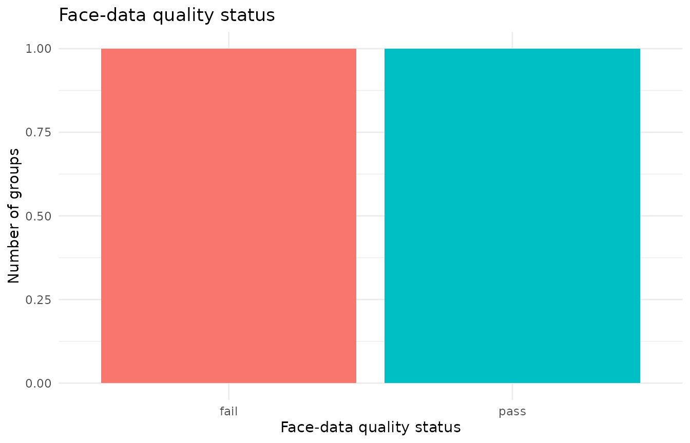
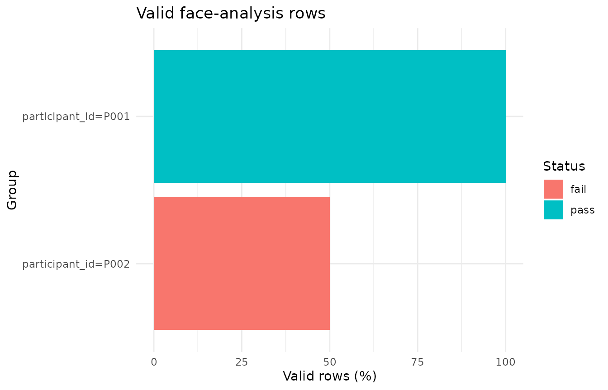
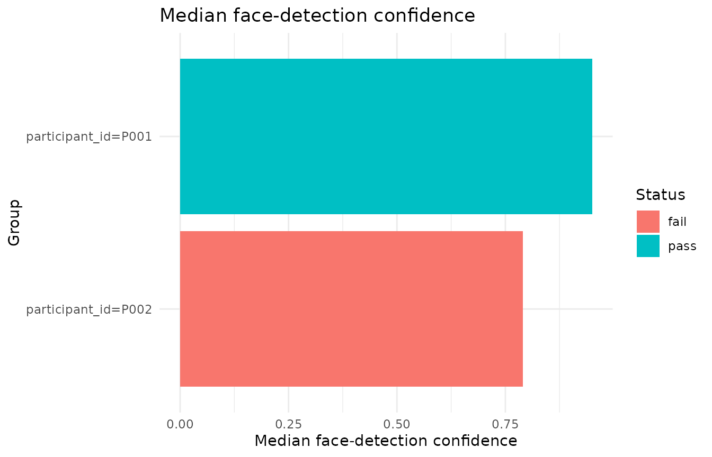
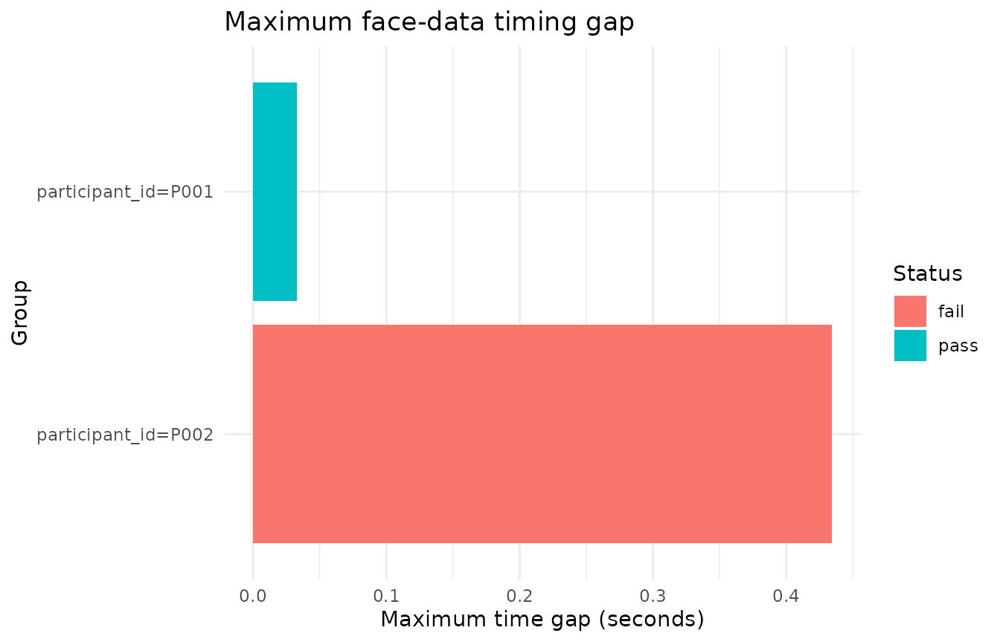

# External face-data quality audit

This article demonstrates quality-control helpers for external
facial-behaviour exports.

These helpers do **not** infer facial expressions from Gazepoint CSV
files. They audit externally generated face-analysis tables after import
and standardisation. The intended inputs are CSV outputs from tools such
as OpenFace-style, py-feat-style, MediaPipe-style, FaceReader-style, or
generic frame-level facial-behaviour pipelines.

The current scope is:

1.  audit face-detection validity;
2.  summarise confidence and success indicators;
3.  detect duplicate frame indices;
4.  inspect basic timing continuity;
5.  produce cautious status summaries and descriptive QC plots.

Synchronisation with Gazepoint timing, AOIs, trials, pupil, GSR, HR/IBI,
or task phases is a later workflow stage.

## Example face-analysis data

``` r

face <- data.frame(
  participant_id = rep(c("P001", "P002"), each = 4),
  frame = c(1, 2, 3, 4, 1, 2, 2, 4),
  timestamp = c(0.000, 0.033, 0.066, 0.099, 0.000, 0.033, 0.066, 0.500),
  confidence = c(0.98, 0.96, 0.94, 0.92, 0.95, 0.70, 0.40, 0.88),
  success = c(1, 1, 1, 1, 1, 1, 1, 1),
  AU04_r = c(0.05, 0.06, 0.05, 0.04, 0.10, 0.15, 0.20, 0.18),
  AU12_r = c(0.20, 0.22, 0.25, 0.24, 0.10, 0.12, 0.08, 0.09),
  stringsAsFactors = FALSE
)
```

## Audit quality

[`audit_gazepoint_face_quality()`](https://stefanosbalaskas.github.io/gp3tools/reference/audit_gazepoint_face_quality.md)
standardises unstandardised input when needed and returns overview,
group-level, and issue-level summaries.

``` r

face_audit <- audit_gazepoint_face_quality(
  face,
  group_cols = "participant_id",
  confidence_threshold = 0.80,
  min_valid_percent = 70,
  warning_valid_percent = 85,
  max_time_gap_sec = 0.20,
  max_duplicate_frame_percent = 0
)

face_audit$overview
#> # A tibble: 1 × 25
#>   n_groups n_rows n_valid valid_percent n_invalid invalid_percent
#>      <int>  <int>   <int>         <dbl>     <int>           <dbl>
#> 1        2      8       6            75         2              25
#> # ℹ 19 more variables: n_unknown_validity <int>,
#> #   unknown_validity_percent <dbl>, n_missing_confidence <int>,
#> #   confidence_missing_percent <dbl>, mean_confidence <dbl>,
#> #   median_confidence <dbl>, min_confidence <dbl>, max_confidence <dbl>,
#> #   n_success <int>, success_percent <dbl>, n_duplicate_frames <int>,
#> #   duplicate_frame_percent <dbl>, n_missing_time <int>,
#> #   n_nonpositive_time_steps <int>, max_time_gap_sec <dbl>, …
```

``` r

face_audit$group_summary
#> # A tibble: 2 × 26
#>   face_quality_group  participant_id n_rows n_valid valid_percent n_invalid
#>   <chr>               <chr>           <int>   <int>         <dbl>     <int>
#> 1 participant_id=P001 P001                4       4           100         0
#> 2 participant_id=P002 P002                4       2            50         2
#> # ℹ 20 more variables: invalid_percent <dbl>, n_unknown_validity <int>,
#> #   unknown_validity_percent <dbl>, n_missing_confidence <int>,
#> #   confidence_missing_percent <dbl>, mean_confidence <dbl>,
#> #   median_confidence <dbl>, min_confidence <dbl>, max_confidence <dbl>,
#> #   n_success <int>, success_percent <dbl>, n_duplicate_frames <int>,
#> #   duplicate_frame_percent <dbl>, n_missing_time <int>,
#> #   n_nonpositive_time_steps <int>, max_time_gap_sec <dbl>, …
```

``` r

face_audit$issue_summary
#> # A tibble: 6 × 5
#>   issue                       n_groups_affected n_groups threshold status
#>   <chr>                                   <int>    <int>     <dbl> <chr> 
#> 1 valid_percent_below_minimum                 1        2      70   review
#> 2 valid_percent_below_warning                 1        2      85   review
#> 3 unknown_validity                            0        2      NA   ok    
#> 4 duplicate_frames                            1        2       0   review
#> 5 large_time_gaps                             1        2       0.2 review
#> 6 missing_confidence                          0        2      NA   ok
```

The object keeps the standardised data used for the audit.

``` r

head(face_audit$data)
#> # A tibble: 6 × 16
#>   face_source face_file participant_id face_id face_frame face_time_sec
#>   <chr>       <chr>     <chr>          <chr>        <int>         <dbl>
#> 1 openface    NA        P001           NA               1         0    
#> 2 openface    NA        P001           NA               2         0.033
#> 3 openface    NA        P001           NA               3         0.066
#> 4 openface    NA        P001           NA               4         0.099
#> 5 openface    NA        P002           NA               1         0    
#> 6 openface    NA        P002           NA               2         0.033
#> # ℹ 10 more variables: face_time_ms <dbl>, face_confidence <dbl>,
#> #   face_success <lgl>, face_valid <lgl>, frame <dbl>, timestamp <dbl>,
#> #   confidence <dbl>, success <dbl>, AU04_r <dbl>, AU12_r <dbl>
```

## Compact summary

[`summarize_gazepoint_face_quality()`](https://stefanosbalaskas.github.io/gp3tools/reference/summarize_gazepoint_face_quality.md)
returns the overview table. The British spelling alias is also
available.

``` r

summarize_gazepoint_face_quality(face_audit)
#> # A tibble: 1 × 25
#>   n_groups n_rows n_valid valid_percent n_invalid invalid_percent
#>      <int>  <int>   <int>         <dbl>     <int>           <dbl>
#> 1        2      8       6            75         2              25
#> # ℹ 19 more variables: n_unknown_validity <int>,
#> #   unknown_validity_percent <dbl>, n_missing_confidence <int>,
#> #   confidence_missing_percent <dbl>, mean_confidence <dbl>,
#> #   median_confidence <dbl>, min_confidence <dbl>, max_confidence <dbl>,
#> #   n_success <int>, success_percent <dbl>, n_duplicate_frames <int>,
#> #   duplicate_frame_percent <dbl>, n_missing_time <int>,
#> #   n_nonpositive_time_steps <int>, max_time_gap_sec <dbl>, …
```

``` r

summarise_gazepoint_face_quality(face)
#> # A tibble: 1 × 25
#>   n_groups n_rows n_valid valid_percent n_invalid invalid_percent
#>      <int>  <int>   <int>         <dbl>     <int>           <dbl>
#> 1        2      8       6            75         2              25
#> # ℹ 19 more variables: n_unknown_validity <int>,
#> #   unknown_validity_percent <dbl>, n_missing_confidence <int>,
#> #   confidence_missing_percent <dbl>, mean_confidence <dbl>,
#> #   median_confidence <dbl>, min_confidence <dbl>, max_confidence <dbl>,
#> #   n_success <int>, success_percent <dbl>, n_duplicate_frames <int>,
#> #   duplicate_frame_percent <dbl>, n_missing_time <int>,
#> #   n_nonpositive_time_steps <int>, max_time_gap_sec <dbl>, …
```

## Plot quality status

[`plot_gazepoint_face_quality()`](https://stefanosbalaskas.github.io/gp3tools/reference/plot_gazepoint_face_quality.md)
can visualise status counts across groups.

``` r

plot_gazepoint_face_quality(
  face_audit,
  plot_type = "status",
  title = "Face-data quality status"
)
```



## Plot valid-row percentages

``` r

plot_gazepoint_face_quality(
  face_audit,
  plot_type = "validity",
  title = "Valid face-analysis rows"
)
```



## Plot confidence

``` r

plot_gazepoint_face_quality(
  face_audit,
  plot_type = "confidence",
  title = "Median face-detection confidence"
)
```



## Plot timing gaps

``` r

plot_gazepoint_face_quality(
  face_audit,
  plot_type = "time_gaps",
  title = "Maximum face-data timing gap"
)
```



## Recommended interpretation

The audit reports data quality, not emotion validity. A group with high
valid-row percentage and high confidence has better technical coverage
for downstream facial-behaviour analysis. It does not prove that
algorithmic emotion labels are psychologically valid.

Prefer cautious language such as:

- face-detection confidence;
- face-analysis coverage;
- valid facial-behaviour frames;
- action-unit availability;
- head-pose availability;
- timing continuity;
- facial-behaviour data quality.

Avoid unsupported language such as:

- true emotion detection;
- micro-expression evidence;
- hidden affect;
- psychological diagnosis;
- participant emotional state inferred directly from a classifier.

## Suggested workflow position

A transparent workflow is:

1.  import external face-analysis CSVs with
    [`read_gazepoint_face_export()`](https://stefanosbalaskas.github.io/gp3tools/reference/read_gazepoint_face_export.md);
2.  standardise timing, frame, confidence, and validity columns with
    [`standardize_gazepoint_face_columns()`](https://stefanosbalaskas.github.io/gp3tools/reference/standardize_gazepoint_face_columns.md);
3.  audit quality with
    [`audit_gazepoint_face_quality()`](https://stefanosbalaskas.github.io/gp3tools/reference/audit_gazepoint_face_quality.md);
4.  review quality summaries and plots;
5.  only then proceed to synchronisation with Gazepoint timing, trial
    windows, AOIs, pupil, GSR, HR/IBI, or task phases.
