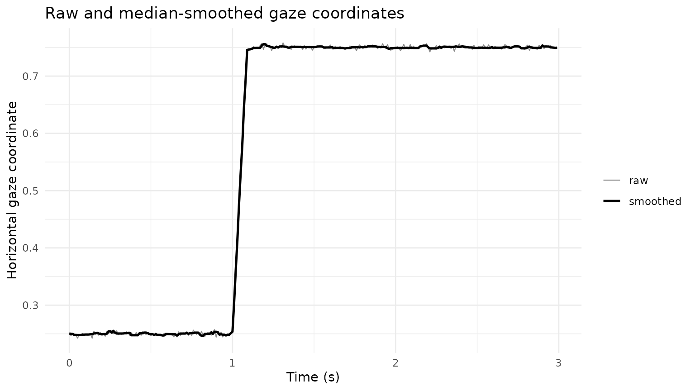
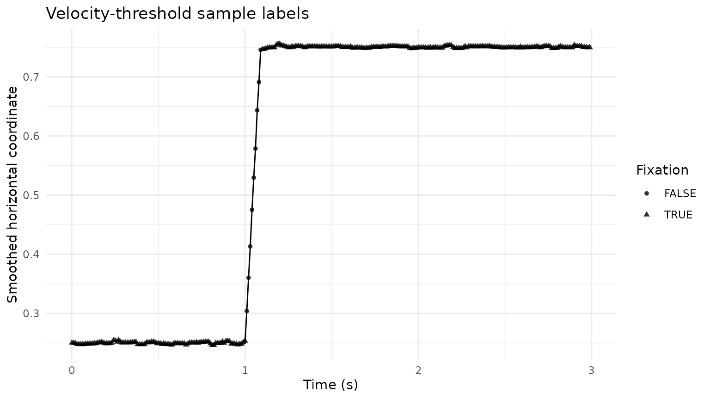
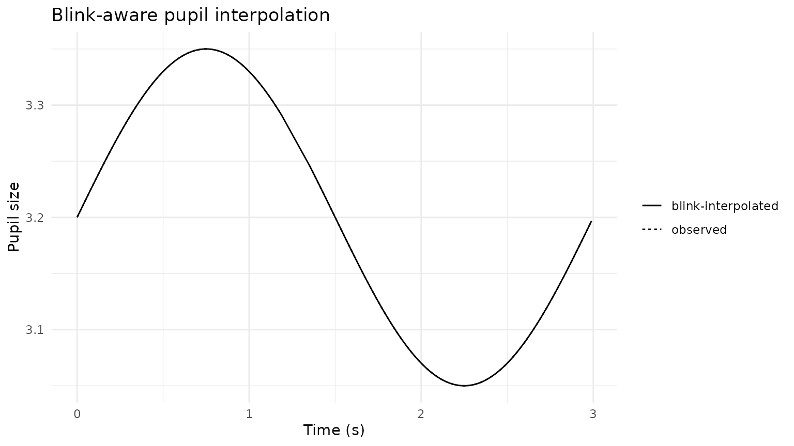

# Velocity Fixations, Blink Detection, and Blink-Aware Interpolation

## Purpose

This article demonstrates a transparent event-preprocessing branch for
sample-level gaze and pupil data:

1.  smooth noisy gaze coordinates;
2.  derive fixation events with a velocity threshold;
3.  detect blink-like pupil intervals;
4.  interpolate only short, internally bounded blink gaps.

The velocity threshold is expressed in scaled coordinate units per
second. When gaze coordinates are already expressed in visual degrees,
`vmax` is in degrees per second. For normalized or pixel coordinates,
use `x_scale` and `y_scale` when an appropriate conversion is available.

## Simulated sample trace

``` r

set.seed(2026)

time <- seq(0, 2.99, by = 0.01)
n <- length(time)

trace <- data.frame(
  USER_ID = "P01",
  trial = "T01",
  TIME = time,
  FPOGX = c(
    rep(0.25, 100),
    seq(0.25, 0.75, length.out = 10),
    rep(0.75, n - 110)
  ) + rnorm(n, 0, 0.003),
  FPOGY = 0.50 + rnorm(n, 0, 0.003),
  mean_pupil = 3.2 + 0.15 * sin(2 * pi * time / 3)
)

trace$mean_pupil[121:135] <- NA_real_
```

## Smooth gaze coordinates

``` r

smoothed <- smooth_gazepoint_coordinate(
  trace,
  method = "median",
  window = 5,
  group_cols = "trial"
)

ggplot(smoothed, aes(TIME)) +
  geom_line(aes(y = FPOGX, linewidth = "raw"), alpha = 0.45) +
  geom_line(aes(y = FPOGX_smooth, linewidth = "smoothed")) +
  scale_linewidth_manual(values = c(raw = 0.4, smoothed = 0.9)) +
  labs(
    x = "Time (s)",
    y = "Horizontal gaze coordinate",
    linewidth = NULL,
    title = "Raw and median-smoothed gaze coordinates"
  ) +
  theme_minimal()
```



## Detect velocity-defined fixations

``` r

fixation_result <- detect_gazepoint_fixations_velocity(
  smoothed,
  x_col = "FPOGX_smooth",
  y_col = "FPOGY_smooth",
  group_cols = "trial",
  vmax = 5,
  min_duration = 80,
  return = "both"
)

fixation_result$events
#> # A tibble: 2 × 14
#>   USER_ID trial fixation_id start_time end_time duration duration_ms n_samples
#>   <chr>   <chr>       <int>      <dbl>    <dbl>    <dbl>       <dbl>     <int>
#> 1 P01     T01             1        0       1        1010        1010       101
#> 2 P01     T01             2        1.1     2.99     1900        1900       190
#> # ℹ 6 more variables: mean_x <dbl>, mean_y <dbl>, median_velocity <dbl>,
#> #   max_velocity <dbl>, velocity_threshold <dbl>, algorithm <chr>
```

``` r

fixation_samples <- fixation_result$samples

ggplot(fixation_samples, aes(TIME, FPOGX_smooth)) +
  geom_line() +
  geom_point(
    aes(shape = velocity_fixation),
    size = 1.4,
    alpha = 0.8
  ) +
  labs(
    x = "Time (s)",
    y = "Smoothed horizontal coordinate",
    shape = "Fixation",
    title = "Velocity-threshold sample labels"
  ) +
  theme_minimal()
```



## Detect blink intervals

``` r

blinks <- detect_gazepoint_blinks(
  trace,
  pupil_col = "mean_pupil",
  group_cols = "trial",
  min_duration = 50,
  merge_gap_ms = 20
)

blinks
#> # A tibble: 1 × 10
#>   USER_ID trial blink_id start_time end_time duration duration_ms n_samples
#>   <chr>   <chr>    <int>      <dbl>    <dbl>    <dbl>       <dbl>     <int>
#> 1 P01     T01          1        1.2     1.34     150.        150.        15
#> # ℹ 2 more variables: reason <chr>, pupil_columns <chr>
```

## Interpolate eligible blink gaps

``` r

interpolated <- interpolate_gazepoint_blinks(
  trace,
  blinks,
  pupil_cols = "mean_pupil",
  group_cols = "trial",
  method = "linear",
  max_gap_ms = 500
)

ggplot(interpolated, aes(TIME)) +
  geom_line(aes(y = mean_pupil, linetype = "observed")) +
  geom_line(
    aes(y = mean_pupil_blink_interp, linetype = "blink-interpolated")
  ) +
  labs(
    x = "Time (s)",
    y = "Pupil size",
    linetype = NULL,
    title = "Blink-aware pupil interpolation"
  ) +
  theme_minimal()
```



## Recommended reporting

Report the coordinate unit, conversion to visual angle when used,
velocity threshold, minimum fixation duration, blink definition,
interpolation method, maximum interpolated gap, and whether leading or
trailing gaps remained missing.
