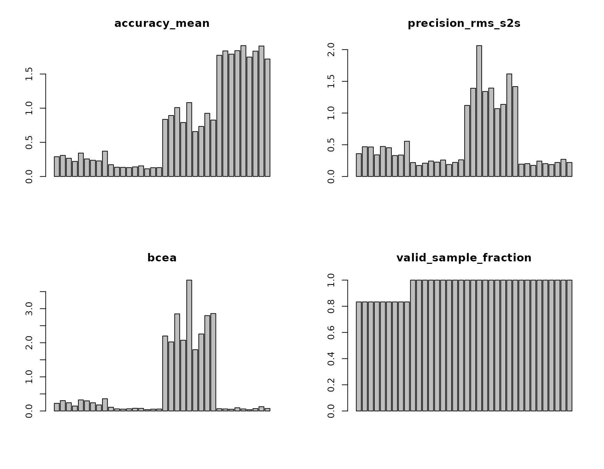
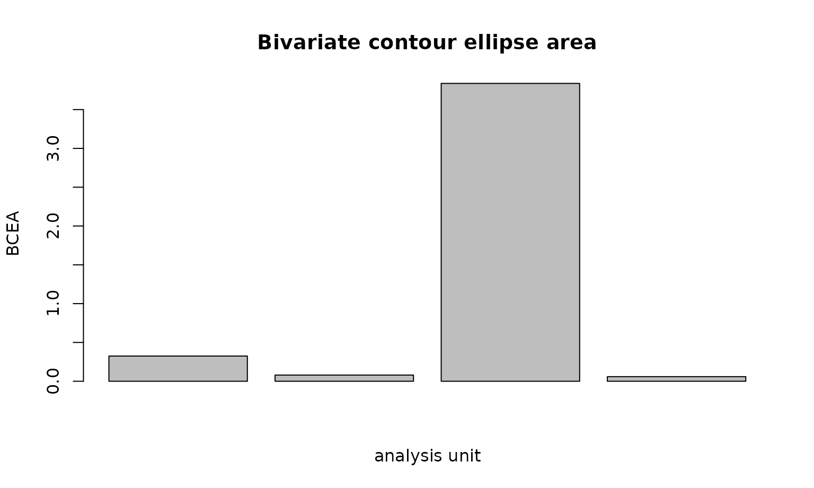

# Gazepoint data quality: accuracy, precision, sampling, and loss

``` r

library(gp3tools)
```

## Why this workflow exists

Gazepoint exports contain useful native validity and coordinate fields,
but a vendor summary is not a substitute for a reproducible study-level
quality analysis. The gp3tools wrappers in this article resolve
Gazepoint columns and metadata and then delegate every scientific
formula to the vendor-neutral eyeprocess core.

The workflow keeps four questions separate:

1.  **Accuracy:** how far was gaze from a known target?
2.  **Precision:** how stable was gaze while the intended target was
    stable?
3.  **Sampling:** what timing stream was actually recorded?
4.  **Availability:** how much usable gaze was available and how was it
    lost?

No wrapper automatically excludes a trial or participant.

## Native GP3 coordinates and units

Gazepoint BPOG/FPOG/LPOG/RPOG screen coordinates are treated as
normalized coordinates. TIME is interpreted as seconds and MSTIMER as
milliseconds. For a generic column such as gaze_x, the wrapper does not
inspect the numeric range and guess a unit: set coordinate_unit
explicitly.

If you want angular results from normalized or pixel coordinates,
provide physical display geometry and viewing distance and request
output_unit = “degrees”. Merely supplying geometry does not change
units.

## Reproducible 9-point example

The following synthetic data mimic a validation/check-target stream with
native BPOG coordinates. The four profiles deliberately separate
calibration offset, spatial noise, irregular timing, and missingness.

``` r

set.seed(20260918)

targets <- expand.grid(
  target_x = c(0.20, 0.50, 0.80),
  target_y = c(0.20, 0.50, 0.80)
)

profiles <- data.frame(
  profile = c(
    "good",
    "offset",
    "noisy",
    "irregular_missing"
  ),
  bias_x = c(0, 0.035, 0, 0),
  bias_y = c(0, -0.025, 0, 0),
  noise = c(0.003, 0.003, 0.018, 0.006)
)

rows <- list()
k <- 0L

for (p in seq_len(nrow(profiles))) {
  for (target_id in seq_len(nrow(targets))) {
    ms <- 0
    for (sample_id in seq_len(12)) {
      interval <- 1000 / 60
      if (profiles$profile[p] == "irregular_missing" &&
          sample_id %in% c(5, 10)) {
        interval <- interval * 2.5
      }
      ms <- ms + interval

      x <- targets$target_x[target_id] +
        profiles$bias_x[p] +
        rnorm(1, 0, profiles$noise[p])
      y <- targets$target_y[target_id] +
        profiles$bias_y[p] +
        rnorm(1, 0, profiles$noise[p])

      valid <- 1
      reason <- NA_character_
      if (profiles$profile[p] == "irregular_missing" &&
          sample_id %in% c(6, 7)) {
        x <- NA_real_
        y <- NA_real_
        valid <- 0
        reason <- if (sample_id == 6) "blink" else "tracker_invalidity"
      }

      k <- k + 1L
      rows[[k]] <- data.frame(
        USER = "P001",
        SESSION_ID = "S001",
        MEDIA_ID = paste0(profiles$profile[p], "_", target_id),
        profile = profiles$profile[p],
        target_id = target_id,
        MSTIMER = ms,
        BPOGX = x,
        BPOGY = y,
        BPOGV = valid,
        target_x = targets$target_x[target_id],
        target_y = targets$target_y[target_id],
        missing_reason = reason
      )
    }
  }
}

gp_validation <- do.call(rbind, rows)
```

## Build the quality report

For normalized coordinates, the report can stay normalized or be
converted to degrees when geometry is available. This example uses a
24-inch-class 1920-by-1080 display and an explicitly declared viewing
distance.

``` r

geometry <- list(
  screen_width_px = 1920,
  screen_height_px = 1080,
  screen_width_cm = 53.0,
  screen_height_cm = 29.8,
  viewing_distance_cm = 60
)

quality <- create_gazepoint_quality_report(
  gp_validation,
  missing_reason_col = "missing_reason",
  level = "trial",
  output_unit = "degrees",
  geometry = geometry,
  nominal_sampling_hz = 60,
  bcea_probability = 0.68,
  preprocessing_spec = "synthetic raw validation samples; no interpolation",
  quality_rules = "descriptive QC with study-defined review flags"
)

quality[c(
  ".gp3_quality_participant",
  ".gp3_quality_trial",
  "accuracy_mean",
  "precision_rms_s2s",
  "precision_sd",
  "bcea",
  "effective_sampling_hz",
  "valid_sample_fraction",
  "data_loss_fraction"
)]
#>    .gp3_quality_participant  .gp3_quality_trial accuracy_mean precision_rms_s2s
#> 1                      P001 irregular_missing_1     0.2893474         0.3595844
#> 2                      P001 irregular_missing_2     0.3083500         0.4686716
#> 3                      P001 irregular_missing_3     0.2663192         0.4647304
#> 4                      P001 irregular_missing_4     0.2203675         0.3411695
#> 5                      P001 irregular_missing_5     0.3425022         0.4728144
#> 6                      P001 irregular_missing_6     0.2566055         0.4531879
#> 7                      P001 irregular_missing_7     0.2371947         0.3298432
#> 8                      P001 irregular_missing_8     0.2275658         0.3380531
#> 9                      P001 irregular_missing_9     0.3707519         0.5552385
#> 10                     P001              good_1     0.1721052         0.2193582
#> 11                     P001              good_2     0.1350754         0.1730684
#> 12                     P001              good_3     0.1334056         0.2092279
#> 13                     P001              good_4     0.1298730         0.2428993
#> 14                     P001              good_5     0.1401107         0.2261049
#> 15                     P001              good_6     0.1550887         0.2593953
#> 16                     P001              good_7     0.1123879         0.1883011
#> 17                     P001              good_8     0.1284616         0.2222722
#> 18                     P001              good_9     0.1299141         0.2622649
#> 19                     P001             noisy_1     0.8357059         1.1197978
#> 20                     P001             noisy_2     0.8925719         1.3909588
#> 21                     P001             noisy_3     1.0085314         2.0631175
#> 22                     P001             noisy_4     0.7899847         1.3399057
#> 23                     P001             noisy_5     1.0815652         1.3935175
#> 24                     P001             noisy_6     0.6575972         1.0696131
#> 25                     P001             noisy_7     0.7328801         1.1364286
#> 26                     P001             noisy_8     0.9246466         1.6165669
#> 27                     P001             noisy_9     0.8258472         1.4173378
#> 28                     P001            offset_1     1.7744161         0.1942178
#> 29                     P001            offset_2     1.8383665         0.2021369
#> 30                     P001            offset_3     1.7908540         0.1751539
#> 31                     P001            offset_4     1.8418008         0.2424629
#> 32                     P001            offset_5     1.9160391         0.2027116
#> 33                     P001            offset_6     1.7484175         0.1878634
#> 34                     P001            offset_7     1.8348546         0.2207907
#> 35                     P001            offset_8     1.9101714         0.2705530
#> 36                     P001            offset_9     1.7195057         0.2207898
#>    precision_sd       bcea effective_sampling_hz valid_sample_fraction
#> 1     0.2996915 0.22413704                    40             0.8333333
#> 2     0.3560530 0.30330353                    40             0.8333333
#> 3     0.2885190 0.24074798                    40             0.8333333
#> 4     0.2317380 0.14498475                    40             0.8333333
#> 5     0.3537157 0.32483423                    40             0.8333333
#> 6     0.2996274 0.29686539                    40             0.8333333
#> 7     0.2727171 0.24012146                    40             0.8333333
#> 8     0.2546426 0.17718022                    40             0.8333333
#> 9     0.3373674 0.35877175                    40             0.8333333
#> 10    0.1762964 0.10924219                    60             1.0000000
#> 11    0.1379214 0.06132450                    60             1.0000000
#> 12    0.1498638 0.05358841                    60             1.0000000
#> 13    0.1403998 0.06467412                    60             1.0000000
#> 14    0.1528552 0.07976937                    60             1.0000000
#> 15    0.1786511 0.07682361                    60             1.0000000
#> 16    0.1113747 0.03882083                    60             1.0000000
#> 17    0.1441022 0.05328457                    60             1.0000000
#> 18    0.1529913 0.05652435                    60             1.0000000
#> 19    0.8112179 2.19870051                    60             1.0000000
#> 20    0.9526062 2.02466650                    60             1.0000000
#> 21    1.1938757 2.84686706                    60             1.0000000
#> 22    0.8835872 2.07463310                    60             1.0000000
#> 23    1.1786821 3.83708311                    60             1.0000000
#> 24    0.7621789 1.79648913                    60             1.0000000
#> 25    0.8153147 2.25724745                    60             1.0000000
#> 26    0.9914622 2.79626174                    60             1.0000000
#> 27    0.9749427 2.85672506                    60             1.0000000
#> 28    0.1584094 0.06612128                    60             1.0000000
#> 29    0.1446853 0.05956420                    60             1.0000000
#> 30    0.1349605 0.05084382                    60             1.0000000
#> 31    0.1977635 0.09441370                    60             1.0000000
#> 32    0.1313268 0.05930256                    60             1.0000000
#> 33    0.1235829 0.03686284                    60             1.0000000
#> 34    0.1398088 0.06951221                    60             1.0000000
#> 35    0.2274677 0.12617087                    60             1.0000000
#> 36    0.1484603 0.07344989                    60             1.0000000
#>    data_loss_fraction
#> 1           0.1666667
#> 2           0.1666667
#> 3           0.1666667
#> 4           0.1666667
#> 5           0.1666667
#> 6           0.1666667
#> 7           0.1666667
#> 8           0.1666667
#> 9           0.1666667
#> 10          0.0000000
#> 11          0.0000000
#> 12          0.0000000
#> 13          0.0000000
#> 14          0.0000000
#> 15          0.0000000
#> 16          0.0000000
#> 17          0.0000000
#> 18          0.0000000
#> 19          0.0000000
#> 20          0.0000000
#> 21          0.0000000
#> 22          0.0000000
#> 23          0.0000000
#> 24          0.0000000
#> 25          0.0000000
#> 26          0.0000000
#> 27          0.0000000
#> 28          0.0000000
#> 29          0.0000000
#> 30          0.0000000
#> 31          0.0000000
#> 32          0.0000000
#> 33          0.0000000
#> 34          0.0000000
#> 35          0.0000000
#> 36          0.0000000
```

## Accuracy and precision are different

The offset profile should show worse target-referenced accuracy while
retaining relatively good short-term precision. The noisy profile is
centered on the target on average but has poorer precision. This is why
a single “calibration quality” label cannot replace explicit accuracy
and precision metrics.

``` r

aggregate(
  cbind(accuracy_mean, precision_rms_s2s, precision_sd) ~ profile,
  transform(
    quality,
    profile = sub("_[0-9]+$", "", .gp3_quality_trial)
  ),
  mean,
  na.rm = TRUE
)
#>             profile accuracy_mean precision_rms_s2s precision_sd
#> 1              good     0.1373802         0.2225436    0.1493840
#> 2 irregular_missing     0.2798894         0.4203659    0.2993413
#> 3             noisy     0.8610367         1.3941382    0.9515408
#> 4            offset     1.8193806         0.2129645    0.1562739
```

### Aggregation levels

The convenience layer supports dataset, sample, participant, session,
trial, and file grouping. Sample level uses a deterministic source-row
identifier. It is useful for tracing validity and target error, but a
single sample does not provide a meaningful stable-target estimate of
RMS-S2S, SD precision, or BCEA.

## Review thresholds are not exclusions

Thresholds are study-specific and should normally be defined before
inspecting outcomes. They create quality_flags and review_required only.

``` r

reviewed <- create_gazepoint_quality_report(
  gp_validation,
  missing_reason_col = "missing_reason",
  level = "trial",
  output_unit = "degrees",
  geometry = geometry,
  nominal_sampling_hz = 60,
  thresholds = list(
    accuracy_mean = list(max = 1.0),
    valid_sample_fraction = list(min = 0.80)
  )
)

reviewed[c(
  ".gp3_quality_trial",
  "quality_flags",
  "review_required"
)]
#>     .gp3_quality_trial     quality_flags review_required
#> 1  irregular_missing_1                             FALSE
#> 2  irregular_missing_2                             FALSE
#> 3  irregular_missing_3                             FALSE
#> 4  irregular_missing_4                             FALSE
#> 5  irregular_missing_5                             FALSE
#> 6  irregular_missing_6                             FALSE
#> 7  irregular_missing_7                             FALSE
#> 8  irregular_missing_8                             FALSE
#> 9  irregular_missing_9                             FALSE
#> 10              good_1                             FALSE
#> 11              good_2                             FALSE
#> 12              good_3                             FALSE
#> 13              good_4                             FALSE
#> 14              good_5                             FALSE
#> 15              good_6                             FALSE
#> 16              good_7                             FALSE
#> 17              good_8                             FALSE
#> 18              good_9                             FALSE
#> 19             noisy_1                             FALSE
#> 20             noisy_2                             FALSE
#> 21             noisy_3 accuracy_mean>max            TRUE
#> 22             noisy_4                             FALSE
#> 23             noisy_5 accuracy_mean>max            TRUE
#> 24             noisy_6                             FALSE
#> 25             noisy_7                             FALSE
#> 26             noisy_8                             FALSE
#> 27             noisy_9                             FALSE
#> 28            offset_1 accuracy_mean>max            TRUE
#> 29            offset_2 accuracy_mean>max            TRUE
#> 30            offset_3 accuracy_mean>max            TRUE
#> 31            offset_4 accuracy_mean>max            TRUE
#> 32            offset_5 accuracy_mean>max            TRUE
#> 33            offset_6 accuracy_mean>max            TRUE
#> 34            offset_7 accuracy_mean>max            TRUE
#> 35            offset_8 accuracy_mean>max            TRUE
#> 36            offset_9 accuracy_mean>max            TRUE

attr(reviewed, "gazepoint_quality_adapter")$automatic_exclusion
#> [1] FALSE
```

## Visual dashboard

``` r

plot_gazepoint_quality_dashboard(quality)
```



The dashboard is descriptive. It should be paired with the row-level
quality table and with the study’s pre-specified review/exclusion logic.

## Focused plot gallery

Use a single validation target for compact visual comparisons so spatial
precision is not contaminated by intentional target-to-target gaze
movement.

``` r

quality_center <- quality[grepl("_5$", quality$.gp3_quality_trial), ]
```

### Target-referenced accuracy

``` r

eyeprocess::plot_gaze_accuracy(quality_center)
```


Higher values mean larger error from the known target. A stable
calibration offset can therefore be precise but inaccurate.

### RMS sample-to-sample precision

``` r

eyeprocess::plot_gaze_precision(quality_center)
```


RMS-S2S describes short-term fluctuation during stable gaze. It is not a
substitute for accuracy, and it should not be interpreted across target
transitions or intended saccades.

### BCEA

``` r

eyeprocess::plot_bcea(quality_center)
```



BCEA is an area-based dispersion summary. Report its probability level
and area unit; it is not target-referenced accuracy.

### Sampling intervals

``` r

irregular_center <- gp_validation[
  gp_validation$profile == "irregular_missing" &
    gp_validation$target_id == 5,
]
eyeprocess::plot_sampling_intervals(
  irregular_center,
  time = "MSTIMER",
  time_unit = "ms"
)
```


The focused plots are provided by the vendor-neutral core. gp3tools
keeps the Gazepoint-specific convenience dashboard as a thin adapter
rather than duplicating plotting/statistical logic.

For timing diagnostics, distinguish `long_interval_count` from
`dropped_interval_count`: the first counts unusually long observed
intervals, whereas the second estimates how many nominal samples those
long gaps represent. Neither should be described as a direct
hardware-level packet-loss measurement.

## A failure case worth keeping

Generic standardized columns require an explicit unit. This deliberately
fails:

``` r

generic <- data.frame(
  timestamp_ms = c(0, 16.7, 33.4),
  gaze_x = c(0.50, 0.51, 0.50),
  gaze_y = c(0.50, 0.50, 0.50)
)

create_gazepoint_quality_report(generic)
#> Error:
#> ! Coordinate unit cannot be inferred safely from column gaze_x. Set coordinate_unit explicitly; numeric ranges are never used to guess units.
```

The correct call declares the unit:

``` r

create_gazepoint_quality_report(
  generic,
  coordinate_unit = "normalized",
  target_x_col = NULL,
  target_y_col = NULL,
  nominal_sampling_hz = 60
)
#>     n_steps precision_rms_s2s median_s2s p95_s2s dimension
#> all       2              0.01       0.01    0.01        2d
#>     precision_rms_s2s_unit max_gap_ms n_precision_samples precision_sd_x
#> all             normalized         NA                   3    0.004714045
#>     precision_sd_y precision_sd precision_sd_unit n_bcea_samples bcea
#> all              0  0.004714045        normalized              3    0
#>     bcea_probability        sd_x sd_y correlation_xy    bcea_unit
#> all             0.68 0.004714045    0              0 normalized^2
#>     n_observed_timestamps n_intervals median_interval_ms mean_interval_ms
#> all                     3           2               16.7             16.7
#>     min_interval_ms max_interval_ms duplicate_timestamp_count
#> all            16.7            16.7                         0
#>     non_monotonic_timestamp_count sampling_jitter_ms sampling_jitter_mad_ms
#> all                             0                  0                      0
#>     observed_sample_count effective_sample_count timestamp_span_s
#> all                     3                      3           0.0334
#>     trial_duration_s effective_sampling_hz long_interval_count
#> all           0.0501              59.88024                   0
#>     dropped_interval_count nominal_sampling_hz
#> all                      0                  60
#>                          effective_count_rule n_samples valid_sample_fraction
#> all valid gaze samples with finite timestamps         3                     1
#>     invalid_sample_fraction missing_sample_fraction data_loss_fraction
#> all                       0                       0                  0
#>     missing_run_count longest_missing_run_samples longest_missing_run_ms
#> all                 0                           0                     NA
#>     quality_flags review_required
#> all                         FALSE
```

## Quality decisions as sensitivity analysis

Keep the full Gazepoint quality report intact and separate the
measurement diagnostic from the eventual inclusion decision.

``` r

keep <- reviewed[!reviewed$review_required, ]
flagged <- reviewed[reviewed$review_required, ]
```

For downstream modeling, join the report back to the trial or
participant key and compare the primary specification with one or more
pre-specified sensitivity specifications. This can include a stricter
exclusion rule or stratification by quality status. The wrapper never
removes observations for you.

## Reporting guideline

For a manuscript, report the display/coordinate geometry needed to
understand the unit, the validation/check-target procedure, the accuracy
statistic, the precision definition, the BCEA probability when used,
nominal and observed sampling behavior, the operational definition of
data loss, and the actual review/exclusion rule.

A compact starting point is:

``` r

report_gazepoint_quality(quality)
#> [1] "accuracy_mean: mean 0.774, range 0.112-1.916; precision_rms_s2s: mean 0.563, range 0.173-2.063; precision_sd: mean 0.389, range 0.111-1.194; bcea: mean 0.729, range 0.037-3.837; effective_sampling_hz: mean 55.000, range 40.000-60.000; valid_sample_fraction: mean 0.958, range 0.833-1.000; data_loss_fraction: mean 0.042, range 0.000-0.167. Review required for 0/36 analysis units. Thresholds, when supplied, are study-specific review rules and never trigger automatic exclusion."
```

A manuscript-ready sentence can then add the acquisition context:

> Gaze quality was evaluated from known validation targets using
> target-referenced Euclidean accuracy, RMS sample-to-sample and
> spatial-SD precision, and 68% BCEA after explicit conversion from
> normalized screen coordinates to degrees of visual angle. The nominal
> 60-Hz device rate was supplemented by timestamp-based effective
> sampling and interval diagnostics. Missing or invalid gaze was
> summarized by loss fraction and loss-run duration. Pre-specified
> thresholds generated manual-review flags rather than automatic
> exclusions.

## Interpretation boundaries

These measures characterize measurement quality. They do not establish
attention, engagement, cognitive load, motivation, competence, or any
clinical property. A review flag is an analysis-governance signal, not a
diagnosis or a participant label.

## API links

- summarise_gazepoint_spatial_quality()
- create_gazepoint_quality_report()
- plot_gazepoint_quality_dashboard()
- report_gazepoint_quality()

The underlying formulas and scientific contracts are maintained in
eyeprocess; gp3tools remains the Gazepoint-specific adapter layer.
