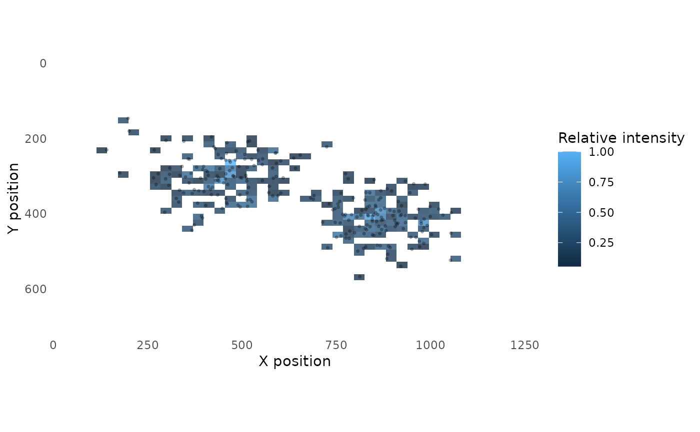
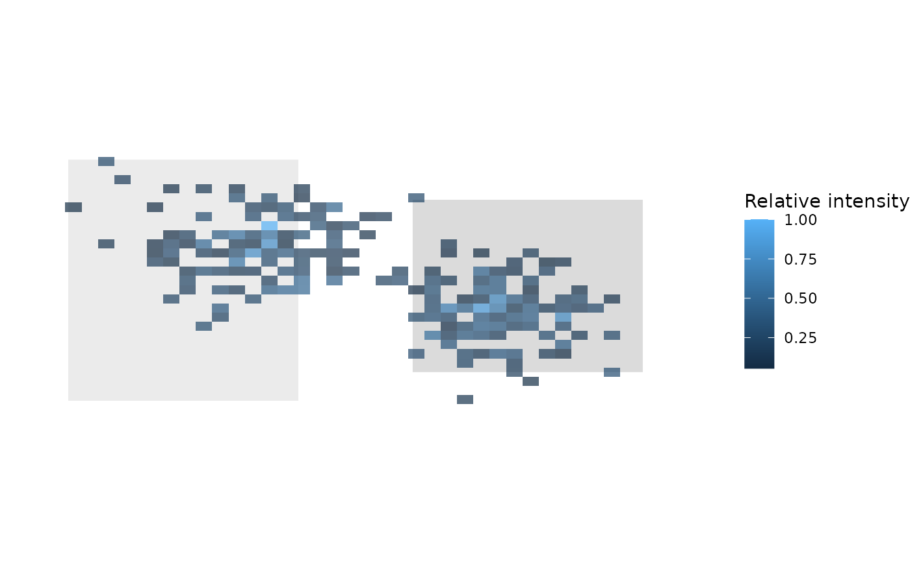

# Heatmaps and spatial visualisation

This article gives compact examples for creating gaze and fixation
heatmaps from Gazepoint-style coordinate data. The examples use
synthetic data and are intended to demonstrate plotting behaviour rather
than to evaluate visual attention.

## Example data

``` r

set.seed(42)

n <- 250

gaze <- data.frame(
  x = pmin(pmax(c(
    stats::rnorm(n / 2, mean = 0.35, sd = 0.08),
    stats::rnorm(n / 2, mean = 0.68, sd = 0.07)
  ), 0), 1),
  y = pmin(pmax(c(
    stats::rnorm(n / 2, mean = 0.42, sd = 0.08),
    stats::rnorm(n / 2, mean = 0.58, sd = 0.07)
  ), 0), 1),
  duration = stats::runif(n, min = 60, max = 350)
)

head(gaze)
```

    ##           x         y  duration
    ## 1 0.4596767 0.3323075 306.00503
    ## 2 0.3048241 0.4239240  78.19644
    ## 3 0.3790503 0.3241203 297.75508
    ## 4 0.4006290 0.4352015 216.41449
    ## 5 0.3823415 0.5238165 204.71583
    ## 6 0.3415100 0.3372901  66.44592

## Preparing heatmap data

``` r

prepared <- prepare_gazepoint_heatmap_data(
  gaze,
  x_col = "x",
  y_col = "y",
  weight_col = "duration",
  display_width = 1280,
  display_height = 720
)

head(prepared[, c(".gp3_x_px", ".gp3_y_px", ".gp3_weight")])
```

    ##   .gp3_x_px .gp3_y_px .gp3_weight
    ## 1  588.3861  239.2614   306.00503
    ## 2  390.1749  305.2253    78.19644
    ## 3  485.1843  233.3666   297.75508
    ## 4  512.8051  313.3451   216.41449
    ## 5  489.3971  377.1479   204.71583
    ## 6  437.1328  242.8489    66.44592

## Native heatmap

``` r

plot_gazepoint_heatmap(
  prepared,
  bins = 45,
  alpha = 0.85
)
```


## Heatmap with raw points

``` r

plot_gazepoint_heatmap(
  prepared,
  bins = 45,
  alpha = 0.80,
  show_points = TRUE
)
```



## Background-image overlay

[`plot_gazepoint_heatmap_overlay()`](https://stefanosbalaskas.github.io/gp3tools/reference/plot_gazepoint_heatmap_overlay.md)
can place the heatmap over a PNG stimulus image. The background-image
helper uses the optional `png` package.

``` r

if (requireNamespace("png", quietly = TRUE)) {
  bg <- tempfile(fileext = ".png")

  img <- array(1, dim = c(720, 1280, 3))
  img[150:570, 120:520, ] <- 0.92
  img[220:520, 720:1120, ] <- 0.86

  png::writePNG(img, bg)

  plot_gazepoint_heatmap_overlay(
    gaze,
    background_image = bg,
    x_col = "x",
    y_col = "y",
    weight_col = "duration",
    display_width = 1280,
    display_height = 720,
    bins = 45,
    heatmap_alpha = 0.70
  )
}
```



## Exporting a heatmap

``` r

p <- plot_gazepoint_heatmap(
  prepared,
  bins = 45
)

export_gazepoint_heatmap_png(
  p,
  filename = "gazepoint_heatmap.png",
  width = 8,
  height = 5,
  dpi = 300
)
```
