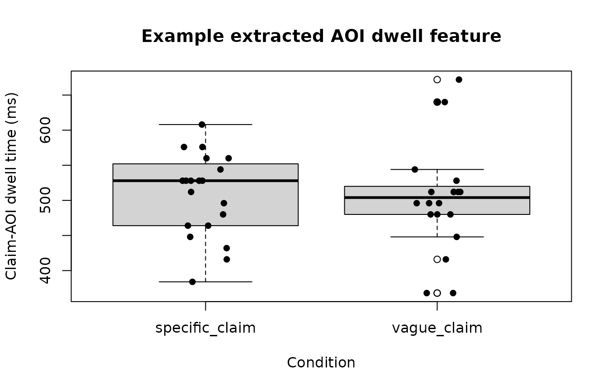
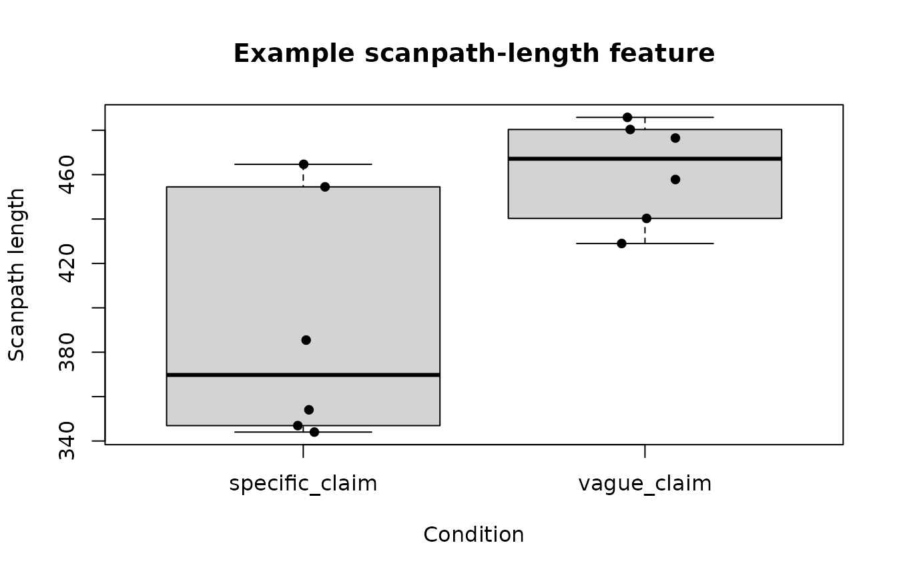

# Metric extraction and model-boundary guidance

This article presents a conservative metric-to-model workflow:

1.  define the raw observation unit;
2.  extract a transparent metric;
3.  inspect its scale and distribution;
4.  select a compatible statistical family;
5.  account for the study’s hierarchical structure;
6.  keep interpretation within the limits of the measure.

``` r

library(gp3tools)

set.seed(202)
```

## Start from the metric rather than the preferred model

``` r

families <- recommend_gazepoint_model_family()

families[
  families$metric %in% c(
    "fixation_duration",
    "dwell_time",
    "fixation_count",
    "aoi_proportion",
    "scanpath_length",
    "convex_hull_area",
    "pupil_timecourse"
  ),
  ,
  drop = FALSE
]
#>               metric                                data_property
#> 1  fixation_duration                       positive, right-skewed
#> 2         dwell_time                       positive, right-skewed
#> 3     fixation_count      non-negative count, often overdispersed
#> 4     aoi_proportion           bounded proportion between 0 and 1
#> 6   pupil_timecourse continuous time-series, often autocorrelated
#> 11   scanpath_length                       positive, right-skewed
#> 12  convex_hull_area                       positive, right-skewed
#>                                             recommended_family
#> 1                                           lognormal or gamma
#> 2                                           lognormal or gamma
#> 3                                 negative binomial or Poisson
#> 4              beta or binomial after denominator construction
#> 6  Gaussian with smooth time terms; consider AR(1) sensitivity
#> 11                                          gamma or lognormal
#> 12                                          gamma or lognormal
#>                                        common_transform
#> 1                                      log(duration_ms)
#> 2                                         log(dwell_ms)
#> 3                                  none; model as count
#> 4             logit after boundary adjustment if needed
#> 6  baseline correction, smoothing, or time-course model
#> 11                                 log(scanpath_length)
#> 12                                            log(area)
#>                                                                          notes
#> 1                             Avoid Gaussian models on raw fixation durations.
#> 2               Avoid Gaussian models on raw dwell times when strongly skewed.
#> 3                            Check overdispersion before using Poisson models.
#> 4          Values exactly 0 or 1 require adjustment or a binomial formulation.
#> 6  Do not use repeated pointwise tests without accounting for time dependence.
#> 11               Interpret as search extent or inefficiency depending on task.
#> 12                     Requires at least three valid spatial points per trial.
```

The recommendation table does not remove the need to inspect the
observed distribution. A duration outcome can contain structural zeros,
truncation, censoring, or participant-specific scales that require
additional decisions.

## Extract simple AOI dwell summaries

The following example simulates sample-level AOI assignments. Each row
represents a 16-ms sample.

``` r

samples <- expand.grid(
  subject = paste0(
    "S",
    sprintf("%02d", 1:10)
  ),
  trial = 1:4,
  sample = 1:80
)

samples$condition <- ifelse(
  samples$trial %% 2 == 0,
  "specific_claim",
  "vague_claim"
)

samples$time_ms <-
  samples$sample * 16

samples$aoi <- sample(
  c(
    "source_label",
    "claim_text",
    "evidence_panel",
    "other"
  ),
  size = nrow(samples),
  replace = TRUE,
  prob = c(
    0.20,
    0.38,
    0.22,
    0.20
  )
)

head(samples)
#>   subject trial sample   condition time_ms        aoi
#> 1     S01     1      1 vague_claim      16 claim_text
#> 2     S02     1      1 vague_claim      16      other
#> 3     S03     1      1 vague_claim      16 claim_text
#> 4     S04     1      1 vague_claim      16 claim_text
#> 5     S05     1      1 vague_claim      16 claim_text
#> 6     S06     1      1 vague_claim      16      other
```

AOI dwell is calculated as the number of assigned samples multiplied by
the sample interval.

``` r

samples$sample_duration_ms <- 16

aoi_dwell <- aggregate(
  sample_duration_ms ~
    subject +
    trial +
    condition +
    aoi,
  data = samples,
  FUN = sum
)

names(aoi_dwell)[
  names(aoi_dwell) == "sample_duration_ms"
] <- "dwell_ms"

head(aoi_dwell)
#>   subject trial      condition        aoi dwell_ms
#> 1     S01     2 specific_claim claim_text      576
#> 2     S02     2 specific_claim claim_text      528
#> 3     S03     2 specific_claim claim_text      512
#> 4     S04     2 specific_claim claim_text      448
#> 5     S05     2 specific_claim claim_text      464
#> 6     S06     2 specific_claim claim_text      528
```

``` r

claim_dwell <- aoi_dwell[
  aoi_dwell$aoi == "claim_text",
  ,
  drop = FALSE
]

boxplot(
  dwell_ms ~ condition,
  data = claim_dwell,
  xlab = "Condition",
  ylab = "Claim-AOI dwell time (ms)",
  main = "Example extracted AOI dwell feature"
)

stripchart(
  dwell_ms ~ condition,
  data = claim_dwell,
  vertical = TRUE,
  method = "jitter",
  pch = 16,
  add = TRUE
)
```



A difference in claim-AOI dwell supports a statement about time
allocated to that AOI under the specified denominator and inclusion
rules. It does not, by itself, establish deeper scrutiny, comprehension,
skepticism, memory, or critical evaluation.

## Scanpath geometry is a descriptive movement feature

``` r

set.seed(303)

scanpath <- do.call(
  rbind,
  lapply(
    1:12,
    function(trial_id) {
      n <- 30

      data.frame(
        subject = paste0(
          "S",
          sprintf(
            "%02d",
            ceiling(trial_id / 3)
          )
        ),
        trial = trial_id,
        condition = ifelse(
          trial_id %% 2 == 0,
          "specific_claim",
          "vague_claim"
        ),
        time_ms = seq_len(n) * 40,
        x = 450 +
          cumsum(
            rnorm(
              n,
              mean = ifelse(
                trial_id %% 2 == 0,
                8,
                12
              ),
              sd = 10
            )
          ),
        y = 320 +
          cumsum(
            rnorm(
              n,
              mean = 2,
              sd = 8
            )
          )
      )
    }
  )
)
```

``` r

scan_features <- compute_gazepoint_scanpath_geometry(
  data = scanpath,
  x = "x",
  y = "y",
  subject = "subject",
  trial = "trial",
  time = "time_ms",
  condition = "condition"
)

head(scan_features)
#>   subject trial n_points scanpath_length straight_line_distance
#> 1     S01     1       30        476.4939               389.7696
#> 2     S01     2       30        454.4967               317.3839
#> 3     S01     3       30        440.2903               378.3754
#> 4     S02     4       30        346.9367               148.3530
#> 5     S02     5       30        480.3459               346.7733
#> 6     S02     6       30        354.0494               185.7385
#>   scanpath_efficiency convex_hull_area spatial_dispersion      condition
#> 1           0.8179949        12627.906          100.96788    vague_claim
#> 2           0.6983194         7337.680           91.41255 specific_claim
#> 3           0.8593771         8197.196          101.32951    vague_claim
#> 4           0.4276083         5299.785           39.45527 specific_claim
#> 5           0.7219242        12783.166           99.64205    vague_claim
#> 6           0.5246119         6262.574           46.27858 specific_claim
```

``` r

trial_one <- scanpath[
  scanpath$trial == 1,
  ,
  drop = FALSE
]

plot(
  trial_one$x,
  trial_one$y,
  type = "b",
  pch = 16,
  xlab = "Screen x-coordinate",
  ylab = "Screen y-coordinate",
  main = "Example scanpath geometry"
)

text(
  trial_one$x[
    c(
      1,
      nrow(trial_one)
    )
  ],
  trial_one$y[
    c(
      1,
      nrow(trial_one)
    )
  ],
  labels = c(
    "Start",
    "End"
  ),
  pos = c(
    2,
    4
  )
)
```


``` r

boxplot(
  scanpath_length ~ condition,
  data = scan_features,
  xlab = "Condition",
  ylab = "Scanpath length",
  main = "Example scanpath-length feature"
)

stripchart(
  scanpath_length ~ condition,
  data = scan_features,
  vertical = TRUE,
  method = "jitter",
  pch = 16,
  add = TRUE
)
```



Scanpath length, convex-hull area, dispersion, and efficiency describe
spatial movement or search extent. Whether a longer path indicates
exploration, inefficiency, uncertainty, task difficulty, or another
process depends on the task and complementary evidence.

## Pupil-response features require explicit baseline decisions

``` r

set.seed(404)

pupil <- expand.grid(
  subject = paste0(
    "S",
    sprintf("%02d", 1:8)
  ),
  trial = 1:4,
  time_ms = seq(
    -200,
    900,
    by = 50
  )
)

pupil$condition <- ifelse(
  pupil$trial %% 2 == 0,
  "specific_claim",
  "vague_claim"
)

pupil$pupil_mm <-
  3 +
  ifelse(
    pupil$condition == "vague_claim",
    0.10,
    0.04
  ) *
    exp(
      -((pupil$time_ms - 400) / 250)^2
    ) +
  rnorm(
    nrow(pupil),
    sd = 0.02
  )
```

``` r

pupil_features <- summarize_gazepoint_pupil_response_features(
  data = pupil,
  pupil = "pupil_mm",
  time = "time_ms",
  subject = "subject",
  trial = "trial",
  baseline_window = c(
    -200,
    0
  ),
  response_window = c(
    0,
    900
  ),
  condition = "condition"
)

head(pupil_features)
#>   subject trial baseline_mean peak_dilation latency_to_peak      auc
#> 1     S01     1      3.017129    0.09460738             300 27.27325
#> 2     S02     1      3.001221    0.11195847             350 36.39739
#> 3     S03     1      3.005514    0.12043512             250 42.73219
#> 4     S04     1      3.008195    0.09886347             300 29.48953
#> 5     S05     1      3.002742    0.12137768             450 39.48836
#> 6     S06     1      3.013597    0.11157195             300 32.87113
#>   missing_percent interpolated_percent   condition
#> 1               0                   NA vague_claim
#> 2               0                   NA vague_claim
#> 3               0                   NA vague_claim
#> 4               0                   NA vague_claim
#> 5               0                   NA vague_claim
#> 6               0                   NA vague_claim
```

``` r

plot(
  pupil_features$peak_dilation,
  pupil_features$auc,
  pch = 16,
  xlab = "Peak dilation",
  ylab = "Pupil-response AUC",
  main = "Relationship between extracted pupil features"
)

abline(
  stats::lm(
    auc ~ peak_dilation,
    data = pupil_features
  ),
  lty = 2
)
```


Peak dilation and area under the curve summarize different aspects of
the same response trajectory. Their association does not make them
interchangeable. The baseline window, response window, interpolation
procedure, smoothing, luminance conditions, and missingness rules should
be reported.

## Metric-to-interpretation boundary table

``` r

interpretation_boundary <- data.frame(
  metric = c(
    "Fixation count",
    "Fixation duration",
    "AOI dwell time",
    "Transition count",
    "Scanpath length",
    "Pupil dilation",
    "Blink rate"
  ),
  directly_supports = c(
    "Number of detected fixations under the stated detection rule",
    "Duration of detected fixation events",
    "Time allocated to the specified AOI",
    "Observed movement between defined AOIs",
    "Spatial length of the observed gaze path",
    "Change in measured pupil size under the stated preprocessing",
    "Frequency of detected blink events per stated exposure"
  ),
  does_not_independently_establish = c(
    "Interest, comprehension, or preference",
    "Deep processing or difficulty",
    "Critical scrutiny or belief revision",
    "A cognitive strategy or causal information integration",
    "Confusion, exploration, or search inefficiency",
    "A specific emotion, cognitive load, or arousal mechanism",
    "Fatigue, stress, or disengagement"
  ),
  stringsAsFactors = FALSE
)

knitr::kable(
  interpretation_boundary,
  align = c(
    "l",
    "l",
    "l"
  )
)
```

| metric | directly_supports | does_not_independently_establish |
|:---|:---|:---|
| Fixation count | Number of detected fixations under the stated detection rule | Interest, comprehension, or preference |
| Fixation duration | Duration of detected fixation events | Deep processing or difficulty |
| AOI dwell time | Time allocated to the specified AOI | Critical scrutiny or belief revision |
| Transition count | Observed movement between defined AOIs | A cognitive strategy or causal information integration |
| Scanpath length | Spatial length of the observed gaze path | Confusion, exploration, or search inefficiency |
| Pupil dilation | Change in measured pupil size under the stated preprocessing | A specific emotion, cognitive load, or arousal mechanism |
| Blink rate | Frequency of detected blink events per stated exposure | Fatigue, stress, or disengagement |

## Model-boundary checklist

A defensible metric-to-model workflow should document:

- whether the input consists of raw samples, fixations, saccades,
  blinks, or trial-level summaries;
- the event-detection algorithm and thresholds;
- AOI definitions and overlap rules;
- sample interval or event-duration calculation;
- baseline and response windows;
- blink, artifact, interpolation, smoothing, and track-loss rules;
- denominator definitions for proportions and rates;
- the participant, item, trial, screen, and order structure;
- whether the outcome is positive continuous, count, bounded, binary, or
  a time course;
- the model family and link function;
- random effects or smooth terms;
- convergence, residual, overdispersion, and sensitivity diagnostics;
- the distinction between confirmatory, sensitivity, and exploratory
  results;
- the interpretation directly supported by the measurement.

## Conservative reporting examples

Prefer:

> Participants allocated more dwell time to the claim AOI in condition A
> than in condition B.

Avoid unless independently supported:

> Participants scrutinized the claim more critically in condition A.

Prefer:

> The pupil response was larger during the prespecified response window
> after baseline correction.

Avoid unless the design and complementary measures isolate the
mechanism:

> Condition A produced greater emotional arousal.

Prefer:

> Scanpaths were longer and covered a larger spatial area.

Avoid without task-specific validation:

> Participants were more confused.

## Final boundary

Eye tracking and pupillometry provide valuable process measures. Their
strength lies in measuring visual allocation, temporal dynamics, event
sequences, spatial movement, and pupil change.

The most defensible workflow extracts those quantities transparently,
models their actual statistical scale, reports preprocessing and
uncertainty, and avoids converting an observed process measure into an
unsupported latent mental state.
