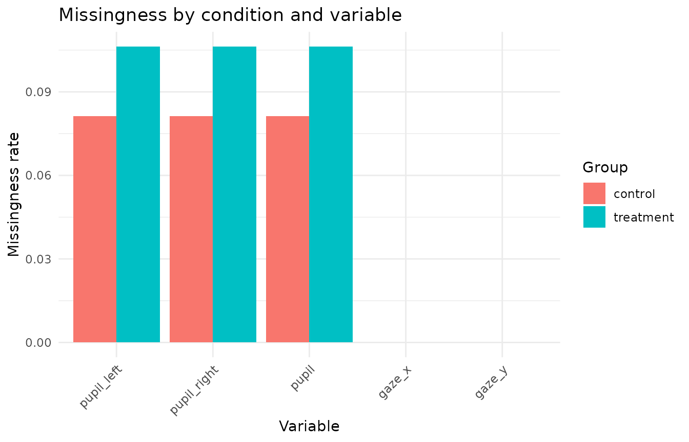
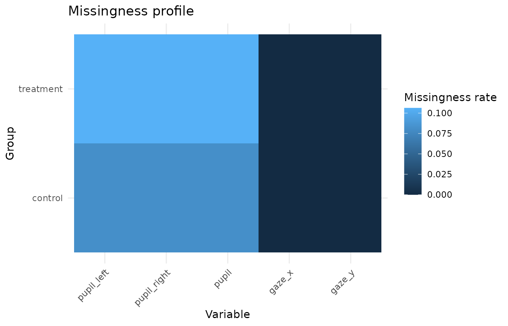

# Missingness and data-coverage reporting

This article demonstrates compact helpers for summarising, plotting, and
reporting missingness in Gazepoint-style data. The helpers are intended
for transparent data-coverage review. They do not define exclusion rules
by themselves.

## Simulate example data

``` r

synthetic <- simulate_gazepoint_pupil_data(
  n_subjects = 4,
  n_trials = 4,
  n_time_bins = 20,
  conditions = c("control", "treatment"),
  blink_probability = 0.08,
  seed = 123
)

head(synthetic)
#>   subject trial condition time_bin timestamp_ms    gaze_x   gaze_y pupil_left
#> 1    S001     1   control        1         0.00  993.1529 498.0263   3.355974
#> 2    S001     1   control        2        16.67  977.2926 794.7236   3.484336
#> 3    S001     1   control        3        33.34  950.9250 535.9970   3.385504
#> 4    S001     1   control        4        50.01 1219.3699 504.5001   3.248926
#> 5    S001     1   control        5        66.68  993.1579 563.9892   3.296683
#> 6    S001     1   control        6        83.35  941.0047 414.5260   3.317478
#>   pupil_right blink trackloss    pupil
#> 1    3.303798 FALSE     FALSE 3.329886
#> 2    3.401831 FALSE     FALSE 3.443084
#> 3    3.343765 FALSE     FALSE 3.364635
#> 4    3.400768 FALSE     FALSE 3.324847
#> 5    3.458472 FALSE     FALSE 3.377578
#> 6    3.353714 FALSE     FALSE 3.335596
```

## Summarise missingness

[`summarize_gazepoint_missingness()`](https://stefanosbalaskas.github.io/gp3tools/reference/summarize_gazepoint_missingness.md)
computes missing and observed rates for selected variables, optionally
within grouping columns.

``` r

missingness <- summarize_gazepoint_missingness(
  synthetic,
  cols = c("pupil_left", "pupil_right", "pupil", "gaze_x", "gaze_y"),
  group_cols = "condition"
)

missingness
#>     group_id    variable n_rows n_missing n_observed missing_rate observed_rate
#> 1    control  pupil_left    160        13        147      0.08125       0.91875
#> 2    control pupil_right    160        13        147      0.08125       0.91875
#> 3    control       pupil    160        13        147      0.08125       0.91875
#> 4    control      gaze_x    160         0        160      0.00000       1.00000
#> 5    control      gaze_y    160         0        160      0.00000       1.00000
#> 6  treatment  pupil_left    160        17        143      0.10625       0.89375
#> 7  treatment pupil_right    160        17        143      0.10625       0.89375
#> 8  treatment       pupil    160        17        143      0.10625       0.89375
#> 9  treatment      gaze_x    160         0        160      0.00000       1.00000
#> 10 treatment      gaze_y    160         0        160      0.00000       1.00000
```

The British spelling alias is also available.

``` r

summarise_gazepoint_missingness(
  synthetic,
  cols = c("pupil_left", "pupil_right", "pupil")
)
#>   group_id    variable n_rows n_missing n_observed missing_rate observed_rate
#> 1      all  pupil_left    320        30        290      0.09375       0.90625
#> 2      all pupil_right    320        30        290      0.09375       0.90625
#> 3      all       pupil    320        30        290      0.09375       0.90625
```

## Plot missingness profiles

[`plot_gazepoint_missingness_profile()`](https://stefanosbalaskas.github.io/gp3tools/reference/plot_gazepoint_missingness_profile.md)
can use either raw data or a missingness summary.

``` r

plot_gazepoint_missingness_profile(
  missingness,
  plot_type = "bar",
  title = "Missingness by condition and variable"
)
```



A tile view can be useful when there are many groups or variables.

``` r

plot_gazepoint_missingness_profile(
  missingness,
  plot_type = "tile",
  title = "Missingness profile"
)
```



## Generate cautious report text

[`report_gazepoint_missingness()`](https://stefanosbalaskas.github.io/gp3tools/reference/report_gazepoint_missingness.md)
returns the summary table, an overall table, a variable-level table, and
compact report text.

``` r

missingness_report <- report_gazepoint_missingness(
  missingness,
  digits = 1,
  max_variables = 3
)

missingness_report$overall
#>   n_variables n_groups total_cells total_missing overall_missing_rate
#> 1           5        2        1600            90              0.05625
```

``` r

missingness_report$variable_summary
#>      variable n_rows n_missing missing_rate
#> 3       pupil    320        30      0.09375
#> 4  pupil_left    320        30      0.09375
#> 5 pupil_right    320        30      0.09375
#> 1      gaze_x    320         0      0.00000
#> 2      gaze_y    320         0      0.00000
```

``` r

missingness_report$report_text
#> [1] "Missingness was summarized across 5 variable(s). The overall cell-level missingness rate was 5.6%. The highest missingness variable(s) were: pupil (9.4%), pupil_left (9.4%), pupil_right (9.4%). These values are descriptive data-coverage diagnostics and do not by themselves define exclusion decisions."
```

The generated wording is deliberately cautious. Missingness rates are
data-coverage diagnostics and should be interpreted together with study
design, preprocessing decisions, and planned exclusion criteria.

## Suggested workflow

A transparent reporting workflow is:

1.  Summarise missingness for pupil, gaze, AOI, or trial-level
    variables.
2.  Plot missingness by participant, trial, condition, AOI, or
    preprocessing stage.
3.  Report overall and variable-level missingness rates.
4.  Keep exclusion decisions separate from descriptive missingness
    summaries.
