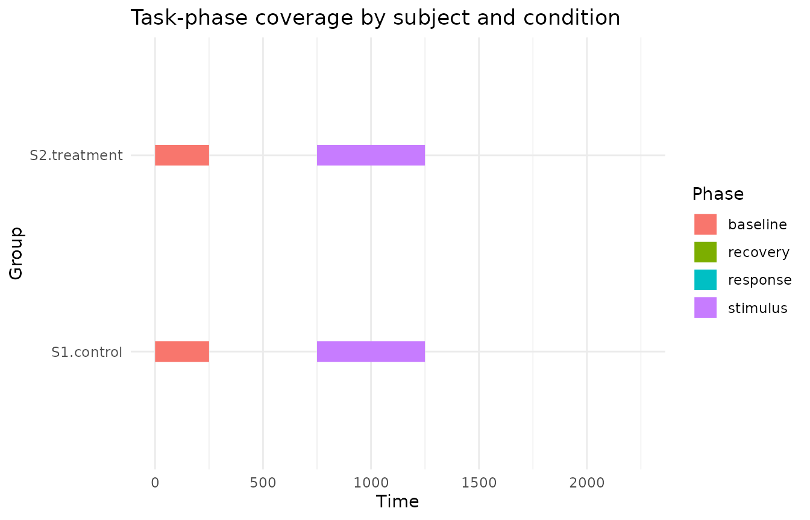
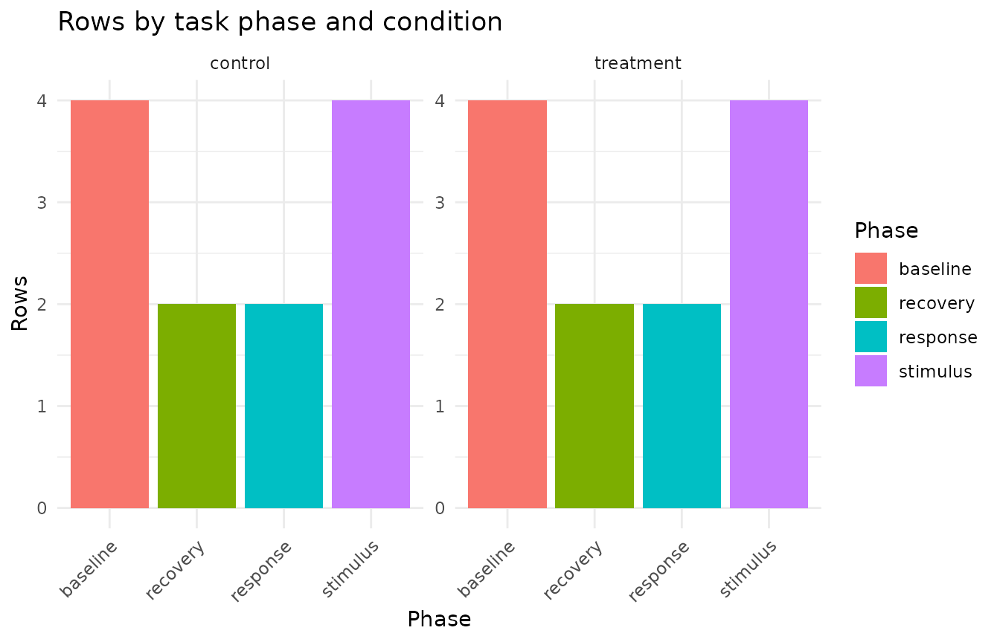

# Task-phase segmentation and coverage reporting

This article demonstrates helpers for assigning Gazepoint-style samples
to declared task phases and summarising phase-level data coverage. These
helpers are descriptive. They do not infer experimental phases, define
exclusion rules, or replace study-specific preprocessing decisions.

## Example data and phase windows

A typical eye-tracking task may include baseline, stimulus, response,
and recovery periods. The phase windows should be declared explicitly by
the analyst.

``` r

gaze_data <- data.frame(
  subject = rep(c("S1", "S2"), each = 12),
  trial = rep(rep(1:2, each = 6), times = 2),
  condition = rep(c("control", "treatment"), each = 12),
  time_ms = rep(c(0, 250, 750, 1250, 1750, 2250), times = 4),
  pupil = c(
    3.1, 3.0, 3.2, 3.3, NA, 3.2,
    3.0, 3.1, 3.3, 3.4, 3.5, 3.4,
    3.2, NA, 3.4, 3.5, 3.6, 3.5,
    3.1, 3.2, 3.3, NA, 3.4, 3.3
  )
)

phase_windows <- data.frame(
  phase = c("baseline", "stimulus", "response", "recovery"),
  start = c(0, 500, 1500, 2000),
  end = c(500, 1500, 2000, 2500)
)

phase_windows
#>      phase start  end
#> 1 baseline     0  500
#> 2 stimulus   500 1500
#> 3 response  1500 2000
#> 4 recovery  2000 2500
```

## Segment samples into task phases

[`segment_gazepoint_task_phases()`](https://stefanosbalaskas.github.io/gp3tools/reference/segment_gazepoint_task_phases.md)
assigns each row to the first declared phase window that contains its
timestamp. Rows outside the declared windows are labelled separately.

``` r

segmented <- segment_gazepoint_task_phases(
  gaze_data,
  time_col = "time_ms",
  phase_windows = phase_windows,
  keep_window_metadata = TRUE
)

head(segmented)
#>   subject trial condition time_ms pupil task_phase .gp3_phase_assigned
#> 1      S1     1   control       0   3.1   baseline                TRUE
#> 2      S1     1   control     250   3.0   baseline                TRUE
#> 3      S1     1   control     750   3.2   stimulus                TRUE
#> 4      S1     1   control    1250   3.3   stimulus                TRUE
#> 5      S1     1   control    1750    NA   response                TRUE
#> 6      S1     1   control    2250   3.2   recovery                TRUE
#>   .gp3_phase_window_start .gp3_phase_window_end
#> 1                       0                   500
#> 2                       0                   500
#> 3                     500                  1500
#> 4                     500                  1500
#> 5                    1500                  2000
#> 6                    2000                  2500
```

The helper records whether each row was assigned to a declared phase.

``` r

table(segmented$task_phase, useNA = "ifany")
#> 
#> baseline recovery response stimulus 
#>        8        4        4        8
table(segmented$.gp3_phase_assigned, useNA = "ifany")
#> 
#> TRUE 
#>   24
```

## Summarise phase coverage

[`summarize_gazepoint_phase_coverage()`](https://stefanosbalaskas.github.io/gp3tools/reference/summarize_gazepoint_phase_coverage.md)
summarises row counts, timing, and optional complete-value coverage by
phase and group.

``` r

phase_coverage <- summarize_gazepoint_phase_coverage(
  segmented,
  phase_col = "task_phase",
  group_cols = c("subject", "condition"),
  time_col = "time_ms",
  value_cols = "pupil"
)

phase_coverage
#>       group_id    phase n_rows n_finite_time min_time max_time time_span
#> 1   S1.control baseline      4             4        0      250       250
#> 2   S1.control recovery      2             2     2250     2250         0
#> 3   S1.control response      2             2     1750     1750         0
#> 4   S1.control stimulus      4             4      750     1250       500
#> 5 S2.treatment baseline      4             4        0      250       250
#> 6 S2.treatment recovery      2             2     2250     2250         0
#> 7 S2.treatment response      2             2     1750     1750         0
#> 8 S2.treatment stimulus      4             4      750     1250       500
#>   n_complete_value_rows complete_value_rate n_any_value_missing
#> 1                     4                1.00                   0
#> 2                     2                1.00                   0
#> 3                     1                0.50                   1
#> 4                     4                1.00                   0
#> 5                     3                0.75                   1
#> 6                     2                1.00                   0
#> 7                     2                1.00                   0
#> 8                     3                0.75                   1
#>   any_value_missing_rate
#> 1                   0.00
#> 2                   0.00
#> 3                   0.50
#> 4                   0.00
#> 5                   0.25
#> 6                   0.00
#> 7                   0.00
#> 8                   0.25
```

The British spelling alias is also available.

``` r

summarise_gazepoint_phase_coverage(
  segmented,
  phase_col = "task_phase",
  time_col = "time_ms",
  value_cols = "pupil"
)
#>   group_id    phase n_rows n_finite_time min_time max_time time_span
#> 1      all baseline      8             8        0      250       250
#> 2      all recovery      4             4     2250     2250         0
#> 3      all response      4             4     1750     1750         0
#> 4      all stimulus      8             8      750     1250       500
#>   n_complete_value_rows complete_value_rate n_any_value_missing
#> 1                     7               0.875                   1
#> 2                     4               1.000                   0
#> 3                     3               0.750                   1
#> 4                     7               0.875                   1
#>   any_value_missing_rate
#> 1                  0.125
#> 2                  0.000
#> 3                  0.250
#> 4                  0.125
```

## Plot phase timing

[`plot_gazepoint_phase_timeline()`](https://stefanosbalaskas.github.io/gp3tools/reference/plot_gazepoint_phase_timeline.md)
visualises the timing coverage of each phase. When timing information is
available, it draws phase intervals by group.

``` r

plot_gazepoint_phase_timeline(
  segmented,
  phase_col = "task_phase",
  group_cols = c("subject", "condition"),
  time_col = "time_ms",
  title = "Task-phase coverage by subject and condition"
)
```



If timing information is not supplied, the same function falls back to a
descriptive count plot.

``` r

plot_gazepoint_phase_timeline(
  segmented,
  phase_col = "task_phase",
  group_cols = "condition",
  title = "Rows by task phase and condition"
)
```



## Generate cautious report text

[`report_gazepoint_phase_coverage()`](https://stefanosbalaskas.github.io/gp3tools/reference/report_gazepoint_phase_coverage.md)
returns the summary table, phase totals, overall diagnostics, and
compact report text.

``` r

phase_report <- report_gazepoint_phase_coverage(
  phase_coverage,
  digits = 1
)

phase_report$overall
#>   n_phases n_groups total_rows least_represented_phase
#> 1        4        2         24                recovery
#>   least_represented_phase_rows weighted_complete_value_rate
#> 1                            4                        0.875
```

``` r

phase_report$phase_totals
#>      phase n_rows
#> 1 baseline      8
#> 4 stimulus      8
#> 2 recovery      4
#> 3 response      4
```

``` r

phase_report$report_text
#> [1] "Task-phase coverage was summarized across 4 phase(s) and 2 group(s), representing 24 row(s). The least represented phase was 'recovery' with 4 row(s). The weighted complete-value rate across summarized phases was 87.5%. These values are descriptive data-coverage diagnostics and do not by themselves define exclusion decisions."
```

The generated wording is deliberately cautious. Phase coverage summaries
describe data availability within declared task windows; they do not by
themselves justify exclusion, imputation, or modelling decisions.

## Suggested workflow

A transparent task-phase workflow is:

1.  Declare phase windows from the experimental protocol.
2.  Segment samples using the declared timing table.
3.  Summarise row, timing, and value coverage by participant, trial,
    condition, or other grouping variables.
4.  Inspect the phase timeline visually.
5.  Report coverage diagnostics separately from exclusion decisions.
