# Plot gallery

This article is a website-only showcase of representative visual outputs
in `gp3tools`. It is intended for users, reviewers, and readers who want
to see the visual diagnostics and reporting plots produced by the
package.

The gallery uses only package-safe synthetic or example data. It should
not be read as an empirical analysis of real participants.

## Important note

`gp3tools` can parse official Gazepoint Analysis summary exports, but
metrics recomputed from all-gaze and fixation files may not always
exactly reproduce Gazepoint’s internal summary calculations. For
official Gazepoint summary values, use
[`read_gazepoint_summary()`](https://stefanosbalaskas.github.io/gp3tools/reference/read_gazepoint_summary.md).
For transparent reproducible calculations from exported rows, use the
sample-level and fixation-level summary functions.

## Exported plot functions

    #>                                plot_function
    #> 1                    plot_gazepoint_aoi_gamm
    #> 2             plot_gazepoint_aoi_sensitivity
    #> 3                plot_gazepoint_aoi_timeline
    #> 4       plot_gazepoint_aoi_transition_matrix
    #> 5            plot_gazepoint_aoi_verification
    #> 6       plot_gazepoint_binocular_diagnostics
    #> 7   plot_gazepoint_cluster_null_distribution
    #> 8         plot_gazepoint_cluster_permutation
    #> 9             plot_gazepoint_cluster_results
    #> 10   plot_gazepoint_event_detector_agreement
    #> 11   plot_gazepoint_event_detector_benchmark
    #> 12               plot_gazepoint_face_quality
    #> 13                        plot_gazepoint_gca
    #> 14                    plot_gazepoint_heatmap
    #> 15            plot_gazepoint_heatmap_overlay
    #> 16        plot_gazepoint_missingness_profile
    #> 17          plot_gazepoint_model_predictions
    #> 18            plot_gazepoint_model_residuals
    #> 19         plot_gazepoint_multiverse_results
    #> 20             plot_gazepoint_phase_timeline
    #> 21        plot_gazepoint_pupil_preprocessing
    #> 22               plot_gazepoint_pupil_status
    #> 23           plot_gazepoint_pupil_timecourse
    #> 24                plot_gazepoint_qc_overview
    #> 25          plot_gazepoint_quality_dashboard
    #> 26                   plot_gazepoint_scanpath
    #> 27 plot_gazepoint_scanpath_cluster_stability
    #> 28          plot_gazepoint_scanpath_clusters
    #> 29                  plot_gazepoint_scanpaths
    #> 30         plot_gazepoint_stimulus_layout_qc
    #> 31                plot_gazepoint_time_series
    #> 32        plot_gazepoint_time_varying_effect
    #> 33                        plot_sampling_rate
    #> 34                     plot_tracking_quality
    #> 35                   plot_transition_heatmap

## Sampling rate

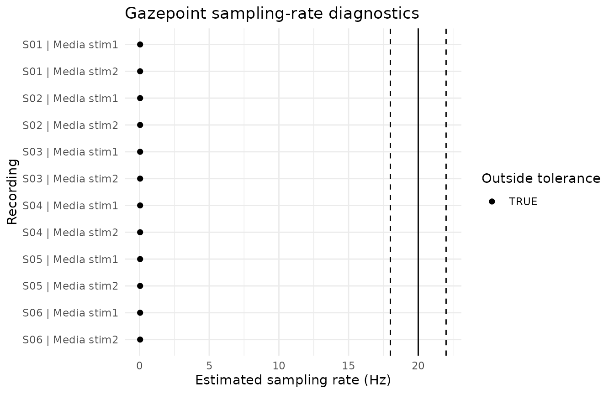

## Tracking quality

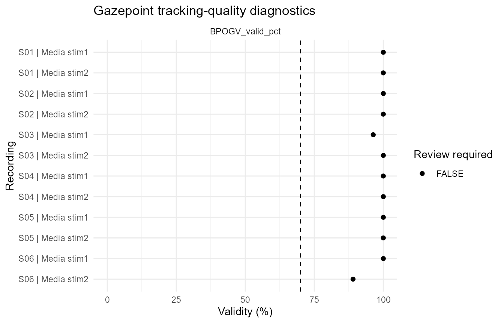

## Pupil status

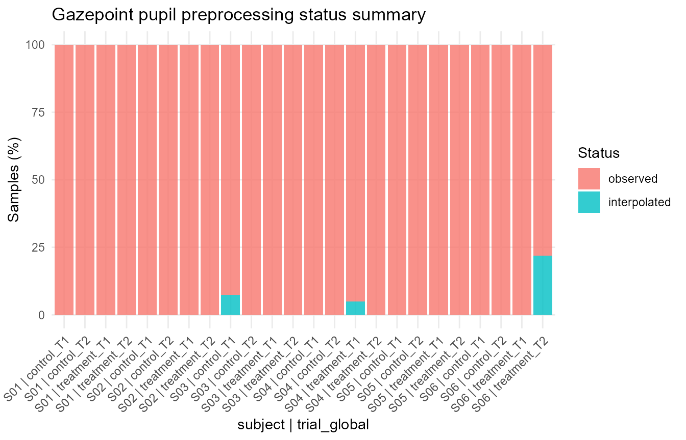

## Pupil preprocessing

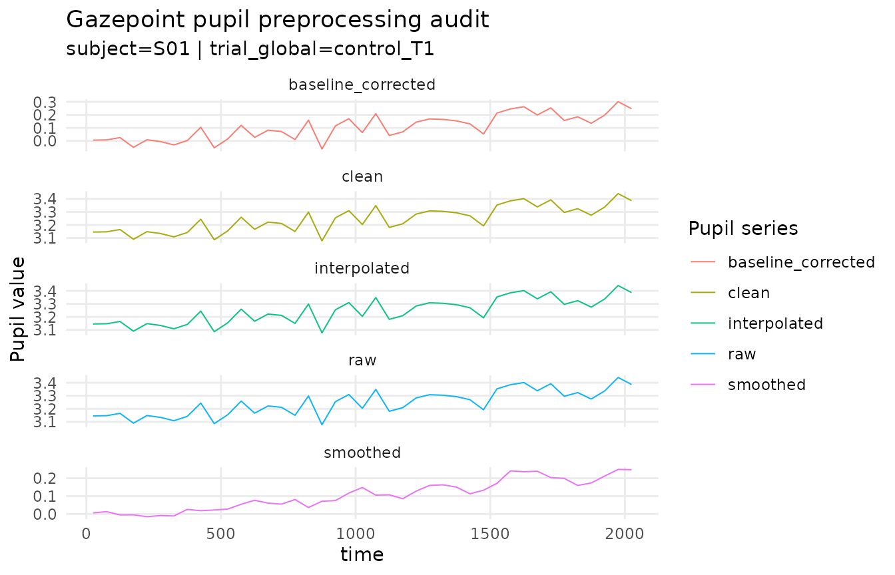

## Pupil time course

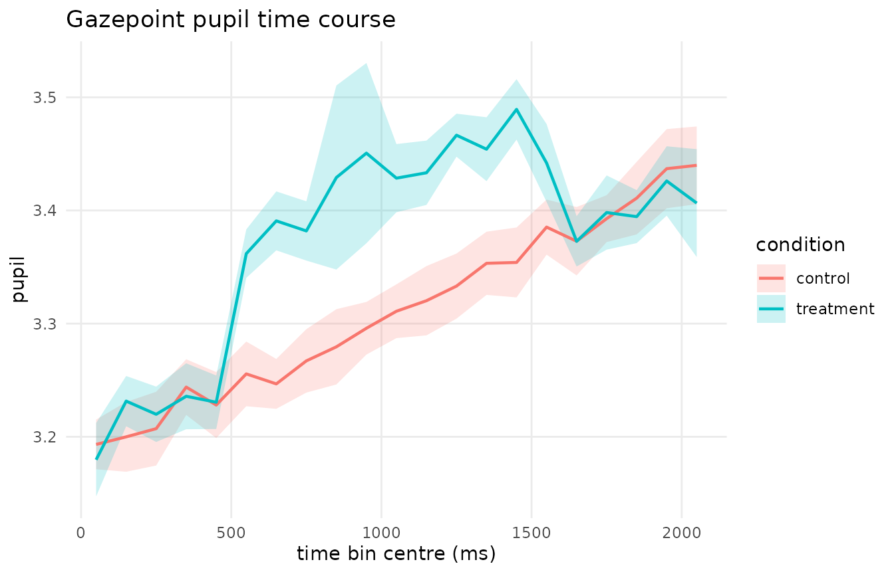

## AOI verification

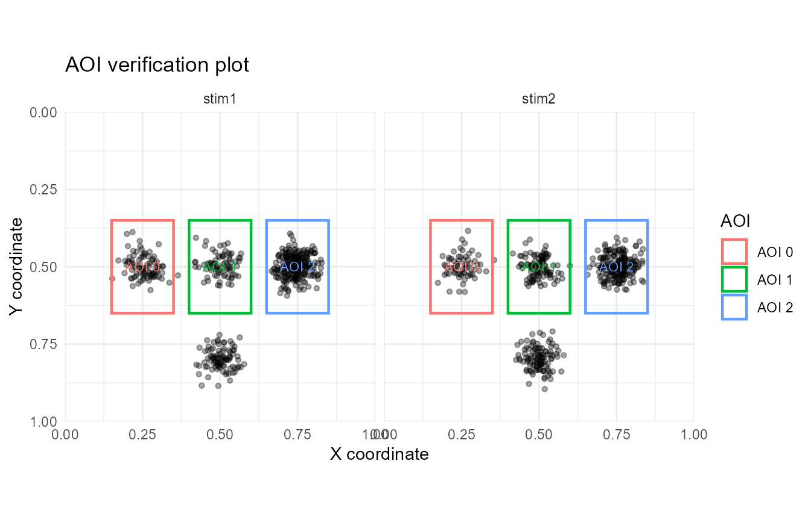

## AOI transition matrix

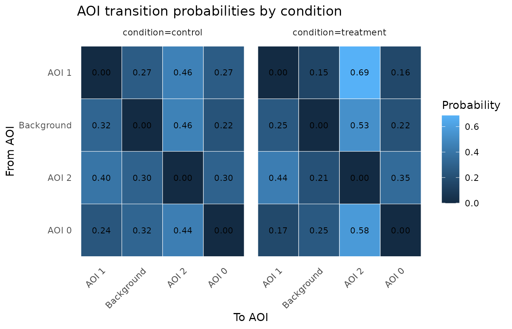

## Transition heatmap

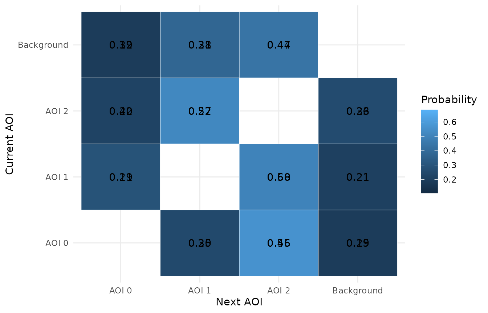

## GCA model plot

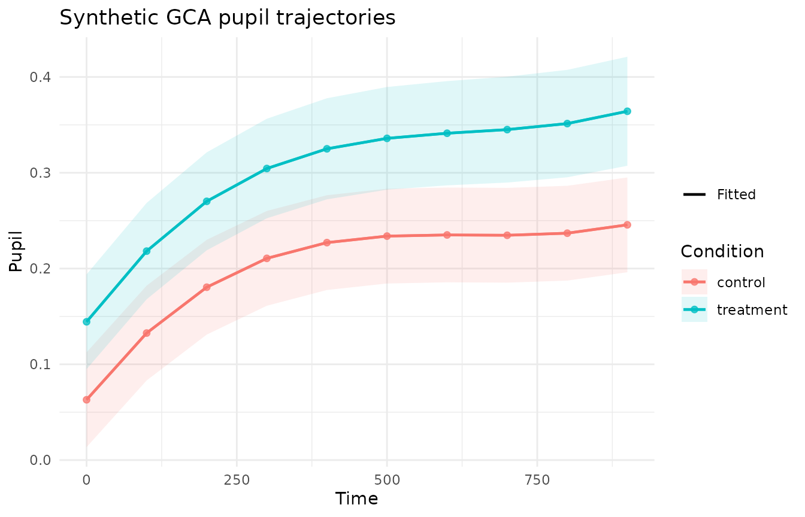

## Model-prediction plot

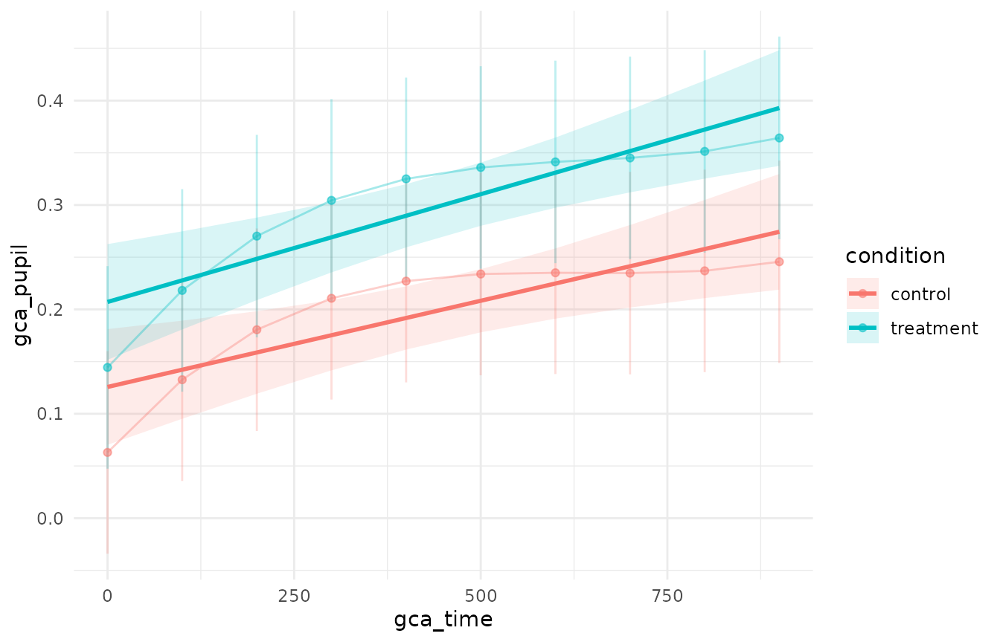

## AOI GAMM plot

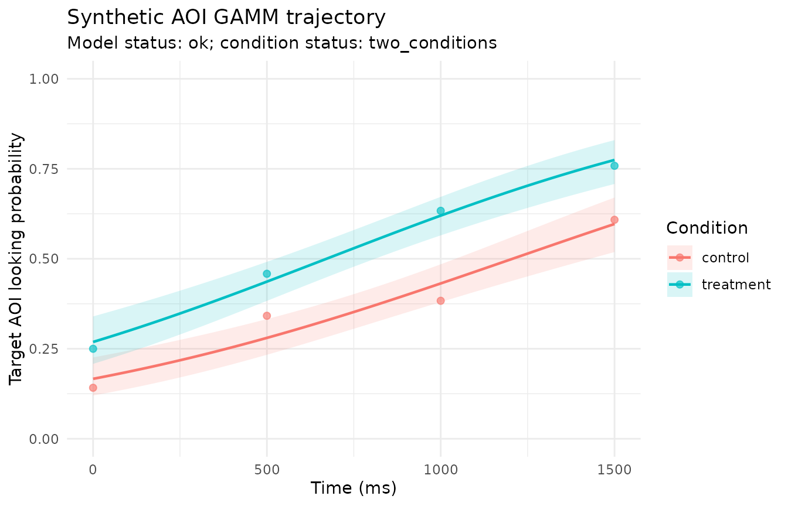

## Cluster-results plot

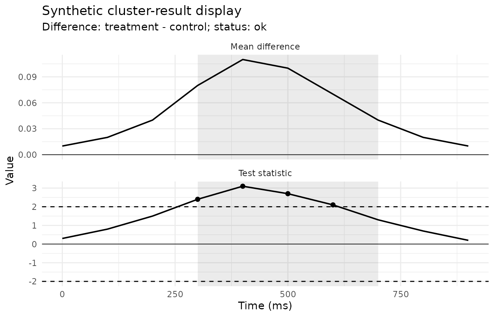

## Multiverse-results plot

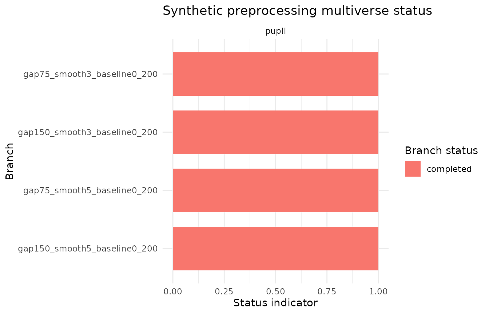
