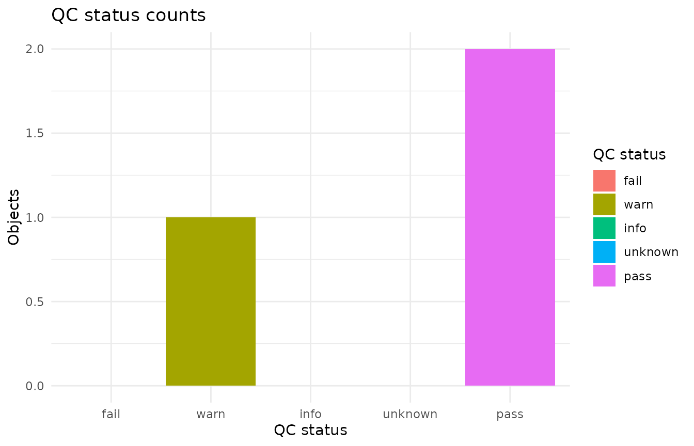
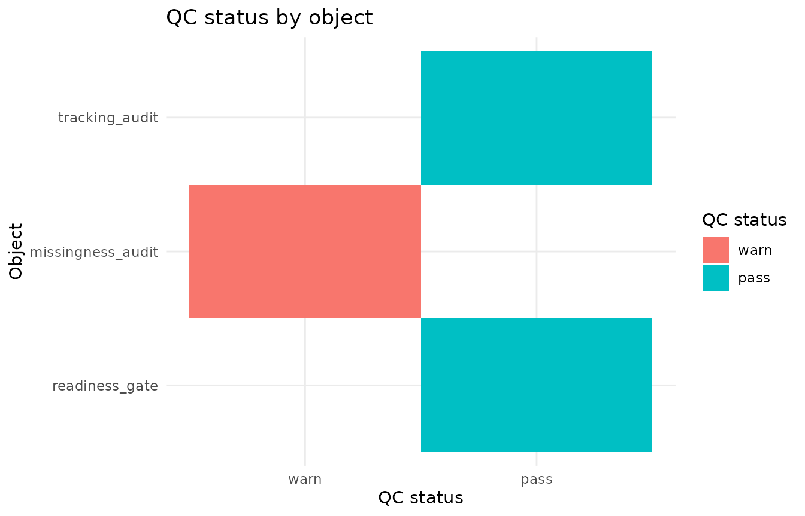

# QC reporting bundle

This article demonstrates lightweight helpers for collecting existing
gp3tools quality-control outputs into a compact overview. The QC bundle
is a reporting aid. It does not rerun audits, define exclusion rules, or
replace readiness gates, reporting checklists, or study-specific
decisions.

## Example QC objects

The collector works with gp3tools-style objects that contain an
`overview` table, as well as standalone overview data frames.

``` r

tracking_audit <- list(
  overview = data.frame(
    audit_status = "ok",
    message = "Tracking-quality checks passed.",
    stringsAsFactors = FALSE
  )
)

missingness_audit <- list(
  overview = data.frame(
    audit_status = "review",
    message = "Missingness should be reported by condition.",
    stringsAsFactors = FALSE
  )
)

readiness_gate <- list(
  overview = data.frame(
    readiness_status = "ready",
    decision_message = "Ready for analysis review.",
    stringsAsFactors = FALSE
  )
)

qc_objects <- list(
  tracking_audit = tracking_audit,
  missingness_audit = missingness_audit,
  readiness_gate = readiness_gate
)
```

## Collect QC summaries

[`collect_gazepoint_qc_summaries()`](https://stefanosbalaskas.github.io/gp3tools/reference/collect_gazepoint_qc_summaries.md)
extracts interpretable status and message information from supplied
objects.

``` r

qc_bundle <- collect_gazepoint_qc_summaries(qc_objects)

qc_bundle$overview
#>                   object_name n_objects n_overview_rows n_pass n_warn n_fail
#> 1 gazepoint_qc_summary_bundle         3               3      2      1      0
#>   n_info n_unknown qc_bundle_status
#> 1      0         0             warn
```

``` r

qc_bundle$object_summary
#>         object_name object_index object_class overview_available
#> 1    tracking_audit            1         list               TRUE
#> 2 missingness_audit            2         list               TRUE
#> 3    readiness_gate            3         list               TRUE
#>   n_overview_rows   status_columns  message_columns qc_status
#> 1               1     audit_status          message      pass
#> 2               1     audit_status          message      warn
#> 3               1 readiness_status decision_message      pass
#>                                     qc_message
#> 1              Tracking-quality checks passed.
#> 2 Missingness should be reported by condition.
#> 3                   Ready for analysis review.
```

``` r

qc_bundle$status_counts
#>         qc_status n_objects
#> pass         pass         2
#> warn         warn         1
#> fail         fail         0
#> info         info         0
#> unknown   unknown         0
```

When requested, the function also keeps a combined long-form table of
available overview rows.

``` r

head(qc_bundle$overview_rows)
#>   .gp3_qc_object_name .gp3_qc_object_index .gp3_qc_row audit_status
#> 1      tracking_audit                    1           1           ok
#> 2   missingness_audit                    2           1       review
#> 3      readiness_gate                    3           1         <NA>
#>                                        message readiness_status
#> 1              Tracking-quality checks passed.             <NA>
#> 2 Missingness should be reported by condition.             <NA>
#> 3                                         <NA>            ready
#>             decision_message
#> 1                       <NA>
#> 2                       <NA>
#> 3 Ready for analysis review.
```

## Summarise QC status

[`summarize_gazepoint_qc_status()`](https://stefanosbalaskas.github.io/gp3tools/reference/summarize_gazepoint_qc_status.md)
produces a compact status summary from a bundle, an object-summary
table, or a raw list of objects.

``` r

qc_status <- summarize_gazepoint_qc_status(qc_bundle)

qc_status$overview
#>   n_objects n_pass n_warn n_fail n_info n_unknown qc_overview_status
#> 1         3      2      1      0      0         0               warn
```

The British spelling alias is also available.

``` r

summarise_gazepoint_qc_status(qc_bundle)$status_counts
#>         qc_status n_objects
#> pass         pass         2
#> warn         warn         1
#> fail         fail         0
#> info         info         0
#> unknown   unknown         0
```

## Plot QC overview

[`plot_gazepoint_qc_overview()`](https://stefanosbalaskas.github.io/gp3tools/reference/plot_gazepoint_qc_overview.md)
can show status counts.

``` r

plot_gazepoint_qc_overview(
  qc_bundle,
  plot_type = "status_counts",
  title = "QC status counts"
)
```



It can also show object-level status.

``` r

plot_gazepoint_qc_overview(
  qc_bundle,
  plot_type = "objects",
  title = "QC status by object"
)
```



## Generate cautious report text

[`report_gazepoint_qc_overview()`](https://stefanosbalaskas.github.io/gp3tools/reference/report_gazepoint_qc_overview.md)
returns compact text for reporting support.

``` r

qc_report <- report_gazepoint_qc_overview(qc_bundle)

qc_report$report_text
#> [1] "QC overview collected 3 object(s): 2 pass, 1 warn, 0 fail, 0 info, and 0 unknown. Overall QC overview status was 'warn'. Object(s) needing review or interpretation: missingness_audit. This overview is a reporting aid only; it does not replace the underlying audit outputs, readiness gates, or exclusion decisions."
```

The generated wording is deliberately cautious. The QC overview
describes available outputs and interpreted status patterns; it should
be read together with the underlying audit tables, readiness gates,
exclusion recommendations, and reporting checklist.

## Suggested workflow

A transparent QC-reporting workflow is:

1.  Run the relevant gp3tools audits, checks, summaries, and reporting
    helpers.
2.  Collect their overview tables into a QC bundle.
3.  Inspect the status summary and object-level messages.
4.  Use the plot and report text as a compact review aid.
5.  Keep final exclusion, imputation, modelling, and manuscript
    decisions separate from the overview itself.
