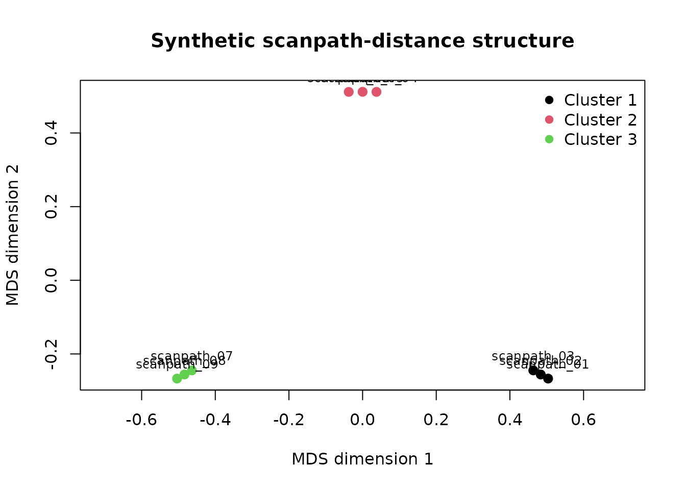
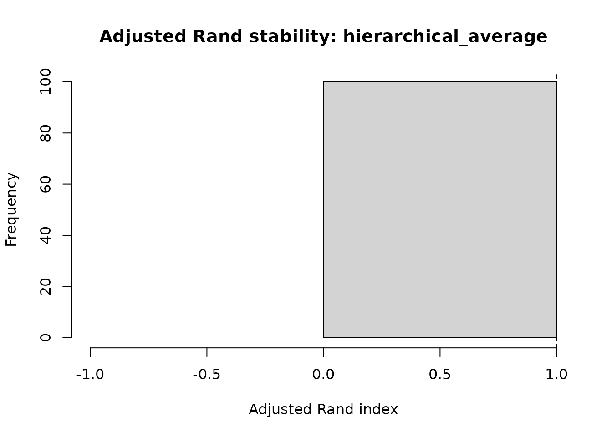
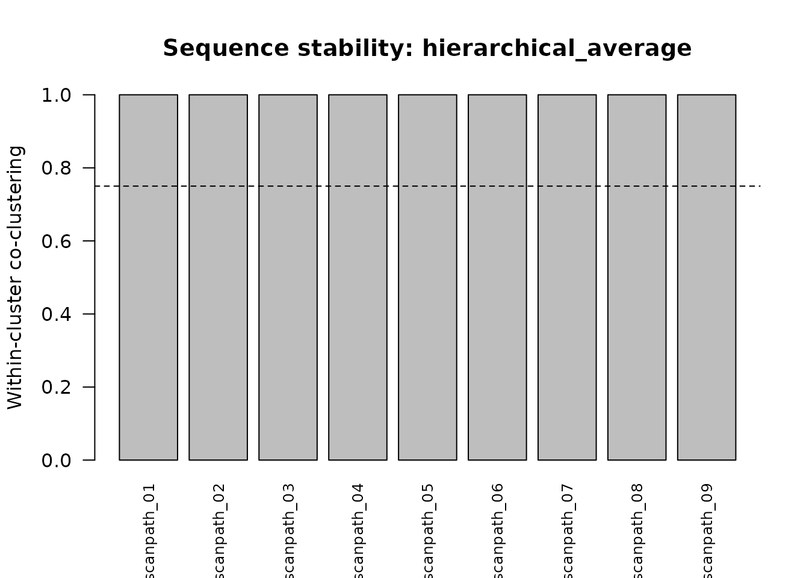

# Scanpath-cluster stability and sensitivity

## Scope

Cluster assignments can change when scanpaths, linkage methods, or
distance definitions change. This article demonstrates a lightweight
subsampling workflow for evaluating that sensitivity.

The workflow records:

- full-data reference solutions;
- iteration-level adjusted Rand agreement;
- pairwise co-clustering probabilities;
- pair-coverage rates;
- sequence-level within-cluster stability;
- representative-scanpath selection rates;
- sensitivity across hierarchical linkage methods.

These diagnostics quantify reproducibility under the specified
resampling scheme. They do not prove that a cluster solution represents
a true latent cognitive strategy.

``` r

library(gp3tools)
```

## Synthetic distance structure

The example contains nine scanpaths arranged around three synthetic
sequence patterns. Within-pattern distances are small and
between-pattern distances are larger, with modest deterministic
variation.

``` r

sequence_ids <- paste0("scanpath_", sprintf("%02d", 1:9))
latent_cluster <- rep(1:3, each = 3)

distance_matrix <- outer(
  seq_along(sequence_ids),
  seq_along(sequence_ids),
  FUN = function(i, j) {
    ifelse(
      latent_cluster[i] == latent_cluster[j],
      0.08 + 0.01 * abs(i - j),
      0.85 + 0.02 * abs(i - j)
    )
  }
)

diag(distance_matrix) <- 0

dimnames(distance_matrix) <- list(
  sequence_ids,
  sequence_ids
)

round(distance_matrix, 2)
#>             scanpath_01 scanpath_02 scanpath_03 scanpath_04 scanpath_05
#> scanpath_01        0.00        0.09        0.10        0.91        0.93
#> scanpath_02        0.09        0.00        0.09        0.89        0.91
#> scanpath_03        0.10        0.09        0.00        0.87        0.89
#> scanpath_04        0.91        0.89        0.87        0.00        0.09
#> scanpath_05        0.93        0.91        0.89        0.09        0.00
#> scanpath_06        0.95        0.93        0.91        0.10        0.09
#> scanpath_07        0.97        0.95        0.93        0.91        0.89
#> scanpath_08        0.99        0.97        0.95        0.93        0.91
#> scanpath_09        1.01        0.99        0.97        0.95        0.93
#>             scanpath_06 scanpath_07 scanpath_08 scanpath_09
#> scanpath_01        0.95        0.97        0.99        1.01
#> scanpath_02        0.93        0.95        0.97        0.99
#> scanpath_03        0.91        0.93        0.95        0.97
#> scanpath_04        0.10        0.91        0.93        0.95
#> scanpath_05        0.09        0.89        0.91        0.93
#> scanpath_06        0.00        0.87        0.89        0.91
#> scanpath_07        0.87        0.00        0.09        0.10
#> scanpath_08        0.89        0.09        0.00        0.09
#> scanpath_09        0.91        0.10        0.09        0.00
```

## Reference clustering

``` r

reference_fit <- cluster_gazepoint_scanpaths(
  distance_matrix,
  k = 3,
  method = "hierarchical",
  linkage = "average"
)

reference_fit$assignments
#>   sequence_id cluster
#> 1 scanpath_01       1
#> 2 scanpath_02       1
#> 3 scanpath_03       1
#> 4 scanpath_04       2
#> 5 scanpath_05       2
#> 6 scanpath_06       2
#> 7 scanpath_07       3
#> 8 scanpath_08       3
#> 9 scanpath_09       3
```

``` r

plot_gazepoint_scanpath_clusters(
  reference_fit,
  plot = "mds",
  main = "Synthetic scanpath-distance structure"
)
```



## Subsampling stability

Each iteration retains 80% of scanpaths without replacement, refits the
three-cluster solution, and compares it with the corresponding full-data
reference partition.

``` r

stability <- bootstrap_gazepoint_scanpath_clusters(
  distance_matrix,
  k = 3,
  n_boot = 100,
  sample_fraction = 0.8,
  method = "hierarchical",
  linkages = c("average", "complete", "ward.D2"),
  seed = 20260715
)

utils::head(stability$iteration_summary)
#>          specification       method linkage iteration n_sampled
#> 1 hierarchical_average hierarchical average         1         8
#> 2 hierarchical_average hierarchical average         2         8
#> 3 hierarchical_average hierarchical average         3         8
#> 4 hierarchical_average hierarchical average         4         8
#> 5 hierarchical_average hierarchical average         5         8
#> 6 hierarchical_average hierarchical average         6         8
#>   adjusted_rand_index mean_silhouette_width
#> 1                   1             0.8980393
#> 2                   1             0.8980393
#> 3                   1             0.8981667
#> 4                   1             0.8981667
#> 5                   1             0.8980393
#> 6                   1             0.8981667
```

The seed is local to the helper: the caller’s random-number state is
restored after the routine finishes.

## Adjusted Rand agreement

``` r

plot_gazepoint_scanpath_cluster_stability(
  stability,
  plot = "ari",
  specification = "hierarchical_average"
)
```



The adjusted Rand index compares a subsampled partition with the
full-data reference partition after restricting both to the sampled
scanpaths. Values near one indicate strong agreement; lower values
identify sensitivity to the particular scanpaths retained.

## Co-clustering probabilities

``` r

plot_gazepoint_scanpath_cluster_stability(
  stability,
  plot = "coclustering",
  specification = "hierarchical_average"
)
```


Each cell reports the proportion of iterations in which two observed
scanpaths were assigned to the same cluster, conditional on both being
sampled. Pair coverage is retained separately because some pairs may
co-occur less often than others.

``` r

round(
  stability$pair_coverage$hierarchical_average,
  2
)
#>             scanpath_01 scanpath_02 scanpath_03 scanpath_04 scanpath_05
#> scanpath_01        0.92        0.82        0.81        0.77        0.81
#> scanpath_02        0.82        0.90        0.79        0.75        0.79
#> scanpath_03        0.81        0.79        0.89        0.74        0.78
#> scanpath_04        0.77        0.75        0.74        0.85        0.74
#> scanpath_05        0.81        0.79        0.78        0.74        0.89
#> scanpath_06        0.77        0.75        0.74        0.70        0.74
#> scanpath_07        0.82        0.80        0.79        0.75        0.79
#> scanpath_08        0.81        0.79        0.78        0.74        0.78
#> scanpath_09        0.83        0.81        0.80        0.76        0.80
#>             scanpath_06 scanpath_07 scanpath_08 scanpath_09
#> scanpath_01        0.77        0.82        0.81        0.83
#> scanpath_02        0.75        0.80        0.79        0.81
#> scanpath_03        0.74        0.79        0.78        0.80
#> scanpath_04        0.70        0.75        0.74        0.76
#> scanpath_05        0.74        0.79        0.78        0.80
#> scanpath_06        0.85        0.75        0.74        0.76
#> scanpath_07        0.75        0.90        0.79        0.81
#> scanpath_08        0.74        0.79        0.89        0.80
#> scanpath_09        0.76        0.81        0.80        0.91
```

## Compact stability summaries

``` r

stability_summary <-
  summarise_gazepoint_scanpath_cluster_stability(
    stability,
    min_pair_coverage = 0.50,
    stable_threshold = 0.75
  )

stability_summary$overview
#>           specification       method  linkage k n_boot sample_size
#> 1  hierarchical_average hierarchical  average 3    100           8
#> 2 hierarchical_complete hierarchical complete 3    100           8
#> 3  hierarchical_ward.D2 hierarchical  ward.D2 3    100           8
#>   mean_adjusted_rand_index sd_adjusted_rand_index min_adjusted_rand_index
#> 1                        1                      0                       1
#> 2                        1                      0                       1
#> 3                        1                      0                       1
#>   mean_within_cluster_coclustering mean_between_cluster_coclustering
#> 1                                1                                 0
#> 2                                1                                 0
#> 3                                1                                 0
#>   mean_sequence_stability min_sequence_stability pct_sequences_stable
#> 1                       1                      1                  100
#> 2                       1                      1                  100
#> 3                       1                      1                  100
#>   stability_status
#> 1           stable
#> 2           stable
#> 3           stable
```

``` r

stability_summary$sequence_summary
#>            specification sequence_id reference_cluster within_cluster_stability
#> 1   hierarchical_average scanpath_01                 1                        1
#> 2   hierarchical_average scanpath_02                 1                        1
#> 3   hierarchical_average scanpath_03                 1                        1
#> 4   hierarchical_average scanpath_04                 2                        1
#> 5   hierarchical_average scanpath_05                 2                        1
#> 6   hierarchical_average scanpath_06                 2                        1
#> 7   hierarchical_average scanpath_07                 3                        1
#> 8   hierarchical_average scanpath_08                 3                        1
#> 9   hierarchical_average scanpath_09                 3                        1
#> 10 hierarchical_complete scanpath_01                 1                        1
#> 11 hierarchical_complete scanpath_02                 1                        1
#> 12 hierarchical_complete scanpath_03                 1                        1
#> 13 hierarchical_complete scanpath_04                 2                        1
#> 14 hierarchical_complete scanpath_05                 2                        1
#> 15 hierarchical_complete scanpath_06                 2                        1
#> 16 hierarchical_complete scanpath_07                 3                        1
#> 17 hierarchical_complete scanpath_08                 3                        1
#> 18 hierarchical_complete scanpath_09                 3                        1
#> 19  hierarchical_ward.D2 scanpath_01                 1                        1
#> 20  hierarchical_ward.D2 scanpath_02                 1                        1
#> 21  hierarchical_ward.D2 scanpath_03                 1                        1
#> 22  hierarchical_ward.D2 scanpath_04                 2                        1
#> 23  hierarchical_ward.D2 scanpath_05                 2                        1
#> 24  hierarchical_ward.D2 scanpath_06                 2                        1
#> 25  hierarchical_ward.D2 scanpath_07                 3                        1
#> 26  hierarchical_ward.D2 scanpath_08                 3                        1
#> 27  hierarchical_ward.D2 scanpath_09                 3                        1
#>    between_cluster_coclustering stability_separation n_within_pairs
#> 1                             0                    1              2
#> 2                             0                    1              2
#> 3                             0                    1              2
#> 4                             0                    1              2
#> 5                             0                    1              2
#> 6                             0                    1              2
#> 7                             0                    1              2
#> 8                             0                    1              2
#> 9                             0                    1              2
#> 10                            0                    1              2
#> 11                            0                    1              2
#> 12                            0                    1              2
#> 13                            0                    1              2
#> 14                            0                    1              2
#> 15                            0                    1              2
#> 16                            0                    1              2
#> 17                            0                    1              2
#> 18                            0                    1              2
#> 19                            0                    1              2
#> 20                            0                    1              2
#> 21                            0                    1              2
#> 22                            0                    1              2
#> 23                            0                    1              2
#> 24                            0                    1              2
#> 25                            0                    1              2
#> 26                            0                    1              2
#> 27                            0                    1              2
#>    n_between_pairs mean_pair_coverage stable
#> 1                6            0.80500   TRUE
#> 2                6            0.78750   TRUE
#> 3                6            0.77875   TRUE
#> 4                6            0.74375   TRUE
#> 5                6            0.77875   TRUE
#> 6                6            0.74375   TRUE
#> 7                6            0.78750   TRUE
#> 8                6            0.77875   TRUE
#> 9                6            0.79625   TRUE
#> 10               6            0.72625   TRUE
#> 11               6            0.77875   TRUE
#> 12               6            0.79625   TRUE
#> 13               6            0.75250   TRUE
#> 14               6            0.78750   TRUE
#> 15               6            0.79625   TRUE
#> 16               6            0.73500   TRUE
#> 17               6            0.81375   TRUE
#> 18               6            0.81375   TRUE
#> 19               6            0.77000   TRUE
#> 20               6            0.79625   TRUE
#> 21               6            0.68250   TRUE
#> 22               6            0.74375   TRUE
#> 23               6            0.83125   TRUE
#> 24               6            0.78750   TRUE
#> 25               6            0.78750   TRUE
#> 26               6            0.78750   TRUE
#> 27               6            0.81375   TRUE
```

Within-cluster stability is the mean co-clustering probability between a
scanpath and the other members of its full-data reference cluster.
Between- cluster co-clustering provides a complementary separation
diagnostic.

``` r

plot_gazepoint_scanpath_cluster_stability(
  stability,
  plot = "sequence",
  specification = "hierarchical_average",
  min_pair_coverage = 0.50,
  stable_threshold = 0.75
)
```



The dashed line marks the reporting threshold supplied to the plot. It
is a review threshold, not a universal inferential cutoff.

## Representative-scanpath stability

``` r

representative_table <-
  stability_summary$representative_stability

representative_table[
  order(
    representative_table$specification,
    representative_table$reference_cluster,
    -representative_table$
      representative_rate_when_included
  ),
]
#>            specification sequence_id reference_cluster n_included
#> 2   hierarchical_average scanpath_02                 1         90
#> 1   hierarchical_average scanpath_01                 1         92
#> 3   hierarchical_average scanpath_03                 1         89
#> 5   hierarchical_average scanpath_05                 2         89
#> 4   hierarchical_average scanpath_04                 2         85
#> 6   hierarchical_average scanpath_06                 2         85
#> 8   hierarchical_average scanpath_08                 3         89
#> 7   hierarchical_average scanpath_07                 3         90
#> 9   hierarchical_average scanpath_09                 3         91
#> 11 hierarchical_complete scanpath_02                 1         89
#> 10 hierarchical_complete scanpath_01                 1         83
#> 12 hierarchical_complete scanpath_03                 1         91
#> 14 hierarchical_complete scanpath_05                 2         90
#> 13 hierarchical_complete scanpath_04                 2         86
#> 15 hierarchical_complete scanpath_06                 2         91
#> 17 hierarchical_complete scanpath_08                 3         93
#> 16 hierarchical_complete scanpath_07                 3         84
#> 18 hierarchical_complete scanpath_09                 3         93
#> 20  hierarchical_ward.D2 scanpath_02                 1         91
#> 19  hierarchical_ward.D2 scanpath_01                 1         88
#> 21  hierarchical_ward.D2 scanpath_03                 1         78
#> 23  hierarchical_ward.D2 scanpath_05                 2         95
#> 22  hierarchical_ward.D2 scanpath_04                 2         85
#> 24  hierarchical_ward.D2 scanpath_06                 2         90
#> 26  hierarchical_ward.D2 scanpath_08                 3         90
#> 25  hierarchical_ward.D2 scanpath_07                 3         90
#> 27  hierarchical_ward.D2 scanpath_09                 3         93
#>    n_selected_as_representative representative_rate_when_included
#> 2                            79                         0.8777778
#> 1                            21                         0.2282609
#> 3                             0                         0.0000000
#> 5                            74                         0.8314607
#> 4                            26                         0.3058824
#> 6                             0                         0.0000000
#> 8                            80                         0.8988764
#> 7                            20                         0.2222222
#> 9                             0                         0.0000000
#> 11                           80                         0.8988764
#> 10                           20                         0.2409639
#> 12                            0                         0.0000000
#> 14                           81                         0.9000000
#> 13                           19                         0.2209302
#> 15                            0                         0.0000000
#> 17                           86                         0.9247312
#> 16                           14                         0.1666667
#> 18                            0                         0.0000000
#> 20                           69                         0.7582418
#> 19                           31                         0.3522727
#> 21                            0                         0.0000000
#> 23                           85                         0.8947368
#> 22                           15                         0.1764706
#> 24                            0                         0.0000000
#> 26                           83                         0.9222222
#> 25                           17                         0.1888889
#> 27                            0                         0.0000000
```

`representative_rate_when_included` reports how often an observed
scanpath was selected as the central representative for its mapped
reference cluster, conditional on that scanpath being included in the
iteration.

## Linkage sensitivity

``` r

stability_summary$overview[
  ,
  c(
    "specification",
    "mean_adjusted_rand_index",
    "mean_within_cluster_coclustering",
    "mean_between_cluster_coclustering",
    "min_sequence_stability",
    "stability_status"
  )
]
#>           specification mean_adjusted_rand_index
#> 1  hierarchical_average                        1
#> 2 hierarchical_complete                        1
#> 3  hierarchical_ward.D2                        1
#>   mean_within_cluster_coclustering mean_between_cluster_coclustering
#> 1                                1                                 0
#> 2                                1                                 0
#> 3                                1                                 0
#>   min_sequence_stability stability_status
#> 1                      1           stable
#> 2                      1           stable
#> 3                      1           stable
```

Agreement across linkage methods supports robustness to that analytical
choice. Divergence indicates that the cluster geometry or distance
structure requires closer inspection.

## PAM sensitivity

PAM stability can be evaluated with the same interface when the optional
`cluster` package is available.

``` r

if (requireNamespace("cluster", quietly = TRUE)) {
  pam_stability <-
    bootstrap_gazepoint_scanpath_clusters(
      distance_matrix,
      k = 3,
      n_boot = 50,
      sample_fraction = 0.8,
      method = "pam",
      seed = 20260715
    )

  summarise_gazepoint_scanpath_cluster_stability(
    pam_stability
  )$overview
}
#>   specification method linkage k n_boot sample_size mean_adjusted_rand_index
#> 1           pam    pam    <NA> 3     50           8                        1
#>   sd_adjusted_rand_index min_adjusted_rand_index
#> 1                      0                       1
#>   mean_within_cluster_coclustering mean_between_cluster_coclustering
#> 1                                1                                 0
#>   mean_sequence_stability min_sequence_stability pct_sequences_stable
#> 1                       1                      1                  100
#>   stability_status
#> 1           stable
```

## Recommended reporting

Report:

- distance definition and sequence preprocessing;
- clustering method and linkage;
- full-data cluster count and sizes;
- number of resamples;
- retained sample fraction and resolved sample size;
- random seed;
- mean, variability, and minimum adjusted Rand agreement;
- within- and between-cluster co-clustering;
- pair-coverage threshold;
- sequence-level stability;
- representative-scanpath stability;
- sensitivity across linkage or clustering methods.

The resampling design assesses procedural stability under the observed
distance structure. It does not replace external validation or
substantive review of the representative scanpaths.
