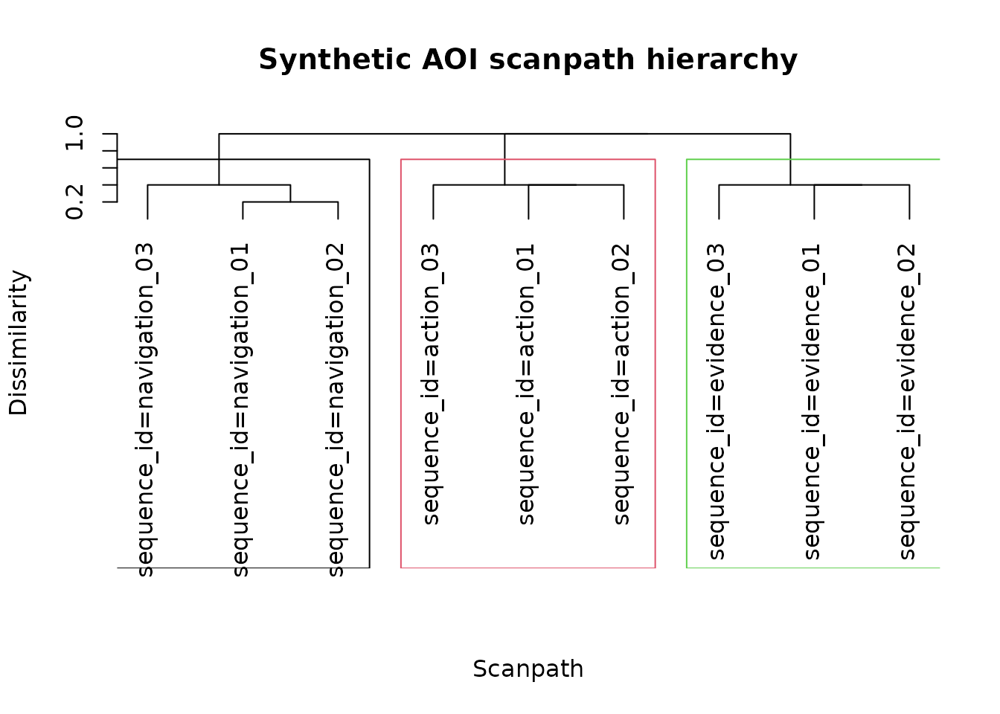
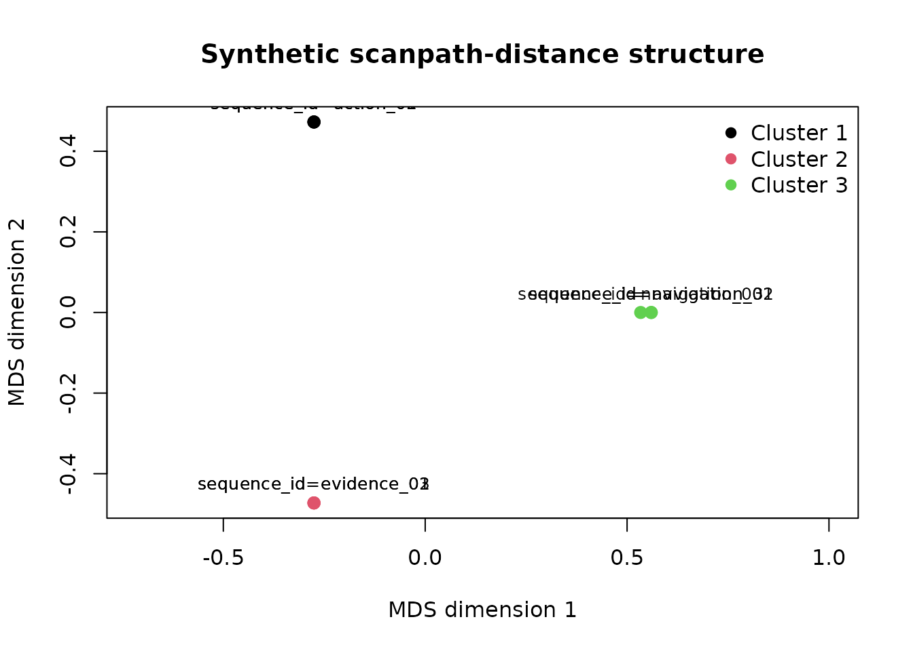
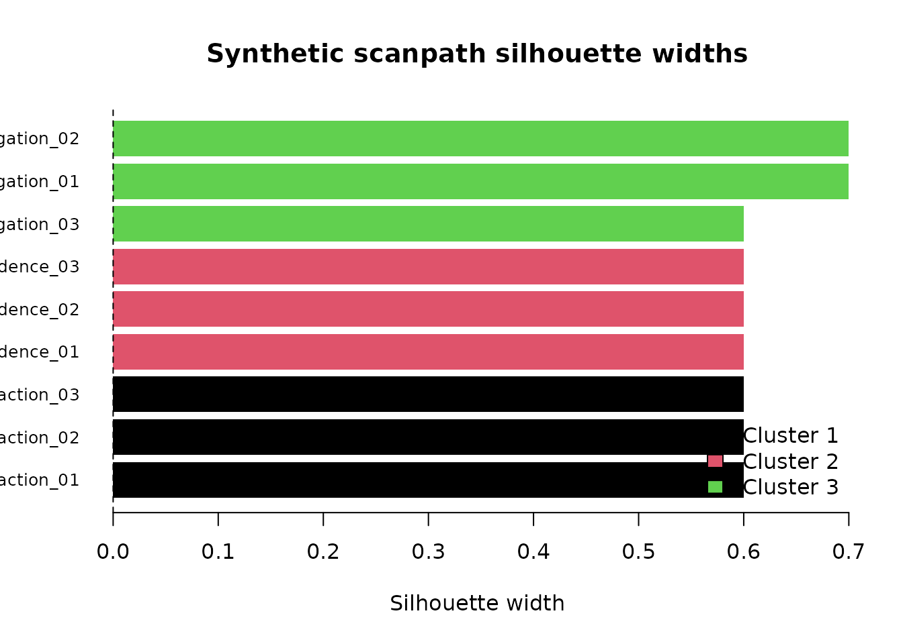
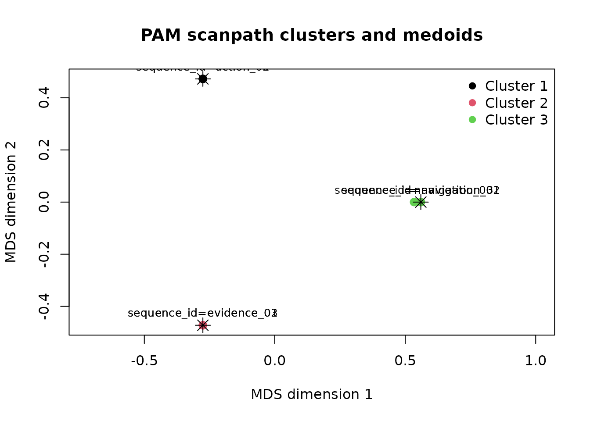

# Scanpath clustering, selection, and visual diagnostics

## Scope

This article demonstrates a lightweight workflow for grouping AOI
fixation sequences according to pairwise sequence dissimilarity.

The clusters describe similarity in observed AOI ordering and transition
structure. They should not automatically be interpreted as distinct
cognitive strategies, intentions, or psychological states.

``` r

library(gp3tools)
```

## Synthetic AOI sequences

The example contains nine synthetic scanpaths organised around three
different AOI-sequence patterns.

``` r

sequence_list <- list(
  navigation_01 = c("map", "world", "map", "world", "map"),
  navigation_02 = c("map", "world", "map", "world", "world"),
  navigation_03 = c("map", "map", "world", "map", "world"),
  evidence_01 = c("header", "claim", "evidence", "claim", "evidence"),
  evidence_02 = c("header", "claim", "evidence", "evidence", "claim"),
  evidence_03 = c("claim", "header", "claim", "evidence", "claim"),
  action_01 = c("image", "cta", "image", "cta", "cta"),
  action_02 = c("image", "cta", "cta", "image", "cta"),
  action_03 = c("cta", "image", "cta", "image", "cta")
)

scanpath_data <- do.call(
  rbind,
  lapply(
    names(sequence_list),
    function(sequence_id) {
      sequence <- sequence_list[[sequence_id]]

      data.frame(
        sequence_id = sequence_id,
        fixation_order = seq_along(sequence),
        aoi = sequence,
        stringsAsFactors = FALSE
      )
    }
  )
)

rownames(scanpath_data) <- NULL
utils::head(scanpath_data, 12)
#>      sequence_id fixation_order   aoi
#> 1  navigation_01              1   map
#> 2  navigation_01              2 world
#> 3  navigation_01              3   map
#> 4  navigation_01              4 world
#> 5  navigation_01              5   map
#> 6  navigation_02              1   map
#> 7  navigation_02              2 world
#> 8  navigation_02              3   map
#> 9  navigation_02              4 world
#> 10 navigation_02              5 world
#> 11 navigation_03              1   map
#> 12 navigation_03              2   map
```

## Pairwise sequence distances

``` r

pairwise_distances <- compute_gazepoint_scanpath_similarity(
  data = scanpath_data,
  aoi_col = "aoi",
  group_cols = "sequence_id",
  time_col = "fixation_order"
)

utils::head(pairwise_distances, 12)
#>                   sequence_a                sequence_b edit_distance
#> 1      sequence_id=action_01     sequence_id=action_01             0
#> 2      sequence_id=action_02     sequence_id=action_02             0
#> 3      sequence_id=action_03     sequence_id=action_03             0
#> 4    sequence_id=evidence_01   sequence_id=evidence_01             0
#> 5    sequence_id=evidence_02   sequence_id=evidence_02             0
#> 6    sequence_id=evidence_03   sequence_id=evidence_03             0
#> 7  sequence_id=navigation_01 sequence_id=navigation_01             0
#> 8  sequence_id=navigation_02 sequence_id=navigation_02             0
#> 9  sequence_id=navigation_03 sequence_id=navigation_03             0
#> 10     sequence_id=action_01     sequence_id=action_02             2
#> 11     sequence_id=action_01     sequence_id=action_03             2
#> 12     sequence_id=action_01   sequence_id=evidence_01             5
#>    normalized_distance similarity sequence_a_length sequence_b_length
#> 1                  0.0        1.0                 5                 5
#> 2                  0.0        1.0                 5                 5
#> 3                  0.0        1.0                 5                 5
#> 4                  0.0        1.0                 5                 5
#> 5                  0.0        1.0                 5                 5
#> 6                  0.0        1.0                 5                 5
#> 7                  0.0        1.0                 5                 5
#> 8                  0.0        1.0                 5                 5
#> 9                  0.0        1.0                 5                 5
#> 10                 0.4        0.6                 5                 5
#> 11                 0.4        0.6                 5                 5
#> 12                 1.0        0.0                 5                 5
#>    n_sequences similarity_status
#> 1            9                ok
#> 2            9                ok
#> 3            9                ok
#> 4            9                ok
#> 5            9                ok
#> 6            9                ok
#> 7            9                ok
#> 8            9                ok
#> 9            9                ok
#> 10           9                ok
#> 11           9                ok
#> 12           9                ok
```

## Compare candidate cluster counts

Silhouette-based comparison requires the optional `cluster` package.

``` r

cluster_available <- requireNamespace(
  "cluster",
  quietly = TRUE
)

if (cluster_available) {
  selection <- select_gazepoint_scanpath_clusters(
    x = pairwise_distances,
    k_values = 2:5,
    method = "hierarchical",
    linkage = "average"
  )

  selection$diagnostics
}
#>   k mean_silhouette_width n_clusters       method
#> 2 2             0.3822222          2 hierarchical
#> 3 3             0.6222222          3 hierarchical
#> 4 4             0.5111111          4 hierarchical
#> 5 5             0.3111111          5 hierarchical
```

``` r

if (cluster_available) {
  recommended_k <- selection$recommended_k
  hierarchical_fit <- selection$recommended_fit
} else {
  recommended_k <- 3L

  hierarchical_fit <- cluster_gazepoint_scanpaths(
    x = pairwise_distances,
    k = recommended_k,
    method = "hierarchical",
    linkage = "average"
  )
}

hierarchical_fit$assignments
#>                 sequence_id cluster
#> 1     sequence_id=action_01       1
#> 2     sequence_id=action_02       1
#> 3     sequence_id=action_03       1
#> 4   sequence_id=evidence_01       2
#> 5   sequence_id=evidence_02       2
#> 6   sequence_id=evidence_03       2
#> 7 sequence_id=navigation_01       3
#> 8 sequence_id=navigation_02       3
#> 9 sequence_id=navigation_03       3
```

The largest mean silhouette width identifies the strongest candidate
among the evaluated values. It does not prove that the selected number
of clusters is uniquely correct.

## Hierarchical dendrogram

``` r

plot_gazepoint_scanpath_clusters(
  hierarchical_fit,
  plot = "dendrogram",
  main = "Synthetic AOI scanpath hierarchy"
)
```



## MDS distance representation

``` r

plot_gazepoint_scanpath_clusters(
  hierarchical_fit,
  plot = "mds",
  main = "Synthetic scanpath-distance structure"
)
```



The MDS display is a two-dimensional approximation of the complete
distance object.

## Silhouette diagnostics

``` r

if (cluster_available) {
  plot_gazepoint_scanpath_clusters(
    hierarchical_fit,
    plot = "silhouette",
    main = "Synthetic scanpath silhouette widths"
  )
}
```



Small or negative silhouette widths identify assignments that require
additional review.

## Representative scanpaths

``` r

representatives <-
  extract_gazepoint_representative_scanpaths(
    hierarchical_fit,
    n_per_cluster = 1
  )

representatives
#>   cluster representative_rank               sequence_id
#> 1       1                   1     sequence_id=action_01
#> 2       2                   1   sequence_id=evidence_01
#> 3       3                   1 sequence_id=navigation_01
#>   mean_within_cluster_distance cluster_size is_model_medoid
#> 1                          0.4            3           FALSE
#> 2                          0.4            3           FALSE
#> 3                          0.3            3           FALSE
```

Representative identifiers can be joined back to the long-format
observations for sequence timelines or qualitative inspection.

``` r

representative_rows <- scanpath_data[
  scanpath_data$sequence_id %in%
    representatives$sequence_id,
]

representative_rows
#> [1] sequence_id    fixation_order aoi           
#> <0 rows> (or 0-length row.names)
```

## PAM sensitivity analysis

PAM represents each cluster using an observed medoid scanpath.

``` r

if (cluster_available) {
  pam_fit <- cluster_gazepoint_scanpaths(
    x = hierarchical_fit$distance,
    k = recommended_k,
    method = "pam"
  )

  pam_fit$assignments
  pam_fit$medoids
}
#> [1] "sequence_id=action_03"     "sequence_id=evidence_03"  
#> [3] "sequence_id=navigation_02"
```

``` r

if (cluster_available) {
  plot_gazepoint_scanpath_clusters(
    pam_fit,
    plot = "mds",
    main = "PAM scanpath clusters and medoids"
  )
}
```



Stars identify PAM medoids in the MDS representation.

## Reporting

Report the AOI sequence definition, ordering variable, treatment of
repeated and missing states, distance definition, clustering method,
linkage, candidate values of `k`, cluster sizes, silhouette widths, and
sensitivity to alternative clustering specifications.
