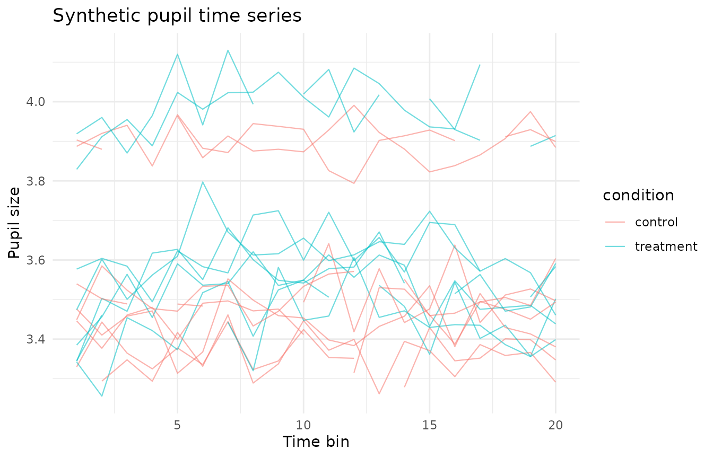
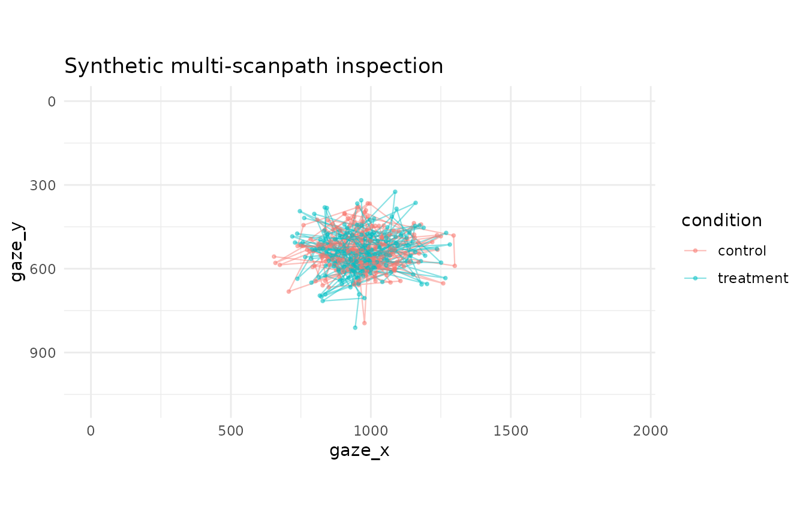
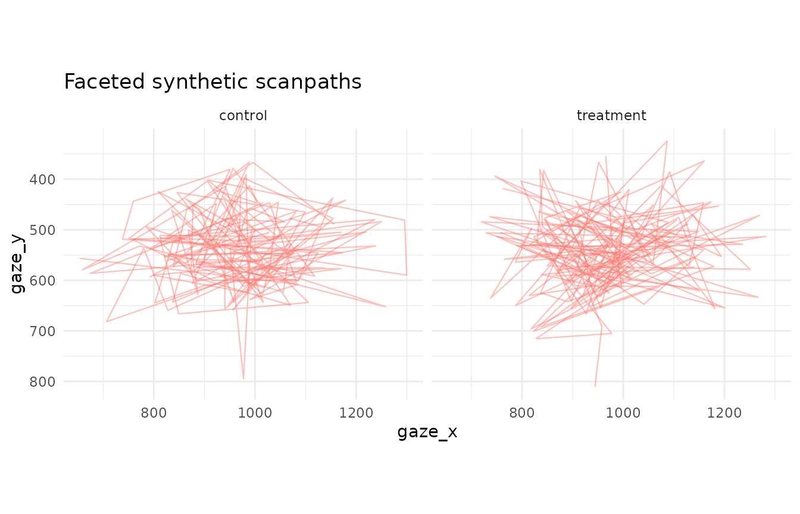

# Scanpath and quality-control quick wins

This article demonstrates a compact set of descriptive helpers for
privacy-safe examples, binocular pupil preparation, trackloss review,
time-series plotting, and multi-scanpath visual inspection. These
helpers are intended for transparent quality control and documentation.
They do not replace study-specific preprocessing decisions or
inferential modelling.

## Simulate pupil and gaze data

[`simulate_gazepoint_pupil_data()`](https://stefanosbalaskas.github.io/gp3tools/reference/simulate_gazepoint_pupil_data.md)
creates a small synthetic data set with participant, trial, condition,
time-bin, gaze-coordinate, left-pupil, right-pupil, blink, trackloss,
and combined-pupil columns.

``` r

synthetic <- simulate_gazepoint_pupil_data(
  n_subjects = 4,
  n_trials = 4,
  n_time_bins = 20,
  conditions = c("control", "treatment"),
  blink_probability = 0.05,
  seed = 123
)

head(synthetic)
#>   subject trial condition time_bin timestamp_ms    gaze_x   gaze_y pupil_left
#> 1    S001     1   control        1         0.00  993.1529 498.0263   3.355974
#> 2    S001     1   control        2        16.67  977.2926 794.7236   3.484336
#> 3    S001     1   control        3        33.34  950.9250 535.9970   3.385504
#> 4    S001     1   control        4        50.01 1219.3699 504.5001   3.248926
#> 5    S001     1   control        5        66.68  993.1579 563.9892   3.296683
#> 6    S001     1   control        6        83.35  941.0047 414.5260   3.317478
#>   pupil_right blink trackloss    pupil
#> 1    3.303798 FALSE     FALSE 3.329886
#> 2    3.401831 FALSE     FALSE 3.443084
#> 3    3.343765 FALSE     FALSE 3.364635
#> 4    3.400768 FALSE     FALSE 3.324847
#> 5    3.458472 FALSE     FALSE 3.377578
#> 6    3.353714 FALSE     FALSE 3.335596
```

The generator is designed for examples and tests. It should not be used
to make claims about empirical pupil physiology.

## Combine left and right pupil channels

[`combine_gazepoint_eyes()`](https://stefanosbalaskas.github.io/gp3tools/reference/combine_gazepoint_eyes.md)
combines two eye-specific numeric columns into a single analysis column.
The default method averages available left/right values. Other options
can prefer one eye or choose the globally less-missing eye.

``` r

combined <- combine_gazepoint_eyes(
  synthetic,
  left_col = "pupil_left",
  right_col = "pupil_right",
  output_col = "pupil_combined",
  method = "mean",
  valid_min = 1,
  valid_max = 9
)

head(combined[, c("pupil_left", "pupil_right", "pupil_combined")])
#>   pupil_left pupil_right pupil_combined
#> 1   3.355974    3.303798       3.329886
#> 2   3.484336    3.401831       3.443084
#> 3   3.385504    3.343765       3.364635
#> 4   3.248926    3.400768       3.324847
#> 5   3.296683    3.458472       3.377578
#> 6   3.317478    3.353714       3.335596
```

## Flag groups by trackloss

[`clean_gazepoint_by_trackloss()`](https://stefanosbalaskas.github.io/gp3tools/reference/clean_gazepoint_by_trackloss.md)
computes trackloss rates globally or within grouping columns. Here,
participant-trial groups with more than 20% trackloss are flagged.

``` r

trackloss_flagged <- clean_gazepoint_by_trackloss(
  synthetic,
  group_cols = c("subject", "trial"),
  tracking_col = "trackloss",
  max_trackloss = 0.20,
  action = "flag"
)

head(trackloss_flagged[, c("subject", "trial", "trackloss", ".gp3_trackloss_rate", ".gp3_trackloss_exclude")])
#>   subject trial trackloss .gp3_trackloss_rate .gp3_trackloss_exclude
#> 1    S001     1     FALSE                0.95                   TRUE
#> 2    S001     1     FALSE                0.95                   TRUE
#> 3    S001     1     FALSE                0.95                   TRUE
#> 4    S001     1     FALSE                0.95                   TRUE
#> 5    S001     1     FALSE                0.95                   TRUE
#> 6    S001     1     FALSE                0.95                   TRUE
```

A compact group-level summary is stored as an attribute.

``` r

head(attr(trackloss_flagged, "gp3_trackloss_summary"))
#>   group_id n_rows n_trackloss_rows trackloss_rate exclude
#> 1   S001.1     20               19           0.95    TRUE
#> 2   S001.2     20               19           0.95    TRUE
#> 3   S001.3     20               19           0.95    TRUE
#> 4   S001.4     20               17           0.85    TRUE
#> 5   S002.1     20               19           0.95    TRUE
#> 6   S002.2     20               20           1.00    TRUE
```

The same helper can filter high-trackloss groups, but filtering should
normally be reported as an explicit preprocessing decision.

## Plot a descriptive time series

[`plot_gazepoint_time_series()`](https://stefanosbalaskas.github.io/gp3tools/reference/plot_gazepoint_time_series.md)
provides a general descriptive line plot for pupil, gaze, AOI, or other
time-varying measures that have already been prepared by the user.

``` r

plot_gazepoint_time_series(
  synthetic,
  time_col = "time_bin",
  value_col = "pupil",
  group_cols = c("subject", "trial"),
  colour_col = "condition",
  title = "Synthetic pupil time series",
  x_label = "Time bin",
  y_label = "Pupil size"
)
```



This plot is descriptive. It does not smooth, model, or test condition
differences.

## Plot multiple scanpaths

[`plot_gazepoint_scanpaths()`](https://stefanosbalaskas.github.io/gp3tools/reference/plot_gazepoint_scanpaths.md)
supports quick visual inspection of gaze paths across participants,
trials, or conditions.

``` r

plot_gazepoint_scanpaths(
  synthetic,
  x_col = "gaze_x",
  y_col = "gaze_y",
  order_col = "time_bin",
  group_cols = c("subject", "trial"),
  colour_col = "condition",
  screen_width = 1920,
  screen_height = 1080,
  title = "Synthetic multi-scanpath inspection"
)
```



For crowded data, faceting can make trial or condition-level review
easier.

``` r

plot_gazepoint_scanpaths(
  synthetic,
  x_col = "gaze_x",
  y_col = "gaze_y",
  order_col = "time_bin",
  group_cols = c("subject", "trial"),
  facet_col = "condition",
  show_points = FALSE,
  title = "Faceted synthetic scanpaths"
)
```



These visualisations are intended for quality review and documentation,
not as inferential scanpath-comparison methods.
