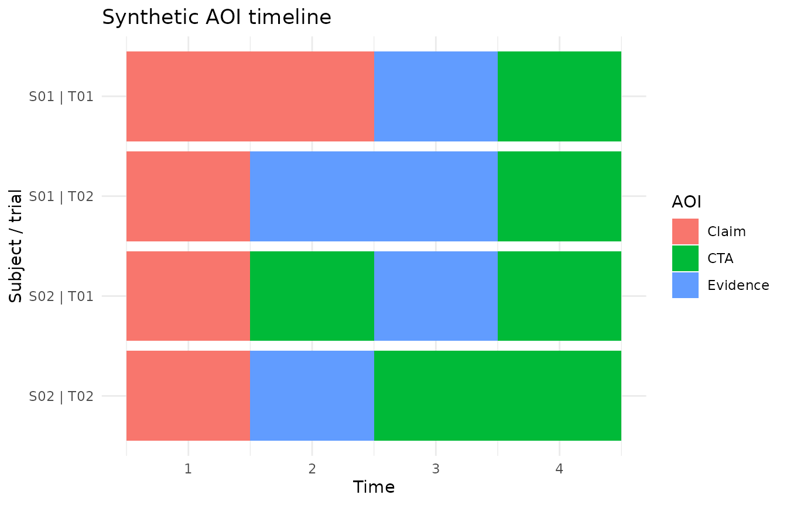

# AOI sequence and reliability diagnostics

This article demonstrates conservative statistical extensions for
Gazepoint-style AOI and fixation workflows. The examples use small
synthetic data and are intended as software demonstrations, not
empirical findings.

``` r

if (requireNamespace('pkgload', quietly = TRUE)) {
  pkgload::load_all('.', export_all = FALSE, quiet = TRUE)
} else {
  library(gp3tools)
}

aoi_demo <- data.frame(
  subject = rep(c('S01', 'S02'), each = 8),
  trial = rep(rep(c('T01', 'T02'), each = 4), 2),
  condition = rep(c('control', 'treatment'), each = 8),
  time = rep(1:4, 4),
  AOI = c(
    'Claim', 'Claim', 'Evidence', 'CTA',
    'Claim', 'Evidence', 'Evidence', 'CTA',
    'Claim', 'CTA', 'Evidence', 'CTA',
    'Claim', 'Evidence', 'CTA', 'CTA'
  )
)
```

## AOI entropy

``` r

compute_gazepoint_aoi_entropy(
  aoi_demo,
  aoi_col = 'AOI',
  group_cols = c('subject', 'trial', 'condition'),
  time_col = 'time'
)
#>   subject trial condition n_observations n_aoi spatial_entropy
#> 1     S01   T01   control              4     3             1.5
#> 2     S01   T02   control              4     3             1.5
#> 3     S02   T01 treatment              4     3             1.5
#> 4     S02   T02 treatment              4     3             1.5
#>   spatial_entropy_norm n_transitions n_transition_types transition_entropy
#> 1            0.9463946             3                  3           1.584963
#> 2            0.9463946             3                  3           1.584963
#> 3            0.9463946             3                  3           1.584963
#> 4            0.9463946             3                  3           1.584963
#>   transition_entropy_norm conditional_transition_entropy
#> 1                       1                      0.6666667
#> 2                       1                      0.6666667
#> 3                       1                      0.0000000
#> 4                       1                      0.0000000
#>   conditional_transition_entropy_norm entropy_status
#> 1                           0.4206198             ok
#> 2                           0.4206198             ok
#> 3                           0.0000000             ok
#> 4                           0.0000000             ok
```

## AOI sequence metrics

``` r

compute_gazepoint_aoi_sequence_metrics(
  aoi_demo,
  aoi_col = 'AOI',
  group_cols = c('subject', 'trial', 'condition'),
  time_col = 'time'
)
#>   subject trial condition sequence_length n_aoi_visits n_unique_aoi
#> 1     S01   T01   control               4            3            3
#> 2     S01   T02   control               4            3            3
#> 3     S02   T01 treatment               4            4            3
#> 4     S02   T02 treatment               4            3            3
#>   transition_count revisit_count revisit_prop dominant_aoi first_aoi last_aoi
#> 1                2             0         0.00        Claim     Claim      CTA
#> 2                2             0         0.00     Evidence     Claim      CTA
#> 3                3             1         0.25          CTA     Claim      CTA
#> 4                2             0         0.00          CTA     Claim      CTA
#>   mean_run_length max_run_length sequence_status
#> 1        1.333333              2              ok
#> 2        1.333333              2              ok
#> 3        1.000000              1              ok
#> 4        1.333333              2              ok
```

## Sequence distance

``` r

compute_gazepoint_sequence_distance(
  sequence_a = c('Claim', 'Evidence', 'CTA'),
  sequence_b = c('Claim', 'CTA', 'Evidence')
)
#>   edit_distance normalized_distance sequence_a_length sequence_b_length
#> 1             2           0.6666667                 3                 3
#>   distance_status
#> 1              ok
```

## Split-half reliability

``` r

fix_demo <- expand.grid(
  subject = paste0('S', 1:8),
  trial = paste0('T', 1:4),
  KEEP.OUT.ATTRS = FALSE
)

fix_demo$duration <- rep(seq_len(8), each = 4) +
  rep(c(0, 0.1, 0, 0.1), 8)

audit_gazepoint_fixation_reliability(
  fix_demo,
  subject_col = 'subject',
  trial_col = 'trial',
  metric = 'total_fixation_duration',
  duration_col = 'duration'
)
#>                    metric split_method correlation_method split_half_r
#> 1 total_fixation_duration     odd_even            pearson            1
#>   spearman_brown n_subjects_total n_subjects_used n_trials min_trials
#> 1              1                8               8       32          4
#>   reliability_status reliability_warning
#> 1                 ok
```

## AOI timeline plot

``` r

plot_gazepoint_aoi_timeline(
  aoi_demo,
  aoi_col = 'AOI',
  time_col = 'time',
  subject_col = 'subject',
  trial_col = 'trial',
  title = 'Synthetic AOI timeline'
)
```


