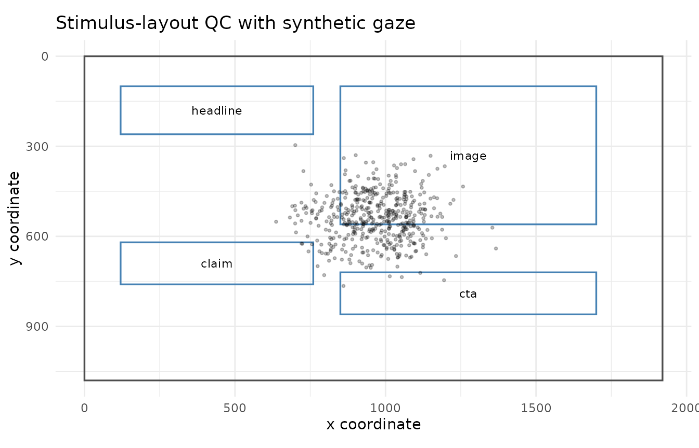

# Stimulus-layout quality control

This article demonstrates descriptive quality-control helpers for
checking whether AOI geometry and gaze coordinates are compatible with
declared screen or stimulus dimensions. The helpers are intended for
transparent review before AOI summaries, heatmaps, scanpaths, or
publication reporting. They do not make automatic exclusion decisions.

## Example AOI layout

``` r

aoi <- data.frame(
  aoi = c("headline", "image", "claim", "cta"),
  x_min = c(120, 850, 120, 850),
  x_max = c(760, 1700, 760, 1700),
  y_min = c(100, 100, 620, 720),
  y_max = c(260, 560, 760, 860)
)

aoi
#>        aoi x_min x_max y_min y_max
#> 1 headline   120   760   100   260
#> 2    image   850  1700   100   560
#> 3    claim   120   760   620   760
#> 4      cta   850  1700   720   860
```

## Audit AOI screen coverage

[`audit_gazepoint_aoi_screen_coverage()`](https://stefanosbalaskas.github.io/gp3tools/reference/audit_gazepoint_aoi_screen_coverage.md)
checks rectangular AOIs against declared screen or stimulus dimensions.
It reports missing geometry, invalid rectangles, off-screen boundaries,
raw AOI area, clipped on-screen area, and descriptive screen-coverage
rates.

``` r

aoi_audit <- audit_gazepoint_aoi_screen_coverage(
  aoi,
  screen_width = 1920,
  screen_height = 1080,
  aoi_col = "aoi"
)

aoi_audit$overall_summary
#>   n_aois n_missing_geometry n_invalid_rectangles n_outside_screen
#> 1      4                  0                    0                0
#>   total_raw_area total_clipped_area total_raw_screen_coverage
#> 1         702000             702000                 0.3385417
#>   total_clipped_screen_coverage
#> 1                     0.3385417
#>                                                       coverage_note
#> 1 Coverage sums are descriptive and do not correct for AOI overlap.
```

The AOI-level table shows which regions are inside or outside the
declared screen.

``` r

aoi_audit$aoi_summary
#>     aoi_id x_min x_max y_min y_max width height raw_area clipped_area
#> 1 headline   120   760   100   260   640    160   102400       102400
#> 2    image   850  1700   100   560   850    460   391000       391000
#> 3    claim   120   760   620   760   640    140    89600        89600
#> 4      cta   850  1700   720   860   850    140   119000       119000
#>   raw_screen_coverage clipped_screen_coverage missing_geometry
#> 1          0.04938272              0.04938272            FALSE
#> 2          0.18856096              0.18856096            FALSE
#> 3          0.04320988              0.04320988            FALSE
#> 4          0.05738812              0.05738812            FALSE
#>   invalid_rectangle outside_screen offscreen_left offscreen_right offscreen_top
#> 1             FALSE          FALSE          FALSE           FALSE         FALSE
#> 2             FALSE          FALSE          FALSE           FALSE         FALSE
#> 3             FALSE          FALSE          FALSE           FALSE         FALSE
#> 4             FALSE          FALSE          FALSE           FALSE         FALSE
#>   offscreen_bottom
#> 1            FALSE
#> 2            FALSE
#> 3            FALSE
#> 4            FALSE
```

Coverage totals are descriptive and do not correct for overlap between
AOIs. Use the existing AOI-overlap helpers when overlap itself is the
target diagnostic.

## Summarise coordinate coverage

We create privacy-safe synthetic gaze and pupil data for the example.

``` r

synthetic <- simulate_gazepoint_pupil_data(
  n_subjects = 4,
  n_trials = 4,
  n_time_bins = 30,
  conditions = c("control", "treatment"),
  seed = 123
)

head(synthetic)
#>   subject trial condition time_bin timestamp_ms    gaze_x   gaze_y pupil_left
#> 1    S001     1   control        1         0.00 1035.6288 475.2996   3.355724
#> 2    S001     1   control        2        16.67 1091.5994 590.0281   3.483586
#> 3    S001     1   control        3        33.34  841.3868 474.6260   3.384254
#> 4    S001     1   control        4        50.01 1092.9594 342.9940   3.247176
#> 5    S001     1   control        5        66.68  901.2561 432.5634   3.294433
#> 6    S001     1   control        6        83.35  995.3224 550.9036   3.314728
#>   pupil_right blink trackloss    pupil
#> 1    3.402408 FALSE     FALSE 3.379066
#> 2    3.408690 FALSE     FALSE 3.446138
#> 3    3.420563 FALSE     FALSE 3.402409
#> 4    3.302430 FALSE     FALSE 3.274803
#> 5    3.479532 FALSE     FALSE 3.386982
#> 6    3.319905 FALSE     FALSE 3.317316
```

[`summarize_gazepoint_coordinate_coverage()`](https://stefanosbalaskas.github.io/gp3tools/reference/summarize_gazepoint_coordinate_coverage.md)
reports valid-coordinate rates, inside-screen rates, coordinate ranges,
and coarse grid occupancy. This can help identify whether gaze samples
cover plausible screen areas before plotting or AOI analysis.

``` r

coverage <- summarize_gazepoint_coordinate_coverage(
  synthetic,
  x_col = "gaze_x",
  y_col = "gaze_y",
  screen_width = 1920,
  screen_height = 1080,
  group_cols = "condition",
  grid_n_x = 8,
  grid_n_y = 6
)

coverage
#>    group_id n_rows n_finite_coordinates n_inside_screen finite_coordinate_rate
#> 1   control    240                  240             240                      1
#> 2 treatment    240                  240             240                      1
#>   inside_screen_rate    x_min    x_max    y_min    y_max   x_mean   y_mean
#> 1                  1 682.3517 1215.266 296.1711 765.2867 953.6874 544.5078
#> 2                  1 636.5605 1366.844 329.6540 735.8398 976.9079 532.4556
#>   occupied_grid_cells total_grid_cells occupied_grid_rate
#> 1                  11               48          0.2291667
#> 2                  11               48          0.2291667
```

The grid-occupancy result is descriptive. It should not be interpreted
as an inferential measure of attention.

## Plot stimulus-layout quality control

[`plot_gazepoint_stimulus_layout_qc()`](https://stefanosbalaskas.github.io/gp3tools/reference/plot_gazepoint_stimulus_layout_qc.md)
draws the screen bounds, AOI rectangles, and optional gaze points in the
same coordinate system.

``` r

plot_gazepoint_stimulus_layout_qc(
  aoi,
  screen_width = 1920,
  screen_height = 1080,
  aoi_col = "aoi",
  gaze_data = synthetic,
  gaze_x_col = "gaze_x",
  gaze_y_col = "gaze_y",
  title = "Stimulus-layout QC with synthetic gaze"
)
```



The plot is intended for visual review of coordinate compatibility, AOI
placement, and gaze coverage. It is not an inferential scanpath or
attention analysis.

## Combine with screen-bound auditing

The layout QC helpers complement the screen-coordinate checks introduced
in the scanpath/QC article.

``` r

screen_audit <- audit_gazepoint_screen_bounds(
  synthetic,
  x_col = "gaze_x",
  y_col = "gaze_y",
  screen_width = 1920,
  screen_height = 1080,
  group_cols = c("subject", "trial")
)

screen_audit$overall_summary
#>   n_rows n_missing_coordinate n_zero_zero n_outside_bounds n_invalid_coordinate
#> 1    480                    0           0                0                    0
#>   missing_coordinate_rate zero_zero_rate outside_bounds_rate
#> 1                       0              0                   0
#>   invalid_coordinate_rate
#> 1                       0
```

Together, these helpers support a transparent workflow:

1.  Check raw gaze coordinates against screen bounds.
2.  Check AOI geometry against the same screen bounds.
3.  Summarise coordinate coverage.
4.  Plot AOIs and gaze points together for visual inspection.
5.  Report any exclusions or coordinate harmonisation decisions
    explicitly.
