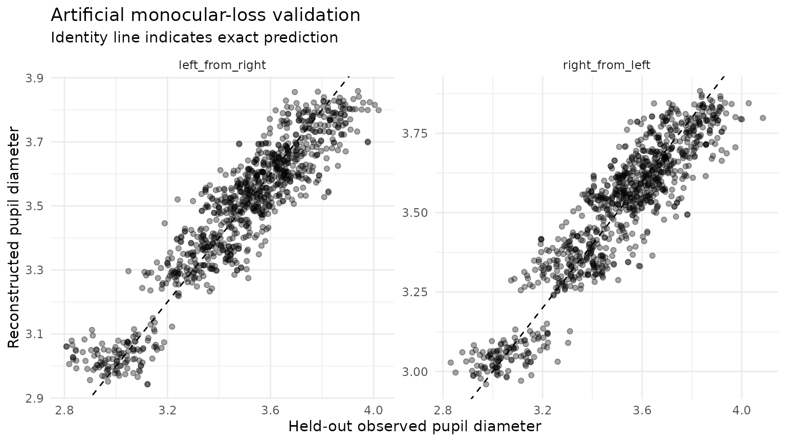
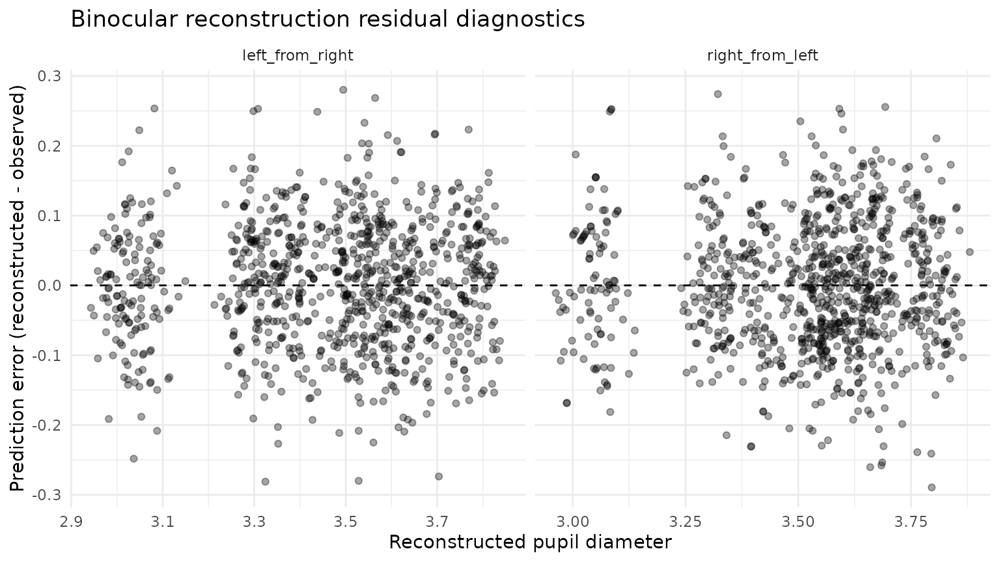

# Validating Pupil Reconstruction with Artificial Monocular Loss

## Purpose

Cross-eye pupil reconstruction has a useful property that ordinary
missing-data problems often lack: bilateral samples provide observable
targets that can be hidden deliberately. This article uses that fact to
test a reconstruction policy before it is applied to naturally missing
eye measurements.

Artificial monocular loss does not prove that naturally missing values
behave in the same way. It does, however, directly answer a narrower and
important question: **when one eye is known, how accurately does the
declared calibration reconstruct the other eye in this dataset?**

## Build a deterministic synthetic benchmark

``` r

dat <- simulate_gazepoint_pupil_data(
  n_subjects = 8,
  n_trials = 4,
  n_time_bins = 120,
  blink_probability = 0.01,
  seed = 4102
)

# Give the right eye a reproducible affine offset.
dat$pupil_right <- 0.06 + 0.985 * dat$pupil_right
```

## Random held-out samples

Random masking tests local prediction when individual bilateral
observations are hidden.

``` r

random_validation <- validate_gazepoint_binocular_reconstruction(
  dat,
  left_col = "pupil_left",
  right_col = "pupil_right",
  time_col = "timestamp_ms",
  group_cols = "subject",
  gap_group_cols = c("subject", "trial"),
  mask_prop = 0.10,
  mask_mode = "random",
  repeats = 5,
  seed = 2026,
  min_pairs = 80
)

random_validation$summary
#> # A tibble: 2 × 11
#>   direction       repeats total_requested total_predicted prediction_rate   rmse
#>   <chr>             <int>           <int>           <int>           <dbl>  <dbl>
#> 1 left_from_right       5             951             949           0.998 0.0926
#> 2 right_from_left       5             969             965           0.996 0.0957
#> # ℹ 5 more variables: mae <dbl>, bias <dbl>, median_error <dbl>,
#> #   error_mad <dbl>, correlation <dbl>
```

``` r

plot_gazepoint_binocular_diagnostics(random_validation, "validation")
#> Warning: Removed 6 rows containing missing values or values outside the scale range
#> (`geom_point()`).
```



## Contiguous held-out runs

Natural eye loss is often temporally clustered. Contiguous masking
therefore asks a more demanding question than hiding independent
samples.

``` r

contiguous_validation <- validate_gazepoint_binocular_reconstruction(
  dat,
  left_col = "pupil_left",
  right_col = "pupil_right",
  time_col = "timestamp_ms",
  group_cols = "subject",
  gap_group_cols = c("subject", "trial"),
  mask_prop = 0.10,
  mask_mode = "contiguous",
  block_size = 8,
  repeats = 5,
  seed = 2027,
  min_pairs = 80
)

contiguous_validation$summary
#> # A tibble: 2 × 11
#>   direction       repeats total_requested total_predicted prediction_rate   rmse
#>   <chr>             <int>           <int>           <int>           <dbl>  <dbl>
#> 1 left_from_right       5             948             946           0.998 0.0887
#> 2 right_from_left       5             972             969           0.997 0.0916
#> # ℹ 5 more variables: mae <dbl>, bias <dbl>, median_error <dbl>,
#> #   error_mad <dbl>, correlation <dbl>
```

The row-level prediction table retains direction, model ID, calibration
level, gap duration, extrapolation status, and reconstruction outcome.

``` r

head(contiguous_validation$predictions)
#> # A tibble: 6 × 14
#>   repeat_id row_id direction       observed predicted   error status    model_id
#>       <int>  <int> <chr>              <dbl>     <dbl>   <dbl> <chr>     <chr>   
#> 1         1     71 left_from_right     3.58      3.63  0.0482 left_rec… binoc_0…
#> 2         1     72 left_from_right     3.70      3.68 -0.0240 left_rec… binoc_0…
#> 3         1     73 left_from_right     3.70      3.68 -0.0214 left_rec… binoc_0…
#> 4         1     74 left_from_right     3.67      3.63 -0.0414 left_rec… binoc_0…
#> 5         1     75 left_from_right     3.71      3.67 -0.0387 left_rec… binoc_0…
#> 6         1     76 left_from_right     3.64      3.67  0.0294 left_rec… binoc_0…
#> # ℹ 6 more variables: calibration_level <chr>, r_squared <dbl>,
#> #   extrapolated <lgl>, gap_ms <dbl>, subject <chr>, timestamp_ms <dbl>
```

``` r

plot_gazepoint_binocular_diagnostics(contiguous_validation, "residuals")
#> Warning: Removed 5 rows containing missing values or values outside the scale range
#> (`geom_point()`).
```



## Stress-test increasing monocular loss

A single masking percentage can conceal a deterioration in calibration
support. The stress-test helper repeats validation across a declared
range of missingness.

``` r

stress <- stress_test_gazepoint_binocular_reconstruction(
  dat,
  left_col = "pupil_left",
  right_col = "pupil_right",
  time_col = "timestamp_ms",
  group_cols = "subject",
  gap_group_cols = c("subject", "trial"),
  missingness = c(0.05, 0.10, 0.20, 0.30),
  mask_modes = c("random", "contiguous"),
  block_size = 8,
  repeats = 3,
  seed = 2028,
  min_pairs = 80
)

stress$results
#> # A tibble: 16 × 13
#>    mask_mode  missingness direction      repeats total_requested total_predicted
#>    <chr>            <dbl> <chr>            <int>           <int>           <int>
#>  1 random            0.05 left_from_rig…       3             310             309
#>  2 random            0.05 right_from_le…       3             266             265
#>  3 random            0.1  left_from_rig…       3             567             565
#>  4 random            0.1  right_from_le…       3             585             584
#>  5 random            0.2  left_from_rig…       3            1141            1134
#>  6 random            0.2  right_from_le…       3            1151            1146
#>  7 random            0.3  left_from_rig…       3            1696            1686
#>  8 random            0.3  right_from_le…       3            1727            1710
#>  9 contiguous        0.05 left_from_rig…       3             294             293
#> 10 contiguous        0.05 right_from_le…       3             282             282
#> 11 contiguous        0.1  left_from_rig…       3             560             558
#> 12 contiguous        0.1  right_from_le…       3             592             588
#> 13 contiguous        0.2  left_from_rig…       3            1222            1218
#> 14 contiguous        0.2  right_from_le…       3            1070            1066
#> 15 contiguous        0.3  left_from_rig…       3            1713            1705
#> 16 contiguous        0.3  right_from_le…       3            1710            1699
#> # ℹ 7 more variables: prediction_rate <dbl>, rmse <dbl>, mae <dbl>, bias <dbl>,
#> #   median_error <dbl>, error_mad <dbl>, correlation <dbl>
```

Useful quantities include both error and **prediction rate**. A low RMSE
among the few rows that remain eligible is not enough if the declared
gates prevent reconstruction of most requested samples.

## Evaluate a gap-duration policy directly

The cross-eye model uses the contralateral eye at the same time point,
so a gap-duration restriction is a governance choice rather than a
mathematical requirement of linear regression. If a study chooses such a
restriction, it can be tested explicitly.

``` r

short_gap_validation <- validate_gazepoint_binocular_reconstruction(
  dat,
  left_col = "pupil_left",
  right_col = "pupil_right",
  time_col = "timestamp_ms",
  group_cols = "subject",
  gap_group_cols = c("subject", "trial"),
  mask_prop = 0.10,
  mask_mode = "contiguous",
  block_size = 8,
  repeats = 3,
  seed = 2029,
  min_pairs = 80,
  max_gap_ms = 100
)

short_gap_validation$summary
#> # A tibble: 2 × 11
#>   direction       repeats total_requested total_predicted prediction_rate   rmse
#>   <chr>             <int>           <int>           <int>           <dbl>  <dbl>
#> 1 left_from_right       3             600             276           0.46  0.0876
#> 2 right_from_left       3             552             233           0.422 0.0975
#> # ℹ 5 more variables: mae <dbl>, bias <dbl>, median_error <dbl>,
#> #   error_mad <dbl>, correlation <dbl>
```

Compare the prediction rate and error with the unrestricted run. This
separates the cost of a strict eligibility policy from the error of the
regression model itself.

## Compare directions

Separate left-from-right and right-from-left models are retained because
one direction can be better calibrated than the other.

``` r

left_only_validation <- validate_gazepoint_binocular_reconstruction(
  dat,
  "pupil_left", "pupil_right",
  time_col = "timestamp_ms",
  group_cols = "subject",
  gap_group_cols = c("subject", "trial"),
  direction = "left_from_right",
  mask_prop = 0.10,
  repeats = 3,
  seed = 2030,
  min_pairs = 80
)

right_only_validation <- validate_gazepoint_binocular_reconstruction(
  dat,
  "pupil_left", "pupil_right",
  time_col = "timestamp_ms",
  group_cols = "subject",
  gap_group_cols = c("subject", "trial"),
  direction = "right_from_left",
  mask_prop = 0.10,
  repeats = 3,
  seed = 2031,
  min_pairs = 80
)

rbind(left_only_validation$summary, right_only_validation$summary)
#> # A tibble: 2 × 11
#>   direction       repeats total_requested total_predicted prediction_rate   rmse
#>   <chr>             <int>           <int>           <int>           <dbl>  <dbl>
#> 1 left_from_right       3            1152            1149           0.997 0.0929
#> 2 right_from_left       3            1152            1146           0.995 0.0951
#> # ℹ 5 more variables: mae <dbl>, bias <dbl>, median_error <dbl>,
#> #   error_mad <dbl>, correlation <dbl>
```

## What to report

At minimum report:

- calibration level (for example participant, participant-session, or
  pooled);
- minimum paired observations and any model-quality gate;
- whether a pooled fallback was allowed;
- whether extrapolation was permitted;
- maximum reconstructed missing-eye run, if restricted;
- artificial-missingness design (random or contiguous, proportion,
  repeats, seed);
- prediction rate as well as RMSE/MAE/bias;
- final reconstruction burden in the analysed data;
- whether reconstruction rates differed across experimental groups;
- whether downstream summaries were stable under alternative
  pupil-construction policies.

The reporting helper can combine validation with the realised
reconstruction audit.

``` r

report <- summarise_gazepoint_binocular_reporting(
  reconstructed,
  audit = audit,
  validation = contiguous_validation
)
cat(report$text)
```

## Interpretation boundary

Artificial monocular loss is a validation device, not a missingness
model. It evaluates prediction where ground truth is observed and then
hidden. It cannot establish what an eye would have measured during
naturally occurring loss, nor can it justify reconstruction through
blinks, long bilateral loss, or other intervals where the contralateral
signal is also unavailable or contaminated.
